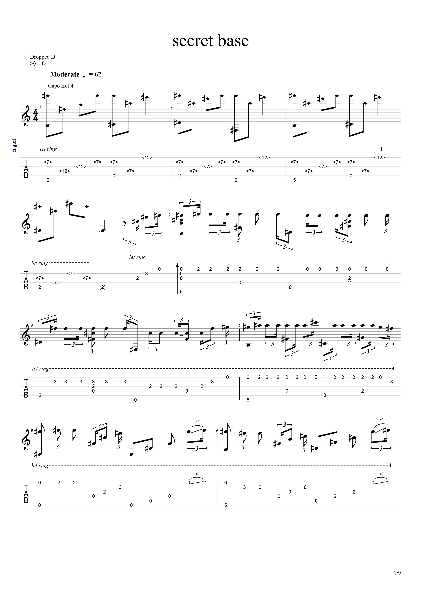
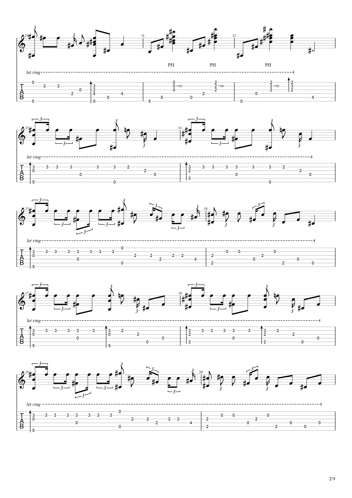
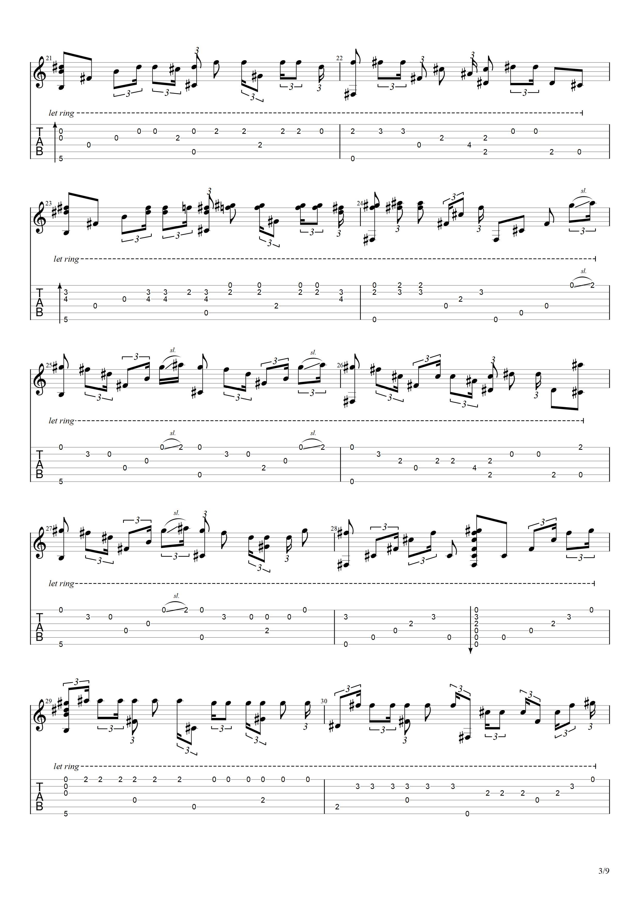
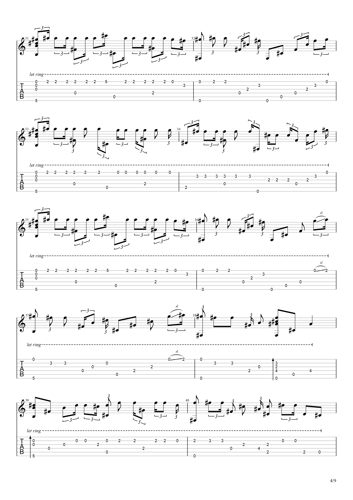
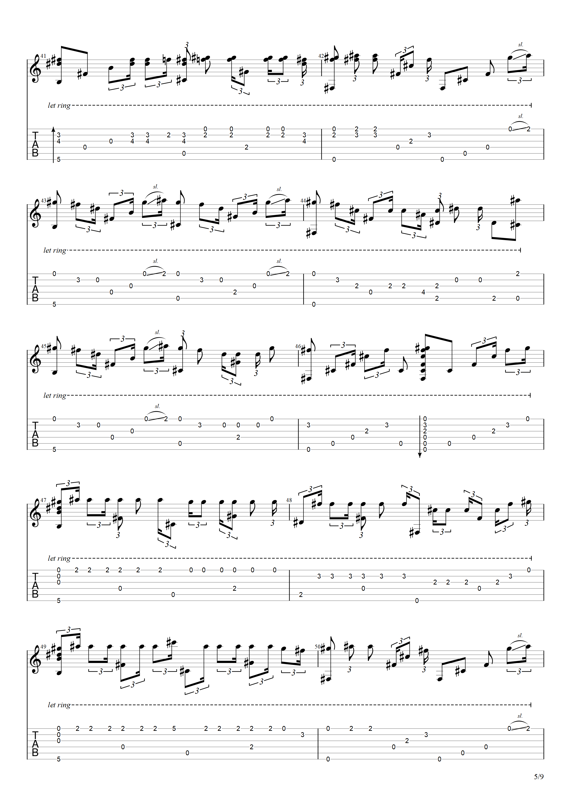
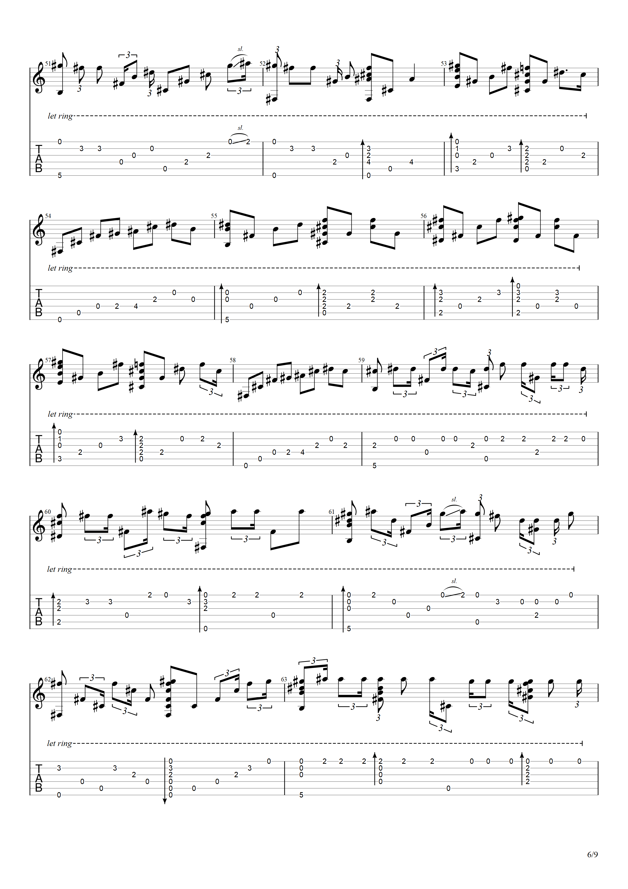
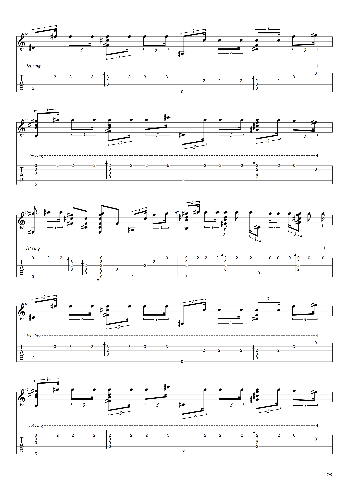
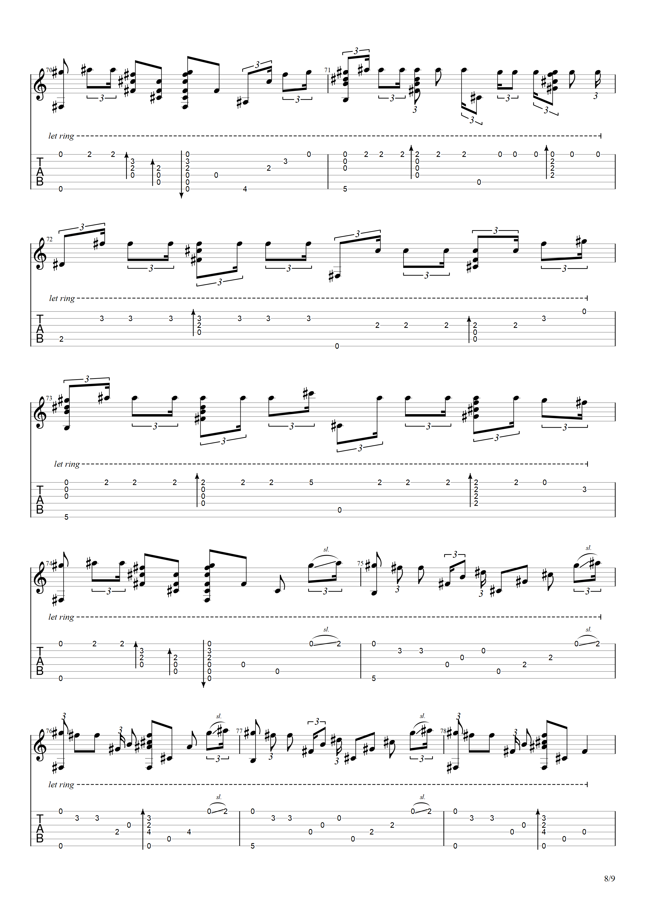

我们仍未知道那天所看见的花的名字。
ACG
我们仍未知道那天所看见的花的名字的 ed 《secret base》歌词 + 吉他谱
2018-10-7

# secret base ~君がくれたもの~ (10 years after Ver.)

Tag: ACG

## 歌词

君と夏の終わり 将来の夢
**与你在夏末约定 将来的梦想**

大きな希望 忘れない
**远大的希望　别忘记**

10年後の8月
**十年后的八月**

また出会えるのを 信じて
**我相信我们还能再相遇**

最高の思い出を…
**共创最美好的回忆...**

------

出会いは ふっとした 瞬間 帰り道の交差点で
**相识　是在那麼不经意的瞬间　我在回家途中的十字路口**

声をかけてくれたね 「一緒に帰ろう」
**听见你的一声『一起回家吧』**

僕は 照れくさそうに カバンで顔を隠しながら
**我当时有点尴尬 还拿书包遮著脸**

本当は とても とても 嬉しかったよ
**其实我心里好高兴　真的好高兴**

------

あぁ 花火が夜空 きれいに咲いて ちょっとセツナク
**啊　烟火在夜空中灿烂盛开　几许伤感**

あぁ 風が時間とともに 流れる
**啊 风和时间一起飘过**

------

嬉しくって 楽しくって 冒険も いろいろしたね
**很高兴 很愉快 曾到处冒险**

二人の 秘密の 基地の中
**就在我们的秘密基地中**

------

君と夏の終わり 将来の夢 大きな希望 忘れない
**与你在夏末约定　将来的梦想 远大的希望　别忘记**

10年後の8月 また出会えるのを 信じて
**我相信十年后的八月　我们还能再相遇**

君が最後まで 心から 「ありがとう」叫んでいたこと
**你最后一直在心底呼喊著『谢谢你』**

知っていたよ
**我是知道的**

涙をこらえて 笑顔でさようなら せつないよね
**很难过呢 强忍著泪水笑著说再见**

最高の思い出を…
**那一段最美好的回忆**

------

あぁ 夏休みも あと少しで 終っちゃうから
**啊　暑假就快要过完了**

あぁ 太陽と月 仲良くして
**啊　太阳和月亮　默契十足**

------

悲しくって 寂しくって 喧嘩も いろいろしたね
**想来令人悲伤　或许有些寂寥 我们也多有争吵**

二人の 秘密の 基地の中
**就在我们的秘密基地中**

------

君が最後まで 心から 「ありがとう」叫んでいたこと
**你最后一直在心底呼喊著『谢谢你』**

知っていたよ
**我是知道的**

涙をこらえて 笑顔でさようなら せつないよね
**很难过呢 强忍著泪水笑著说再见**

最高の思い出を…
**那一段最美好的回忆**

------

突然の 転校で どうしようもなく
**你突然要转学　你我都无可奈何**

手紙 書くよ 電話もするよ 忘れないでね 僕のことを
**我会写信给你　也会打电话给你 千万别忘记我的事情**

いつまでも 二人の 基地の中
**无论什么时候 那段在秘密基地中的日子**

------

君と夏の終わり ずっと話して
**与你在夏末　聊了那麼多**

夕日を見てから星を眺め
**从黄昏到繁星点点**

君の頬を 流れた涙は ずっと忘れない
**泪水流过你的双颊　我永远不会忘记**

君が最後まで 大きく手を振ってくれたこと
**直到最后　你紧紧握住我的手　这感觉也将长在我心中**

きっと忘れない
**一定不会忘记的**

だから こうして 夢の中で ずっと永遠に…
**就这样　让我们永远在梦中相会吧**

------

君と夏の終わり 将来の夢 大きな希望 忘れない
**与你在夏末约定　将来的梦想 远大的希望　别忘记**

10年後の8月 また出会えるのを 信じて
**我相信十年后的八月　我们还能再相遇**

君が最後まで 心から 「ありがとう」叫んでいたこと
**你最后一直在心底呼喊著『谢谢你』**

知っていたよ
**我是知道的**

涙をこらえて 笑顔でさようなら せつないよね
**很难过呢 强忍著泪水笑著说再见**

最高の思い出を…
**那一段最美好的回忆**

------

最高の思い出を…
**那一段最美好的回忆**

## 吉他谱

