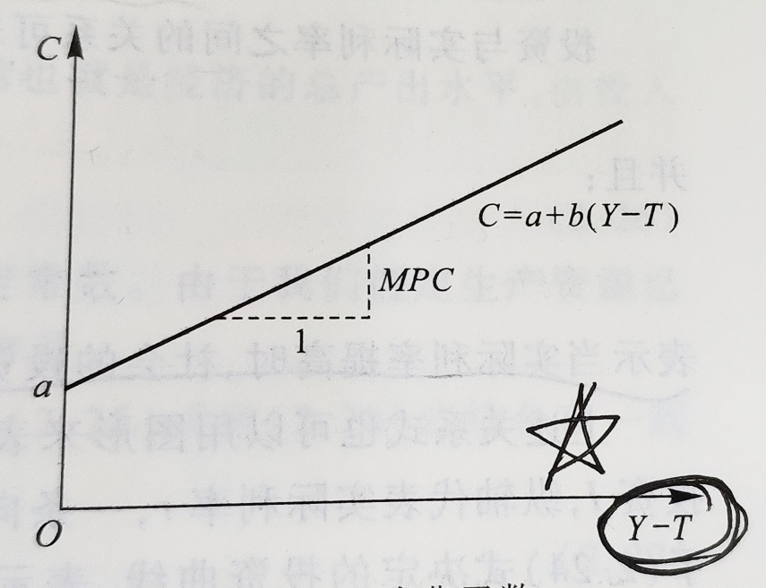
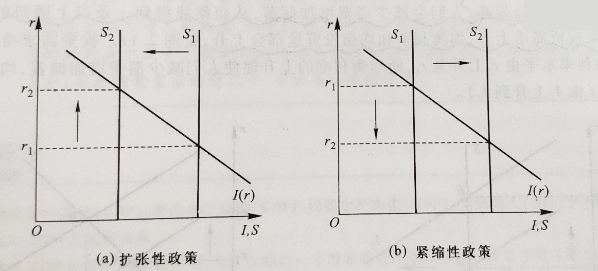
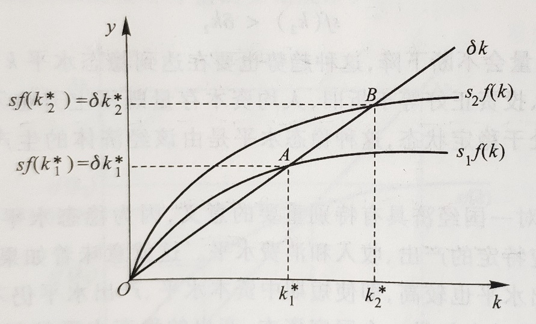
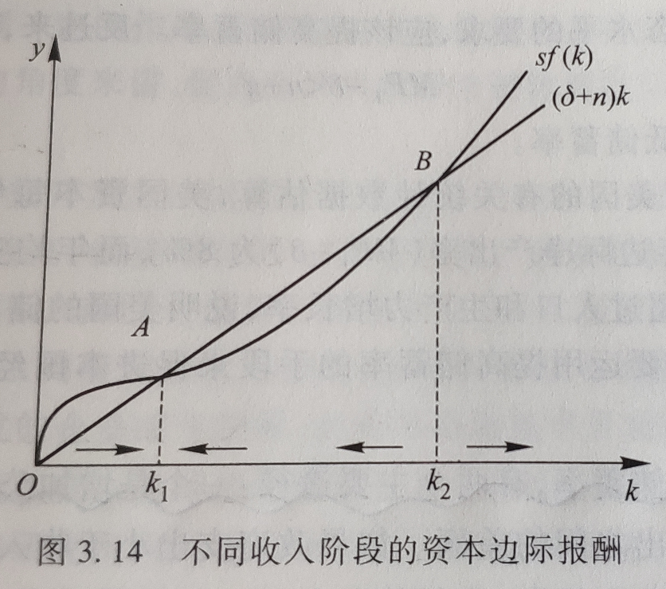
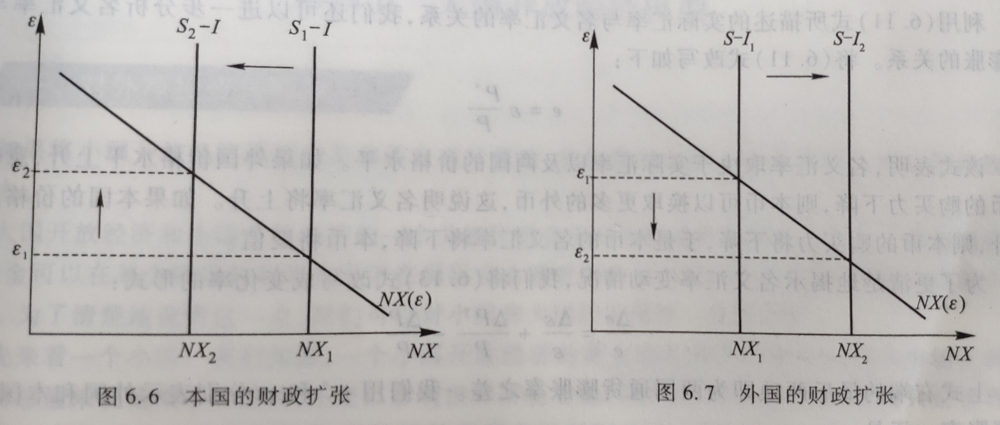
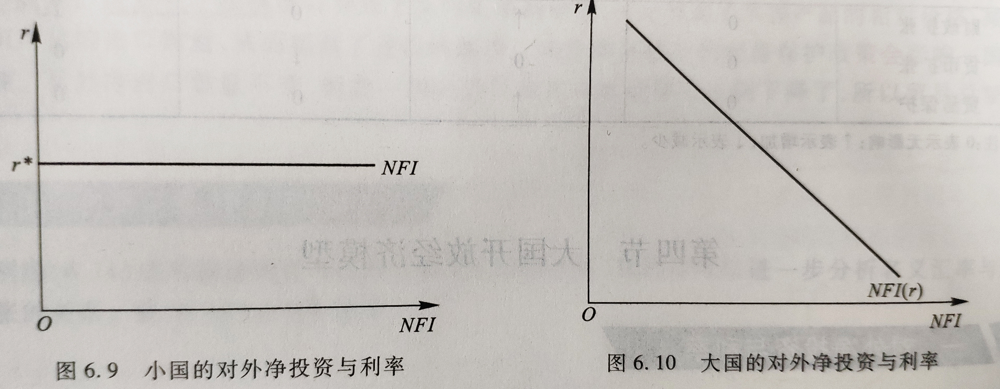
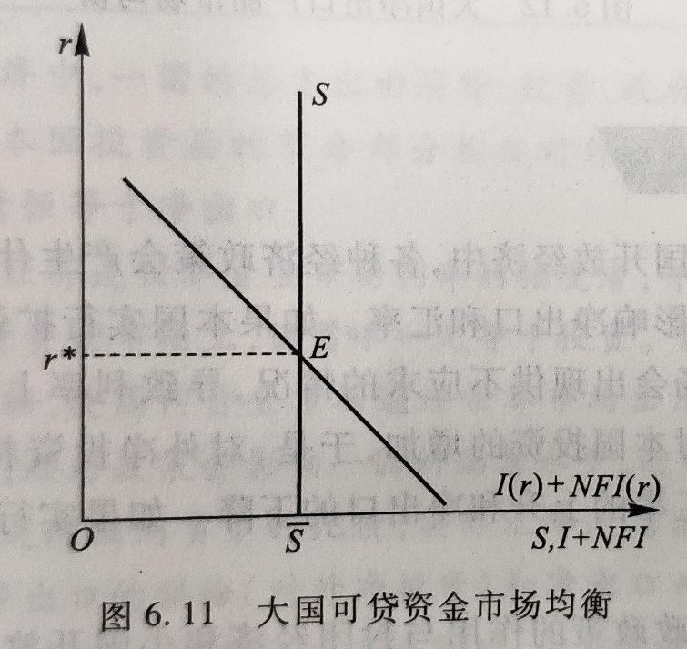
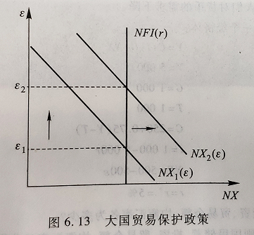
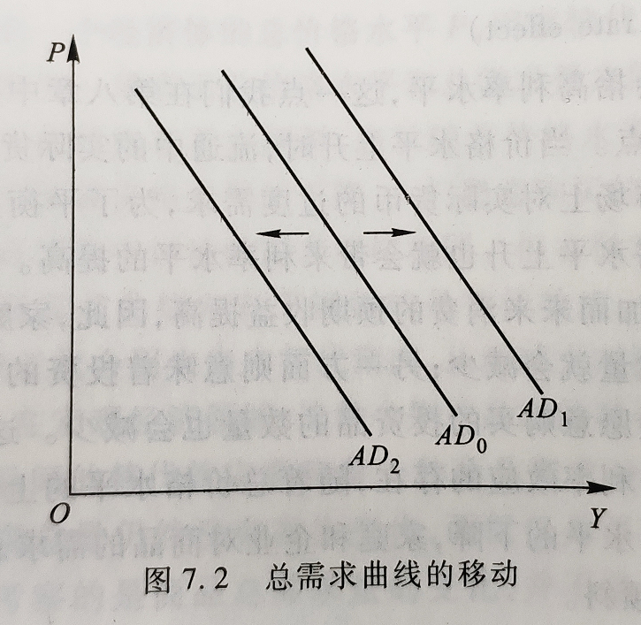

宏观经济学 - 学习笔记
Notes
宏观经济学这一学科研究的对象主要是大型经济单位，通常是指一国的国民经济.
2018-10-8

## 导论

### 宏观经济学的研究对象和方法

#### 什么是宏观经济学

宏观经济学这一学科研究的对象主要是`大型经济单位`，通常是指一国的`国民经济`。涉及的内容是`整个社会的价格水平、总产量、就业水平以及其他经济总量`的决定。

- 微观经济学：个人 / 家庭 / 企业（追求目标：效用、利润）
- 宏观：国家 / 社会（社会福利）

#### 宏观经济学的研究对象

##### 经济增长

`储蓄率、资本积累、技术进步、教育`都是取得高增长的重要条件

长期增长是得益于不断增加的人口为经济发展提供了稳定的`劳动力来源`，但更重要的是在劳动力数量既定的情况下的产出增长，也就是`人均产出的增长`。

##### 经济周期

经济运行过程中出现的阶段性的不规则的上下波动；通常用实际国内生产总值（GDP）和其他一些宏观经济指标的波动来衡量。

一个经济周期分成四个部分：收缩期，谷底，扩张期，顶峰

在特别的情况下，当一个收缩期缩得过于严重，就可能出现经济衰退（Recession）。经济衰退以实际 GDP 增长率`连续两个季度`的下降为标志，严重经济衰退之后的低谷被称为经济萧条（Depression）

1. <u>**失业率与经济周期**</u>

在经济周期的收缩期，失业率通常会上升；在扩张期，失业率则会下降

2. <u>**股票价格与经济周期**</u>

同失业率相比，股票价格与经济周期的吻合型稍显逊色。总的来说，股票价格能够反映经济周期的演变，并且由于其往往领先于经济活动的变化，因而具有一定的预测性（比如日本的股市「崩盘」揭示了「泡沫经济」的破灭）

3. <u>**通货膨胀与经济周期**</u>

当经济步入收缩期时，通货膨胀率往往随之下降，严重时甚至出现负数，也就是通货紧缩

##### 失业（重点）

1. <u>**失业的衡量**</u>

失业：是指在当前工资水平下愿意工作的人无法找到工作。一个国家的失业总人口被称为失业人口，有工作的人口总数被称为就业人口，而这之和是一国的劳动人口。

一个人被计入失业人口的先决条件是其必须`能够愿意工作`，同时满足以下条件任意一个：

- 没有工作，但在此前四周中进行过寻求工作的努力；
- 离开了原先的工作岗位，但正等着被召回原职；
- 期待着在 30 天内开始新的工作

2. <u>**`失业的类型`**</u>（重点）

- 摩擦性失业：来自劳动市场`正常变动`的失业被称为摩擦性失业。
- 结构性失业：这一类失业来自于`经济结构变动`导致特定地区或行业就业机会减少。
- 周期性失业：由于`经济扩张步伐变慢`或者`经济周期`而产生的失业被称为周期性失业。

3. <u>**充分就业**</u>

任何一个特定的时点，都有正在找工作的人和想雇人的企业。指的是`工作机会与失业人口数量相同`的状态。

充分就业下的失业率被称为自然失业率，**所谓自然失业率就是指那些与市场经济运行机制无关，由「自然」因素（如劳动市场人口流动、技术变化等）决定的失业人口**

4. <u>**失业的危害**</u>

- 产出和收入减少
- 人力资本流失：人力资本指个人所受教育和所掌握的技能的价值
- 犯罪率上升
- 人格尊严流失

##### 通货膨胀

简称通胀，指的是一国平均价格水平（三个指数来衡量：消费者价格指数 CPI、生产者价格指数 PPI、GDP 平减指数）的上升，与它相反的是通货紧缩。

1. <u>**通货膨胀率与价格水平**</u>

通货膨胀率是价格水平的百分比变化
$$
今年通货膨胀率 = \frac{今年的价格水平 - 去年的价格水平}{去年的价格水平} \times 100\%
$$

$$
通常来说：百分比变化 = \frac{即期 - 基期}{基期} \times 100\%
$$

上面公式中的价格水平通常选用`消费者价格指数`（CPI）的数字。

汇率的决定：购买力平价：绝对 / 相对

2. <u>**通货膨胀的货币的价值**</u>

当存在通货膨胀时，货币就会贬值，货币的实际购买力就会下降。

3. <u>**预期到的通货膨胀和未预期到的通货膨胀**</u>

##### 开放经济

任何一个有一定规模的国家的经济都是一个与其他国家有着大量贸易和金融联系的经济体，或者说是开放经济。

宏观经济学的研究范围就包括国与国之间经济纽带的联结方式以及由此产生的的各国经济的相互依存关系。

经济周期会借助国与国之间的贸易和借贷关系在世界范围内传导。

当一国的出口大于进口，称为贸易顺差；当进口大于出口，则是贸易逆差。出现贸易逆差的国家将不得不向其他国家借钱，用以支付进口的商品和服务超出出口的部分。出现贸易顺差的国家则可以把钱储备起来，或者购买其他国家的金融资产。

一国的对外借贷关系会发生货币的支出和收入，对外贸易也需要用货币进行交易和结算，因此，我们可以运用`国际收支`的概念来表示一国经济的总体对外收支平衡状况。

一国在一定时期所有对外收支总额的对照表称为`国际收支账户`。

对整个国际收支账户来说，收入和支出总是相等的，既国际收支账户总是平衡的。

1. <u>**经常项目**</u>

商品和服务的进口、商品和服务的出口、净利息收入、净转移支付、经常项目余额

净转移支付：一国对其他国家单方面的净支出，其中包括汇款、年金、赠与、援助等项目。

2. <u>**资本项目**</u>

外国在本国的投资、本国在外国的投资、统计误差和其他、资本项目余额

3. <u>**官方结算项目、官方储备**</u>

为了弥补经常项目的赤字，有两个办法，一是借钱（相当于「引进外资」）；二是动用银行存款（相当于「官方储备」，官方储备是指外汇储备）

##### 宏观经济政策

`财政政策`和`货币政策`是两种最主要的宏观经济政策形式。财政政策是通过`改变政府的支出和税收`对宏观经济的运行施加影响。

国债：既属于财政工具，又是货币工具。

**<u>三大货币政策工具</u>**：`存款准备金率、再贴现率，公开市场业务`

货币政策主要是指通过中央银行这一政策机构`控制货币供应量和利率水平`，进而影响宏观经济的运行。

政府宏观经济政策的目标主要应该包括以下五个方面的内容：

- 促进增长
- 稳定经济：就是减少经济周期的波动，这是宏观经济政策的基本目标之一。
- 减少失业
- 控制物价
- 对外平衡（国际收支平衡）

政府宏观经济政策的治理对象主要就是两个：失业和通货膨胀。但失业和通货膨胀往往存在者此消彼长的反向变动关系。

我国的目标：`在币值稳定的情况下实现经济增长。`

#### 宏观经济学的研究方法

由于研究对象和范畴的差异，宏观经济学的研究方法有其自身的特点。

- **三个市场划分**：金融市场、产品和服务市场、要素市场
- **行为主体的划分**：家庭、企业、政府
- **总量分析**：我们采取的是总量分析方法，也就是从总体上来考察个体的经济行为。
- **以微观经济分析为基础**：宏观经济学与微观经济学的区别仅在于`研究对象不同`，在`研究方法`上并没有本质区别。

### 宏观经济学的基本概念

#### 国内生产总值

国内生产总值是一定时期内（通常是一年）一国境内所产出的全部`最终`产品和服务的价值总和。这里的「最终产品和服务」指的是由最终使用者购买的物品和服务，而不是用作投入品以生产其他产品和服务，与之相对的叫做「中间产品和服务」。

国民生产总值，即一国公民在一定时期内所产出的全部最终产品和服务的价值总和。

`净要素支出`等于本国公民的国外收入减去外国公民在本国的收入：
$$
GNP - GDP = NFP
$$

#### 名义价值与实际价值

- 名义价值：以现时的货币作为衡量产品和服务价值量的标准。
- 实际价值：反映的是产品和服务的实际购买力。

$$
PV = A[\frac{1}{(1 + i)} + \frac{1}{(1 + i) ^ 2} + \ldots + \frac{1}{(1 + i) ^ n}]
$$

实际 $GDP$ 的公式：
$$
实际 GDP = \frac{名义 GDP}{价格水平} \times 100
$$

#### 流量与存量

流量是特定时间段中发生的经济量值，存量是特定时间点上现存的经济量值。

1. **储蓄与财富**：储蓄作为一个流量概念，其数量恰好等于与之相对应的财富存量的变化量。
2. **投资与资本**：显然，资本是一个特定时点上的存量概念，与之相对应的是投资，即一定时期内用于维持或提高资本存量的产出流量。
3. **经常项目与净国际投资地位**

#### 利率与现值

现值需要考虑货币的时间价值；`任何资产在进行价值比较时一定要放在同一时间进行比较`

### 宏观经济学的理论体系

#### 宏观经济学的形成与发展

##### 凯恩斯宏观经济学的形成与完善

宏观经济学形成一个相对独立的理论系统，是从英国经济学家凯恩斯 1936 年出版的《就业、利息和货币通论》一书开始的。推翻了之前的古典学派（亚当斯密，马歇尔，庇古）

20 世纪 30 年代的经济大萧条使古典经济理论收到了挑战。

凯恩斯理论的核心是`有效需求`，由于市场机制本身存在`某种缺陷（如价格、工资刚性）`，供给并不一定就能创造需求；总需求的大小又主要取决于三个`心理因素`，即「边际消费倾向」，「资本的预期收益」，和「流动性偏好」；国民经济就会偏离充分就业的自然水平。

谈论长期无意义。

> 在长期，我们都会死去。

因此政府通过有效运用`财政政策`来刺激总需求能够使经济回到充分就业的自然水平。

1. **<u>IS-LM 模型</u>**

IS-LM 模型将决定总需求的四个因素，消费（或储蓄 S）、投资（I）、货币需求（L）、货币供给（M）结合在一起，从而把产品市场和货币市场的均衡统一在一个理论框架中，较好地诠释了凯恩斯的总需求理论。

薄弱点：IS-LM 模型没有考虑到预期因素

2. **<u>消费、投资和货币需求理论</u>**

消费理论的发展以「生命周期假说」以及「永恒性收入假说」为代表；这两个理论的重大贡献在于都把预期因素引进了消费函数。

投资理论发展与托宾分不开；托宾的 $q$ 理论研究了实际资本存量和意愿资本存量之间的关系，强调了资本的预期收益在投资决策中的作用。

托宾还提出了资产选择理论，研究了投资者在不同金融资产中的选择行为，得出了风险和预期收益的对称关系，是宏观经济货币理论的重大发展，也是现代金融学的基本理论。

3. **<u>增长理论</u>**

凯恩斯的理论基本不涉及经济的长期发展问题。索洛的增长理论分析了决定均衡经济增长的因素。

4. <u>**宏观经济计量模型**</u>

以凯恩斯理论为基础的宏观经济学和以古典理论为基石的微观经济学并行成为这一时期经济学教科书理论体系的一大特色。

##### 新古典学派和新凯恩斯学派的论战

发的国家出现的「滞涨」即失业和通货膨胀并发的现象，严重地动摇了凯恩斯主义经济学的统治地位。

古典学派和凯恩斯理论的「综合」因而受到了许多经济学家的怀疑，其中以货币主义和理性预期学派影响最大。货币主义以弗里德曼为代表，理性预期学派以美国芝加哥大学教授卢卡斯为代表。

其争论内容主要集中在以下两个方面。

1. <u>**市场机制的有效性**</u>

市场机制是否是有效的核心是价格、工资是否具备`充分伸缩性`。如果具备完全伸缩性，市场就会通过自我调节达到`出清状态`。新古典学派从理性预期触发，对价格、工资的伸缩性作了新的解释。世纪经济周期模型解释了经济波动的原因在与技术变化。

新凯恩斯学派则认为，即是理性预期存在，价格、工资的刚性仍然是一种较为普遍的现象，从而导致市场不能出清。

> 市场出清：商品工资和价格具有充分的灵活性，能使需求和攻击迅速的达到市场平衡

2. <u>**政府干预的必要性**</u>

- 新古典学派认为价格、工资具有充分伸缩性，市场能够自我出清，因此政府干预经济是没有必要的。理性预期相信，由于此预期存在，政府的政策就有可能事先被人们预料到，人们会做出相应的对策从而使政策失效；
- 新古典学派还认为，最好的政策不是「最优」政策，而是「时间一致性」政策。政府要`保证政策的连贯性和波动性`，否则良好的愿望可能导致灾难性的后果。

而新凯恩斯学派则认为，由于市场机制本身存在着缺陷，市场出清只是一种理想状态，因此政府要负担起市场出清的任务，政府对经济进行干预是必要的。

##### 本书的理论结构

除导论外分为三部分：

- 第一篇考察宏观经济的长期模型
- 第二篇分析宏观经济的短期模型
- 在第三篇中我们对宏观经济模型中某些基础性问题进行进一步讨论

经济学中，`短期和长期是一对相当重要的概念`。

大多数宏观经济学家都认为，区分长期和短期的关键在于对不同的价格行为的假设。

## 宏观经济的衡量与均衡

我国在改革开放以后采纳 SNA（《国民账户体系》System of National Accounts） 体系。

#### 国民收入的衡量

##### 收入和支出的循环流动

国内生产总值（GDP）是指一个国家在某一时期（通常为一年）内所生产的所有最终产品和服务的价值总和，这是从`生产`的角度定义的 GDP。

在这里，我们运用一个国民收入流量模型来描述宏观经济的运行情况，然后从不同的角度来进一步讨论 GDP 的构成和测算问题。

如下是简单的收入和支出循坏流动图：

循环流动图中：

- 假设：金融市场只有借贷市场，即只有银行
- 政府的购买支出（G）只考虑购买性支出，不考虑~~转移性支出（再分配）~~

从循环流动图中可知，我们可以用另外两种方法来预测 GDP（之前定义的是`生产法`），一种方法是从`收入的角度`出发，GDP 是指所有生产要素收入的总和，在图中，它等于家庭提供生产要素的全部收入，也就是国民收入；另一种方法是从`支出的角度`出发，利用家庭提供的生产要素，企业生产产品和服务供给给市场。
$$
\begin{align}
&\;\;\;\;\;\;\;\;支出法 \equiv 收入法 \equiv 生产法 \\
&\;\;\;\;\;\;\;\;\;\;\;\;↑\\
&\;\;\;\;\;\;\;\;\;\;基准\\
&收入法与支出法的差异称为错误与遗漏
\end{align}
$$

`生产法一般不涉及核算问题，只给出定义`

##### 总支出的方法

从循环流量图可以看出，用总支出的方法来计算国民收入，GDP 可以分为是大部分：消费支出（C）、投资支出（I）、政府购买（G）和净出口（NX），用国民收入 Y 来表示 GDP：
$$
Y \equiv C + I + G + NX
$$
这是一个无条件成立的恒等式，以上式子的左边是总收入，右边是总支出，因此我们又把它称为国民收入恒等式。

1. **<u>消费支出（C）</u>**

消费支出指的是本国居民对最终产品的服务和购买。

消费支出进一步又可以分三类：耐用消费品、非耐用消费品和服务支出

`注意：耐用消费品不包括住房，住房支出在总支出中作为投资处理`

2. **<u>投资支出（I）</u>**

投资支出由企业固定投资、住房投资、和`存货投资`。

- 企业固定投资是指购买新增资本品的支出，比如设备、厂房、办公楼的支出
- 住房投资是指购买新居民住宅的支出
- 将存货的变动作为企业存货投资来处理，是为了使企业的支出与生产要素得到的收入一致起来。如果企业的存货增加，存货投资就是正的；反之就是负的。

3. **<u>政府购买</u>**

指各级政府购买产品和服务的支出，其中的转移支付不计入 GDP 中。

4. **<u>净出口（NX）</u>**

净出口指的是出口额减去进口额的差额

是净出口而不是净进口是因为：`国外购买国内的生产`

##### 总收入的方法

1. <u>**国民生产总值**</u>

GNP（国民生产总值）等于家庭的全部收入，也就是一国所有生产要素收入的总和。

2. <u>**国民生产净值**</u>

从 GNP 中减去折旧，就可以获得国民生产净值。折旧是对一定时期内因经济活动而引起的固定资产消耗的补偿。
$$
NNP = GNP - 折旧
$$

3. <u>**国民收入**</u>

国民收入（National income，简称 NI，注意：这里的国民收入是值的狭义的国民收入，而广义的国民收入 Y 一般就代表 GNP 或 GDP）等于国民生产净值减去企业间接税：
$$
NI = NNP - 间接税
$$

> 间接税，主要指比较好转嫁的税，比如增值税。

国民收入包括参加生产过程的所有生产要素所有者的收入，由五部分收入组成：劳动收入、业主收入、租金收入、企业利润、净利息收入，即：
$$
NI = 劳动收入 + 业主收入 + 租金收入 + 企业利润 +净利息收入
$$

- 劳动收入：工人工资、补贴以及雇主向社会保险机构交纳的社会保障金。
- 业主收入：非公司制小企业的收入，以及不受人雇佣的独立生产者的收入，包含企业收入和劳动收入
- 租金收入：出租土地、房屋等资产的租金收入
- 企业利润：销售收入扣除工资、租金以及其他成本项目后的利润
- 净利息：个人从企业所获得的因资金借贷所产生的净利息，`不包括个人之间因借贷关系而发生的利息和由购买政府公债而得到的利息。`

4. <u>**`个人收入`**</u>

用个人收入这个概念来表示个人实际得到的收入
$$
PI = NI - 公司利润 - 社会保障金 + 政府转移支付 + 红利 + 利息调整
$$

- 政府转移支付：退休金、失业保险金、社会救济金
- 红利：现金红利、股票红利
- 利息调整：个人总的利息收入减去上述净利息收入后的余额（比如国债利息，私人借贷利息）

5. <u>**个人可支配收入**</u>

$$
DPI = PI - 个人所得税 - 非税收性支付
$$

非税收性支付：行政事业性收费

##### GDP 衡量中的其他问题

1. <u>**增加值法**</u>

>  为了避免重复计算，GDP 中只包括最终产品的价值，因为最终产品价值已经包括了中价产品的价值。

但是在实践中，中间产品和最终产品有时候很难进行区别。`解决这个问题的方法是运用增加值法来避免重复计算。`把每一生产过程的增加值加总即等于这个产品的最终价值。

2. <u>**本期产出**</u>

GDP 是本期生产的产品和服务的价值构成的。因此，GDP 应该排除那些在过去生产的，当前又重复交易的产品。

3. <u>**市场价格**</u>

一国经济中有些经济活动不进入公开市场交易是因为没有市场价格，也就无法计入 GDP 之中，这主要有两种情况。

- 地下经济：为了逃避政府管制所从事的经济活动，为逃税或逃避法律， 或本身的就属于非法行为。
- 非市场经济活动：公开的但是没市场交易行为的经济活动

4. <u>**社会福利**</u>

- 闲暇
- 自然资源资源和环境
- 收入分配：收入分配是否平均

#### 价格指数和失业率

##### 名义 GDP 和实际 GDP

- 名义 GDP 是指一定时期内`以当前市场价格`来测算的过国内生产总值。
- 实际 GDP 是以`过去某一年（称为基年）`的价格为标准，测算 GDP 数值。

实际 GDP 可以衡量两个不同时期经济中物质产量的变化。实际 GDP <u>剔除了名义 GDP 中的价格变动因素</u>，它能准确地反映一国实际产量的变化。

##### 价格指数

1. <u>**GDP 消胀（缩减）指数**</u>

是给定年份的名义 GDP 和实际 GDP 之间的比率，即：
$$
GDP 缩减指数 = \frac{名义 GDP}{实际 GDP} \times 100
$$

2. <u>**消费者价格指数**</u>

CPI 是衡量价格水平的另一个重要指标。

通常是通过抽样调查的方式得到的。以一些具有代表性的产品和服务为样本，比较根据当年价格计算的商品总价值和根据基年价格得到的商品总价值，得到的比值就是消费者价格指数。

`与 GDP 缩减指数的区别：`

- GDP 缩减指数组合更广泛，包含所有的商品和服务的价格信息
- 进口品不计入 GDP，但如果进口品在消费中占有比较重要的地位，就会被计入 CPI
- CPI 所衡量的商品组合的数量是固定的，而 GDP 缩减指数所涉及的商品组合的数量是变动的。

假设某经济体只生产 A、B 两种商品，那么：
$$
\begin{align}
GDP 缩减指数& = \frac{名义 GDP}{实际 GDP} \times 100\\
& = \frac{当年 A 价格 \times 当年 A 产量 + 当年 B 价格 \times 当年 B 价格}{基年 A 价格 \times 当年 A 产量 + 基年 B 价格 \times 当年 B 价格} \times 100
\end{align}
$$

$$
CPI = \frac{当年 A 价格 \times 基年 A 产量 + 当年 B 价格 \times 基年 B 价格}{基年 A 价格 \times 基年 A 产量 + 基年 B 价格 \times 基年 B 价格} \times 100
$$

其中 GDP 缩减指数是帕氏指数，而 CPI 是拉氏指数。

值得一提的是，生产者价格指数（PPI）是被经常使用的第三个价格指数，与 CPI 相似，使用固定的商品组合（包括原材料和中间产品），衡量的不是消费者实际支付的零售价格，而是生产过程中开始阶段的价格水平。

> PPI 和 CPI 之间的联动关系不是必然的，比如中国 21 世纪初，产量过剩导致形成「完全竞争市场」，任何厂商只要提高一点价格，就会被逐出市场。

如果我们用 $P_t$ 表示 $t$ 期的价格，$\pi_t$ 表示 $t$ 期的通货膨胀率，那么有：
$$
\pi_{t + 1} = (P_{t +1} - P_{t}) / P_{t}
$$

##### 失业的计量

$$
劳动年龄人口 = 劳动人口 + 不在劳动人口
$$

以下人员一般不被列入劳动年龄人口：

- 军队人员
- 在校学生
- 家务劳动者
- 退休或因病退职人员以及丧失劳动能力、服刑犯人等不能工作的人员
- 不愿工作的人员
- 在家庭农场或家庭企业每周工作少于 15 小时的人员

$$
\begin{align}
失业率& = \frac{失业人口}{劳动人口} \times 100\%\\
& = \frac{失业人口}{就业人口 + 失业人口} \times 100\%
\end{align}
$$

失业人口：

- 有劳动能力但没有工作
- 当前准备工作
- 正在寻找工作

失业率的测算是比较复杂的，因为就业人口、失业人口和不在劳动人口三者间处于变动之中。

##### 奥肯定律

失业率的上升会随着实际 GDP 的下降。

根据`美国`的经验数据显示：

$$
实际 GDP 变化的百分比 = 3\% - 2 \times 失业率变化率
$$

因为用的美国数据，系数不一定具有普适性，但是线性关系确实存在。

#### 国民收入的生产、分配和消费

##### 国民收入的生产

国民经济的产出水平或者说总收入由两个因素决定：

- 投入的生产要素
- 各种生产要素与产出之间的技术关系

通常用生产函数来表示。

生产要素是指生产或服务生产过程中投入的投入品，如劳动、资本、土地等。其中资本和劳动是最重要的生产要素（土地相对既定），我们分别用 K 和 L 来表示一个经济中的资本存量和就业人数。

生产函数具有如下一般形式：

$$
Y = F(K, L)
$$

很多生产函数都具有规模报酬不变的性质。所谓规模报酬不变是指当投入的生产要素增加或减少一定比例，产出也变化相同的比例，用数学公式表示，就是：

$$
\lambda Y = F(\lambda K, \lambda L), \lambda > 0
$$

现在我们以`柯布 - 道格拉斯生产函数`为例来考察规模报酬情况，它的表达式是：
$$
Y = F(K, L) = AK^{\alpha}L^{\beta}
$$

- A 表示综合技术水平：
  - 经济管理水平
  - 劳动力素质
  - 引进先进技术
- $\alpha$ ：资本产出贡献 / 弹性，可以表示为资本投入变化引起产出变化的速率
- $\beta$：劳动产出贡献 /  弹性，可以表示为劳动投入变化引起产出变化的速率

证明：$\beta$ 可以表示劳动投入变化引起产出变化的速率
$$
\begin{align}
劳动的边际产量：mP_L &= \frac{\partial Y}{\partial L} \\
&= AK^{\alpha} \cdot \beta L^{\beta - 1} \\
&= \frac{\beta A K^{\alpha} \cdot L^{\beta}}{L} \\
&= \frac{\beta Y}{L}
\end{align}\\
\therefore \beta = \frac{\partial Y / Y}{\partial L / L}
$$
同理可证 $\alpha$ 表示资本投入变化引起产出变化的速率。

<u>**柯布 - 道格拉斯生产函数的三种情况**</u>：

- $\alpha + \beta > 1$：递增报酬型，按现有技术扩大生产规模，对增加产出是有利的
- $\alpha + \beta < 1$：递减报酬型，按现有技术扩大生产规模，对增加产出是不利的
- $\alpha + \beta = 1$：不变报酬型，产出随生产要素犹如增加而增加相同比例

不变报酬型证明：
$$
\begin{align}
F(\lambda K, \lambda L) &= A(\lambda K)^{\alpha}(\lambda L)^{1 - \alpha}\\
&= \lambda(AK^{\alpha}L^{1 - \alpha}) \\
&= \lambda F(K, L) \\
&= \lambda Y
\end{align}
$$

国际上 $\alpha$ 在 0.2 ~ 0.4 之间波动，我国在 0.2 ~ 0.3 之间波动

$\alpha, \beta, A$ 计算方法：根据历史数据，和线性方程：
$$
ln Y = ln A + \alpha lnK + (1 - \alpha)ln L
$$

##### 国民收入的分配

生产要素的价格就是要素所有者的收入，因此，我们要讨论国民收入的分配，也就是要分析生产要素价格是如何确定的。

为了简化我们的分析，首先假定产品市场和要素市场都是完全竞争的。同时我们还假定企业生产只需要投入两种生产要素：资本和劳动，即企业的生产函数仍然是：
$$
Y = F(K, L)
$$

`企业生产的目的是为了利润最大化`，利润（Z）等于收益减去成本，企业的总收益（TR）等于销售量（即产量 Y ）乘以价格（P），企业的总成本（TC）由劳动成本和资本成本两部分构成，其中劳动成本等于劳动数量乘以工资（W），而劳动成本等于资本资本数量乘以租金（R），我们用数学表达式表示收益和成本的关系，得到：
$$
TR = PY = PF(K, L) \\
TC = WL + RK \\
\begin{align}
\therefore Z &= TR - TC \\
&= PF(K, L) - WL - RK
\end{align}
$$
问题一：劳动的价格为多少时，使利润最大化？

由于完全竞争企业是价格的接受者而不是制定者，它只能通过选择不同的要素投入量来使自己的利润最大化。

随着要素投入量的增加，要素投入所增加的产量是递减的，这就是要素的边际产量递减规律，也称为边际生产力递减规律。

当资本投入不变时（$K = \bar{K}$）时，劳动的边际产量就是曲线上每一点的斜率，随着劳动投入量的增加，曲线越来月平坦，表明劳动的边际产量不断减少。

所以，利润最大化时，就是 Z 在 L 上的导数为 0 时：
$$
\frac{\partial Z}{\partial L} = P \frac{F(K, L)}{\partial L} - W = 0 \\
\because \frac{F(K, L)}{\partial L} = MP_L （MP_L 为边际产量）\\
\therefore P \times MP_L － W = 0 \\
即：MP_L = \frac{W}{P}
$$
即企业利润最大化要求劳动的边际产量等于实际工资。

因此劳动的边际产量曲线实际上就是企业对劳动的需求曲线，由于边际产量递减，劳动需求曲线就是一条向右下倾斜的曲线。

假定一定时期劳动总供给量为 L，根据利润最大化，可决定出均衡的实际工资水平，在完竞争市场上，劳动的报酬就是劳动的边际产量。

问题二：资本的价格为多少时，才使利润最大化？ 

同上理可证：资本的边际产量等于资本的实际租金。类似的，由于资本边际产量递减，企业的资本需求曲线也是一条向右下倾斜的曲线。

综上所述：

工人的实际工资等于劳动的边际产量，资本的实际租用价格等于资本的边际产量，因此，总的工资收入是 $MP_L \times L$，而总的资本收入是 $MP_K \times K$。

总收入中扣除工资收入和资本收入后余下的部分是企业的利润，即：
$$
利润 = Y - MP_L \times L - MP_K \times K \\
可得：Y = MP_L \times L + MP_K \times K + 利润
$$
国民收入就被分为三个部分：劳动的报酬、资本的报酬和利润。

## 在完全竞争的条件下，如果生产函数具有规模报酬不变的性质，国民收入将正好分配给各种生产要素，这时利润就等于零（利润 = 经济利润 + 会计利润，此利润指经济利润），这一规律被称为欧拉定理。

$$
Y = f(K, L) = MP_L \times L + MP_K \times K
$$

##### 国民收入的消费

为了简化分析，我们先考虑`封闭经济情况`面，即假定不存在外国经济部门，这时 NX 就等于零。在封闭经济中，实际 GDP 就等于消费、投资、政府购买之和，即：
$$
Y = C + I + G
$$
下面就来分析这三部分的变化规律

1. <u>**消费**</u>

实际影响人们消费水平的是个人可支配收入，我们可以用国民收入 Y 减去税收 T 来表示，因此我们可以把消费与收入之间的关系表示为：
$$
C = C(Y - T) \\
（并且 \frac{d C}{d(Y - T)} > 0）
$$
【重要方程】 `消费函数经常被写成线性方程的形式`：
$$
C = a + b(Y - T)
$$
常数 $a$ 为自生消费，是指不随收入变化的那部分消费，通常是指为了生存而必需的消费。$bY$ 为派生消费，是指由于收入增加而导致的消费。$b$ 的边际消费倾向，是指每增加一元收入所增加的消费部分。

注意上图函数，`横坐标为 Y - T`，而不是 Y.

2. <u>**投资**</u>

利息构成投资的成本，当利率较低时，投资的成本就较小，投资者就会愿意增加投资；而利率高时，投资者就会因为营利机会减少而缩紧投资，因此投资需求与利率之间是一种反比关系。

我们用 $\pi$ 代表通货膨胀率，实际利率 $r$ 与名义利率 $i$ 有如下关系：
$$
r = i - \pi
$$
投资与实际利率之间的关系可表达为如下的投资函数：
$$
I = I(r) \\
（并且 \frac{dI(r)}{dr} < 0，负相关关系）
$$
表示当实际利率提高时，社会的投资水平随之下降。

3. 政府购买

在这里，我们可以把 $T$ 解释成税收减去转移支付后的净值，或者净税收，这是家庭的可支配收入仍可以用 $Y - T$ 来表示。

事实上，$G$ 和 $T$ 的变化由政府的经济政策所决定，与经济模型本身无关，因而我们在下面的分析中，$G$ 和 $T$  被作为外生变量。

#### 宏观经济的均衡

##### 产品市场的均衡

总需求由消费、投资和政府购买三部分组成，并且消费取决于可支配收入，投资取决于实际利率，政府购买和税收都是外生给定的。我们就有总需求的函数：
$$
Y = C + I + G = C(Y - \bar{T}) + I(r) + \bar{G}
$$
总供给也就是经济的总产出水平，有投入的生产要素决定：
$$
Y = F(\bar{K}, \bar{L}) = \bar{Y}
$$
产品市场的均衡条件就是使总需求与总供给相等，结合上两式：
$$
\bar{Y} = C(\bar{Y} - \bar{T}) + I(r) + \bar{G}
$$
实际利率是唯一可变的变量。实际利率的波动（通过调节投资规模的大小）能使总需求发生变动，从而使总需求与潜在实际国民收入水平相当。

##### 金融市场的均衡

我们仍从封闭经济的国民收入恒等入手，并将它改写成：
$$
Y - C - G = I
$$
其中（$Y - C - G$）是总收入扣除消费和政府购买后剩余的部分，称为国民储蓄。

`隐藏假设：在不改变消费条件下，有闲置资金，就储蓄`

国民储蓄又可以分为两部分，即：
$$
Y - C - G = (Y - T - C) + (T - G)
$$
$Y - T  - C$ 表示可支配收入减去消费，称为私人消费。$T - G$ 表示政府收入减去支出后剩余部分，称为公共储蓄。

将已知的各项条件收入代入国民收入恒等式，得到：
$$
\bar{Y} - C(\bar{Y} - \bar{T}) - \bar{G} = I(r)
$$
此式左边表示国民储蓄 $S$，$S$ 也是不变的，由此可以得到金融市场的均衡条件为：
$$
\bar{S} = I(r)
$$

##### 财政政策的作用

1. <u>**政府购买的变动**</u>

由于潜在国民收入水平由投入的生产要素决定，是保持不变的，消费也是不变的，政府购买的增加只会引起投资相同幅度的减少，而投资的减少意味着利率肯定是提高了。
$$
\bar{Y} = C(\bar{Y} - \bar{T}) + I(r)\uparrow + G\downarrow
$$
政府增加的购买正好等于私人企业减少的投资，也就是说，政府购买「挤出」了私人投资。

（此句有争议，若政府购买企业的东西，企业增加资本和劳动力的投入，反而是增加了投资）

政府购买的增加减少了公共储蓄，由于私人储蓄保持不变，从而总的国民储蓄也降低了。

2. **<u>税收变动</u>**

$$
\bar{Y} = C(\bar{Y} - T\downarrow)\uparrow + I(r)\downarrow + \bar{G}
$$

减税的效果类似于增加政府购买。（是否「挤出」私人投资同样有争议）

##### 投资需求的变动

我们发现均衡的投资量并没有因为投资需求的上升而上升，这是因为储蓄在这里被定义为既定不变的，因此固定的储蓄量决定了固定的实际投资量，投资需求的增加只是使均衡利率水平从 $r_1$ 提高到 $r_2$（左图）。

我们假定随着利率的上升，储蓄的收益提高，人们会减少消费增加储蓄，从而就能得到一条向上倾斜的储蓄曲线。这时候，如果投资需求上升，均衡利率和均衡投资量都会上升（右图）。

## 经济增长

主要方法：归因模型、模型化

#### 资本积累

##### 基本假设

1. <u>**社会生产**</u>

新古典主义的生产函数

$$
Y = F(K, L)
$$

`第一个性质`是资本的边际产量（$MP_K$）劳动的边际产量（$MP_L$）大于零且`递减`，用数学语言来表示：

$$
MP_K = F_K = \frac{\partial F(K, L)}{\partial K} > 0, \frac{\partial MP_K}{\partial K} = \frac{\partial^2F(K, L)}{\partial^2K} < 0 \\
MP_L = F_L = \frac{\partial F(K, L)}{\partial L} > 0, \frac{\partial MP_L}{\partial L} = \frac{\partial^2F(K, L)}{\partial^2L} < 0 \\
$$

`第二个性质`就是`规模报酬不变`，即生产函数满足一次齐次性：

$$
\lambda Y = F(\lambda K, \lambda L)
$$

`第三个性质`就是资本（或劳动）趋向零时，资本（或劳动）的边际产量趋向无穷大；资本（或劳动）趋向无穷大时，资本（或劳动）的边际产量趋向于零，即：

$$
\lim_{K \to 0}F_K = \lim_{L \to 0}F_L = \infty\\
\lim_{K \to \infty}F_K = \lim_{L \to \infty}F_L = 0\\
$$

这个条件也成为「稻田条件」。

如 $y = Y / L$ 代表人均产出，$k = K / L$ 表示人均资本使用量，那么新古典生产函数可以写成：

$$
y = \frac{Y}{L} = F(\frac{K}{L}, 1) = F(k, 1) \\
（证明：规模报酬不变，令  \lambda = \frac{1}{L}） \\
于是我们得到：y = f(k)
$$

即`人均产出只与人均资本投入`有关，是人均资本使用量的函数。

2. <u>**消费、投资和储蓄**</u>

假设一个封闭的经济体系，而且在这个经济体系中不存在政府部门，那么第二章收入恒等式可以写成：

$$
Y = C + I
$$

用人均的概念来表示可得：

$$
\frac{Y}{L} = \frac{C}{L} + \frac{I}{L}
$$

或者：

$$
y = c +i
$$

也就是说，人均产出 $y$ 被分为人均消费 $c = C / L$ 和人均投资 $i = I / L$ 两部分。

如果不存在政府部门，国民储蓄 $S$ 就等于私人储蓄（$Y - C$），用 $s = S / Y$ 表示储蓄率。该经济体中的消费函数可以定义为：

$$
c = (1 - s)y
$$

用上式代替国民收入恒等式中的 $c$ 得：

$$
i = sy
$$

投资就成了人均资本量 $k$ 的函数（1 式）：

$$
i = sf(k)
$$

3. <u>**投资与资本积累**</u>

一个社会的投资会带来资本存量的变化，这是流量与存量的关系。但资本存量的变化不仅取决于投资，而且也取决于资本损耗即折旧。

我们假设一个经济中所有的资本都以一个固定的比例 $\delta$ 折损减少，我们称 $\delta$ 为评价折旧率。（投资 $I$ 是流量，资本 $K$ 是存量）

$$
资本存量变化量 \Delta K = 
\begin{cases}
+ \; 投资 \; I\\
- \; 折旧 \; \delta K
\end{cases}
$$

得到：

$$
I = \Delta K + \delta K
$$

即投资 $I$ 等于资本存量的变化量 $\Delta K$ 加上资本存量的折旧量 $\delta K$。

整理可得：

$$
I = (\frac{\Delta K}{K} + \delta)K
$$

其中 $\Delta K / K$ 为资本存量的增长率。用 $\delta k = \Delta K / L$（在劳动数量固定不变的情况下，$\Delta k = \Delta(K / L) = \Delta K / L$）表示人均资本的增量，又可以写成人均的表示形式（2 式）：

$$
i = (\frac{\Delta k}{k} + \delta)k
$$

因此，在人均资本存量既定的情况下，人均投资 $i$ 取决于人均资本积累的速率 $\Delta k / k$ 和折旧率 $\delta$。

##### 资本积累和稳态

将 2 式代入宏观经济均衡方程 1 式得：

$$
\Delta k = sf(k) = \delta k
$$

将 $sf(k) \; 和 \; \delta k$ 画入坐标图：

如图中的 $A$ 点，此时 $\Delta k = 0$，即人均资本存量保持稳定不变。我们称这个资本存量的`稳定状态`，简称`稳态`，记为 $k^*$。人均资本拥有量达到稳态时，即 $k = k^*$，则上式可以写成：

$$
sf(k^*) = \delta k^*
$$

也就是说，当一个经济处在稳态时，新增投资恰好等于折旧。

##### 储蓄对稳态的影响

如果储蓄率较高，那么长期中经济体会有较高水平的资本存量和产出，如果储蓄率较低，情况会相反。

但值得我们注意的是，较高的储蓄率导致较快的增长仅仅是暂时，因为在长期中，一个经济体一旦达到它的稳态，增长的动力就会消失。此称为`索罗模型的零增长结论`。

#### 资本积累的黄金律

##### 黄金律

对任何一个经济体来说，资本数量的提高（即经济增长）并不是人们追求的根本目标，而是消费福利最大化。

在一个稳态经济中，长期消费水平最大化就体现在选择一个消费水平最高的稳态资本存量。在索罗模型中，长期消费水平最高的稳态资本存量被称为资本积累的`黄金律水平`，记为 $k_{g}^{*}$.

我们把收入恒等式 $y = c + i$ 改写成：$c = y - i$，或者

$$
c = f(k) - i
$$

即消费等于产出减去投资。

有因为在稳定状态投资等于折旧 $\delta k^*$，因此可以用 $k^*$ 代替 $k$，用 $\delta k^*$ 代替 $i$，这样我们得到稳定状态的人均消费：

$$
c^* = f(k^*) - \delta k^*
$$

因此，只有资本存量等于黄金水平，也就是两条曲线的斜率相同，稳态水平的消费达到最大，整个经济体也就处在黄金律稳定状态。

因此，长期消费水平达到最大化，也就是黄金律稳态水平的基本条件是：

$$
MP_K = \delta
$$

即在资本的黄金律水平，资本的边际生产力等于折旧率。

##### 黄金稳态过程

一个经济会自动收敛于一个稳定状态，但不会收敛到一个黄金律的稳定状态。

政府可以通过改变储蓄率来改变一个经济的稳态资本存量，从而使达到黄金律的稳态水平。

#### 人口增长与技术进步

`放松假设进行研究`

##### 人口增长

劳动力数量不再是固定不变的，而是不断增长的。因此，人均资本变化率 $\Delta k / k$ 为：

$$
\frac{\Delta k}{k} = \frac{\Delta K}{K} - \frac{\Delta L}{L} \\
---------------\\
推导过程：\\
人均资本使用量 k = K / L \\
两边取对数：lnk = lnK - lnL \\
再对时间 t 求导：\frac{dk/dt}{k} = \frac{dK/dt}{K} - \frac{dL/dt}{L} \\
令 dX/dt = \Delta X 则可得人均资本变化率.
$$
即人均资本增长率为资本存量的增长率减去劳动力的增长率（用 $n​$ 表示）。

代入 $I= (\frac{\Delta K}{K} + \delta)K$ 整理得：

$$
i = (\frac{\Delta k}{k} + \delta + n)k
$$

这表明，在资本存量一定的情况下，人均投资不仅取决于人均资本增长率和折旧率，而且还取决于人口增长率。

将上式整理得：

$$
i = \Delta k + (\delta + n)k
$$

我们可以把 $(\delta + n)k$ 项看作是一种`平衡投资`，即存在折旧和人口增长的情况下，为了保持人均资本不变需追加的投资。

将上式代入上上式：

$$
\Delta k = sf(k) - (\delta + n)k
$$

与之前的图一样，我们可以在图中画出人均投资曲线 $sf(k)$ ，再画出包括折旧和人口增长因素的平衡投资线 $(\delta + n)k$。

当 $k$ 正好等于稳态水平时，新增投资对人均资本存量的正效应，正好与折旧和人口增长的负效应相抵消，即：

$$
sf(k^*) = (\delta + n)k
$$

我们看到，引进人口增长模型在三个方面改变了基本的索罗模型：
1. 首先，人口增长使模型离现实的经济增长更近了一步。因为在有人口增长的稳态，虽然资本和产出不变，但是劳动力的增长引起了存本存量和总产出的增长。
2. 其次，人口增长提供了国家之间贫富差距的一种解释，可以用用下图解释，高的人口增长率的国家的消费水平更低。

3. 最后，人口增长改变了资本积累黄金率稳态水平，将曾口增长因素稳态水平代入之前的式子：

$$
c^* = f(k^*) - (\delta + n)k^*
$$

因此，能够使稳态消费最大化的黄金律资本稳态水平 $k_g^*$，必须满足：

$$
MP_k = (\delta + n)
$$

##### 技术进步和劳动效率

一般来说，如果技术进步发生，他会通过影响劳动和资本投入使用效率对产出产生影响。为了分析方便，我们`假定技术进步仅仅影响劳动和使用效率`，而不影响资本的使用效率。这样，我们可以定义体现技术进步的「有效劳动」：

$$
E = T \times L
$$

我们将有效劳动 $E$ 取代上述新古典生产函数的 $L$，就能得到反映有效劳动的生产函数：

$$
Y = F(K, E)
$$

有了有效劳动的概念，我们对人均的概念也要进行重新定义。我们仍用小写字母表示人均数量，但现在的「人」已经不是一般意义上的劳动 $L$，而是包含技术进步的有效劳动 $E$，因此，我们把 $k = K / E$ 称为有效人均资本，$ = Y / E$ 称为有效人均产出（`在考虑技术进步时，所有的人均变化量均为有效劳动人均变化量`）。

有效人均函数仍然可以写成：$y = f(k)$

虽然形式和之前的相同，但是内容已经发生了根本的变化。原来的人均生产函数的 $k$ 和 $y$ 可以看作劳动效率 $E$ 不变且等于 $1$ 时的特例。有效人均资本变化率 $\Delta k / K$ 可表达为：

$$
\frac{\Delta k}{k} = \frac{\Delta K}{K} - \frac{\Delta E}{E}\\
或者：\\
\frac{\Delta k}{k} = \frac{\Delta K}{K} - \frac{\Delta L}{L} - \frac{\Delta T}{T}
$$

劳动生产力增长率反映了技术进步的速率，我们用 $g$ 来表示。因此，有效人均投资与有效人均资本存量应该有如下的关系：

$$
i = \Delta k + (\delta + n + g)k
$$

平均投资项多了一个劳动生产力增长率即技术进步率 $g$.

##### 有技术进步的稳态

我们用分析人口增产的同样方法，按照之前人口增长的式子，可得：

$$
\Delta k = sf(k) - (\delta + n + g)k
$$
这表明技术和人口增长等一样，都会降低人均有效资本积累的速度，但是与人口增长方式不同的是，技术进步是通过每个劳动力分更多的资本存量来降低 $\Delta k$.

有效人均产出 $y = Y / E$ 的增长率可表达为：

$$
\frac{\Delta y}{y} = \frac{\Delta Y}{Y} - \frac{\Delta L}{L} - \frac{\Delta T}{T}
$$

经济体一旦达到稳态，有效人均资本的增长率等于零，有效人均产出增长率也等于零（$\Delta y = 0$），稳态形式为：

$$
\frac{\Delta Y}{Y} = n + g\\
或者\\
\frac{\Delta Y}{Y} - \frac{\Delta L}{L} = g
$$

其中 $\Delta Y / Y$ 为总产出增长率即经济增长率，$\Delta Y / Y - \Delta L - L$ 为人均产出增长率。

在稳定状态，虽然有效人均资本 $k = K / E$ 和有效人均产出 $y = Y / E$ 都不变，但是总产出 $Y$ 和人均产出 $Y / L$ 却分别以 $n + g$ 和 $g$ 的速率增长。

（图略，斜率改为 $\delta + n +g$ 即可）
很容易证明有效人均消费的稳态水平为：
$$
c^* = f(k^*) - (\delta + n +g)k^*
$$

因此，稳态人均消费实现的最大化的条件是：

$$
MP_K = \delta + n + g\\
或者\\
MP_K - \delta = n + g
$$

其中 $MP_K - \delta$  为资本的边际净产出或边际净收益率。在资本积累的黄金律水平，资本的边际净收益率 $MP_K - \delta$ 应该等于实际总产出的增长率 $n + g$.

#### 增长理论的应用

次节略讲

##### 增长的源泉

第二章介绍的柯布 - 道格拉斯生产函数：

$$
Y = AK^{\alpha}L^{1 - \alpha}
$$

其中 $A$ 是反映技术变动的自生增长因素，也称为全要素生产力。$A$ 与前面的「劳动增长型」技术进步有所不同，它不仅衡量了技术进步通过提高劳动效率对产出的产生影响，而且也衡量了技术进步通过提高资本效率对产出的产生影响。因此，$A$ 通常也称为中性技术进步，`表明了技术进步不偏向任何一个因素，其影响是中性的`。

我们把生产函数改写成增长率的形式，就能更清楚地了解两个要素以及技术进步在经济增长中的作用：

$$
\frac{\Delta Y}{Y} = \alpha \frac{\Delta K}{K} + (1 - \alpha)\frac{\Delta L}{L} + \frac{\Delta A}{A}
$$

也就是说，经济增长率 $\Delta Y / Y$ 取决于资本增长率的贡献 $\alpha (\Delta K / K)$、劳动增长率的贡献 $(1 - \alpha)(\Delta L / L)$ 和技术进步率 $\Delta A / A$。

$$
\frac{\Delta A}{A} = \frac{\Delta Y}{Y} - \alpha \frac{\Delta K}{K} - (1 - \alpha)\frac{\Delta L}{L}
$$

在这里，技术进步的贡献是根据产出增长率扣除要素投入量增长率贡献得出的余额，也称为「索洛余值」

##### 内生增长理论

首先，索洛模型假设条件的一个结论是，当资本存量增长时，经济会增长，但由于边际报酬递减，经济增长的速度会减慢，直到最终停止而达到一个稳定状态。因此，一旦一个经济体达到稳定状态，人均的资本存量和产出的增长就会停止，人均意义上的持续经济增长可是不能发生的。

这一结论并不符合工业化国家经济增长的现实。

索洛模型的另一个结论是，由于穷国的人均资本存量低于富国，每单位新增投资能产生较高的边际报酬，因此穷国应该比富国增长更快，各国经济应该有「趋同」的趋势。穷国的经济增长应该快于富国。

这一结论也不符合世界各国经济增长的现实。

索洛模型的某些结论与现实的偏离，关键在于模型中储蓄率、人口增长、资本折旧率和技术进步都是外生变量。

我们自然会想到将储蓄率、人口增长和技术进步等重要因素作为内生变量来考虑，从而可以由模型的内部来决定经济的长期增长。这种增长模型（通常也称为新增长理论）称为内生增长模型。

我们仍然从生产函数入手，假定生产函数采取如下形式（我们假定劳动力数量不变）：

$$
Y = AK
$$

内生增长理论理论把一国总资本的边际报酬不变主要归纳为以下两个原因：
1. 一个原因是人力资本。资本存量增长，不仅包括对物资资本的投资，而且也包括对人力资本的投资。人力资本的投资能够开发劳动者潜在的素质和技能，提高劳动的边际效率。
2. 另个一个原因是知识积累（技术进步）。知识是非竞争性的，具有外部溢出效应，这种效应不仅会使知识资本自身收益递增，而且也会提高物资资本和劳动其他要素的生产力，从而会抵消物资本边际产出递减效应。

和索洛模型一样，储蓄率 $s$ 是储蓄 $S$ 在总收入 $AK$ 所占的比重，因此储蓄 $S$ 为下式决定：

$$
S = sAK
$$

投资仍然由净投资资本存量的增量和折旧两部分构成，即：

$$
I = \Delta K = \delta K
$$

宏观经济学的均衡要求投资等于储蓄，因此：

$$
\Delta K + \delta k = sAK
$$

将上式加以整理可得：

$$
\frac{\Delta K}{K} = sA - \delta
$$

由于资本的边际产出不变，因此产出的增长率 $\Delta Y / Y$ 应该等于资本的增长率 $\Delta K / K$（$A = Y / K = \Delta Y / \Delta K \Rightarrow \Delta K / K = \Delta Y / Y$），因此上式意味着：

$$
\frac{\Delta Y}{Y} = sA - \delta
$$

此式中储蓄率 $s$ 决定着一个经济体的长期均衡增长；而在索洛模型中，长期均衡增长与储蓄率无关。

内生增长理论之所以强调储蓄在经济增长的决定作用，正是因为储蓄带来的人力资本开发，知识积累等因素构成了一国经济增长的内在推动力力。

把内生增长理论与索洛的外生增长模型结合起来，我们还可以回答世界各国经济增长趋同的问题。

`我们假定两个不同收入阶段`。

1. 收入较低时，新增的资本主要投资物资资产，不会过多地投资人力资本和只知识，因此，社会总资本基本上采用物资资本模式，具有边际报酬递减的性质。
2. 收入较高时，社会可以把较多的资本用于人力资本的开发和知识的积累。因此社会总资本是物质资本和人力资本、知识的结合体，具有`边际报酬不变`的特点。

产出一开始以递减的速度上升，到一定阶段后转为递增的速度，最终以一个固定的比率不断增加。

因此， $k_1$ 代表了资本存量大于零且小于 $k_2$ 的一个经济零增长的资本存量稳定水平。如果资本存量大于 $k_2$，新增投资将持续大于平衡投资，资本存量会出持续增长，人均经济也会持续增长。因此，$k_2$ 代表了一个由稳态零增长过渡长期增长的临界资本存量水平，也就是说，只要资本存量大于 $k_2$，一个经济体就会从稳态的零增长走向长期持续增长。

这样看来，穷国的经济增长速度慢于富国主要是由两个原因造成的：

1. 一是人均资本存量的水平偏低，达不到长期增长的临界水平  $k_2$；
2. 二是人力资本开发和知识积累不足，导致要素的边际产出递减。

##### 促进增长的政策

1. <u>**储蓄率政策**</u>

在索洛模型中，通过储蓄率的调整不仅可以影响和决定一个经济体的稳态资本存量和产出水平，而且还可以实现一个经济体的黄金律稳态消费水平。

一国通过政策提高国民储蓄率，有两个主要途径：一个增加公共储蓄，二是鼓励私人储蓄。

2. <u>**促进生产力政策**</u>（考研题：三点 + 五十字扩展）

- 鼓励研究开发
- 开发人力资本
- 完善基础设施

## 失业

#### 自然失业

##### 自然失业与周期性失业

按古典学派的观点，劳动市场的运行是有效的，因为实际工资水平具备充分伸缩性。失业只可能是摩擦性失业和结构性失业，人们往往也就把这两种类型的失业称为古典失业（自然失业）。

凯恩斯学派认为，劳动市场的运行不一定有效，因为实际工资水平并不具备充分伸缩性。在凯恩斯看来，引起失业的根本原因是周期性的经济萧条，因此周期性失业往往也称为凯恩斯失业。

这样看来，自然失业（古典失业）可以认为是一个长期现象，二周期性失业（凯恩斯失业）则是一个短期行为。

用  $\bar{Y}$ 表示充分就业的 $GDP$，

1. $Y = \bar{Y}$，不存在周期性失业，所有失业为自然失业。
2. $Y < \bar{Y}$，存在周期性失业，周期性失业为正，反之为负。

我们用横轴表示劳动市场的失业率 $U$，用纵轴表示岗位空缺率 $V$，曲线 $BC$ 为贝弗里奇曲线，表示在一个给定的劳动市场结构中岗位空缺率与失业率之间的负相关关系。

从原点出发做一条 $45^{\circ}$ 的斜线，这条线上的每一点都表示岗位空缺数与失业人数相等的情况。

假如一个经济的劳动市场当前处于曲线 $BC$ 上的 $M$ 点，那么失业率为 $U_m$，岗位空缺率为 $V_m$，其中 $OU_0$ 等于 $V_m$，为摩擦性或结构性的失业，而 $U_0U_m$ 则为周期性失业。

##### 自然失业与劳动人口变化

我们用 $L$ 表示劳动人口，$E$ 表示就业人数，$U$ 表示失业人数：

$$
L = E + U
$$

失业率可以用 $U / L$ 来表示。
为了简化分析，我们假定经济处于长期均衡状态，劳动人口保持不变。因此就业人口中游离出来的失业人口数应该等于失业人口中重新找到工作的人数：

$$
fU = sE
$$

其中 $f$ 表示失业人口中再就业的比率，$s$ 表示就业人口中离职的比率。
利用 $L = E + U$ 式，改写为：

$$
fU = s(L - U)\\
U = \frac{sL}{s + f}
\\
因此，失业率决定式：\frac{U}{L} = \frac{s}{s + f}
$$

离职率越高，意味着从就业队伍中游离出来的失业人口越多，失业率就会越高；再就业率越高，意味着从失业大军重新上岗的人员越多，失业率则会越低。

#### 职业搜寻

##### 岗位空缺与失业

在摩擦性失业和结构性失业中，岗位空缺市场和失业市场并存，劳动者并不能在这两个市场之间自由转移。

1. 同质性：劳动者并不能及时地在市场之间自由转移，就会形成岗位空缺和失业并存的现象。这种市场之间转移所需的时间和成本就是劳动者的市场转移成本，其产生的根本原因就在于劳动者在技能上的差异，也就是劳动的不同质性。
2. 完全信息：劳动市场的信息并不是完全的，劳动者在寻找工作中必然产生成本，也就是职业搜寻成本。

职业搜寻模型，失业保障（略）

#### 职业配给

（略讲）

实际工资水平的变动仍然起着配置劳动资源的作用。从`实际工资调节功能出现障碍`的角度来分析失业现象的理论也称为职业配给理论。这种理论认为，长期失业产生的原因是因为劳动资源在一些场合并不是通过劳动市场的实际工资进行调节，而通过某种制度或人为的因素进行分配。

宏观经济学的三个行为主体，政府企业和劳动者的行为都有可能对劳动市场的调节机制制造障碍。

##### 最低工资（政府行为）

在最低工资的条件下，愿意就业的劳动人数仍为 $\bar{L}$，劳动的供给大于需求，于是 $\bar{L} - L$ 便成了最低工资法带来的非自愿失业人口。

##### 有效工资（企业行为）

效率工资理论就是说明，企业为了提高劳动生产率，有可能主动地将实际工资水平定在高于市场出清的均衡水平上，从而导致了工人的失业。

##### 工会（劳动者行为）

工会是由一部分劳动者组成，借以增加工人市场力量的组织。有组织的工人与雇主就工资水平进行谈判时，讨价还价的能力大大加强，工会工人的工资水平就不再由劳动市场的供求均衡水平决定，而是由工会与企业的集体谈判决定。集体谈判决定的工资水平往往会高于市场的均衡工资水平。

#### 失业治理

##### 失业的时间结构

从失业的时间结构来看，失业大致可分为短期失业和长期失业。

短期失业一般是指摩擦性失业，主要原因是由于寻找工作需要一定的时间和成本。

而长期失业有可能是产业结构调整导致的失业，也有可能是实际工资调节机制出现障碍造成的劳动市场供大于求。

##### 失业的人口结构

1. 年龄
2. 受教育程度
3. 性别
4. 种族

##### 失业治理政策

分为两类：主动性失业治理政策和被动性失业治理政策。

1. 主动性失业治理政策是在劳动供给方面做文章，是劳动供给在数量、结构和质量上符合市场上对劳动的需求。
2. 被动性失业治理政策基于这样的概念，在市场经济条件下，要彻底消除失业现象是不可能的，既然不能消除，我们就应该实施被动的失业治理政策，对失业者进行救济，也就是建立起一套完善的失业保障体系。

## 通货膨胀

#### 货币的概念

##### 货币的职能

货币是指那些`流动性高`、人们普遍愿意接受的资产（货币 $\neq 现金$）。

流动性高：变现能力和速度

货币的基本职能

1.  交易媒介
2.  计价单位
3.  支付手段
4.  价值贮存

##### 货币的形态

其实，人们需要什么货币只是需要货币的几种职能，至于货币采取什么形式并不重要。

##### 货币的分类和数量

从`流动性`出发，货币可进行如下分类：

1.  C：流通中的现金
2.  M1：C + 旅行支票 + 活期存款
    1.  旅行支票：需要到银行进行交换
    2.  活期存款：支票类存款无利益
3.  M2：M1 + 储蓄存款 + 定期存款 + 零售型货币市场共同基金和其他存款
    1.  定期存款：企事业的长期存款

我国：

1.  C：流通中的现金（M0）
2.  M1： C + 企业的活期储蓄存款 + 政府部门、社会机构和部队的储蓄存款 + 农村储蓄存款 + 个人信用存款
3.  M2：M1 + 城市居民定期储蓄量存款 + 企业定期存款 + 外汇储蓄 + 信托储蓄

尽管在实际生活中，我们对货币资产的范围有不同的测算方法，但从最基本方面看，货币只由二部分构成：现金和存款。

存款在货币中占有绝大比重，现金只是起着辅助作用，这正是现代经济的一大特色。

支票和信用卡都不是货币。

#### 货币数量论

##### 数量方程式

$$
货币数量 \times 货币的平均流通速度 = 价格 \times 交易数量 \\
M \times V = P \times T
$$

方程式的右边反映了交易的情况。$T$ 代表一段时期内一个经济所有产品和服务`交易的数量`。$P$ 代表交易的平均价格。

方程的左边反映了用于交易的货币的情况。$M$ 代表一个经济的货币数量，$V$ 代表了货币的交易流通速度，用来衡量单位货币在一段时期内换手的速度。

将经济中的交易定位最终产品和服务即`当期产出的交易`，则可以得到数量方程的另一种形式：

$$
MV = PY
$$

$Y$ 代表当期`产出的数量`，即实际 GDP，$P$ 是当期产出的平均价格水平，$V$ 是货币的收入流通速度，代表 1 年中每一元钱用来购买最终产品和服务的平均次数。

将上式略作变换：

$$
\frac{M}{P} = \frac{1}{V}Y
$$

$M / P$ 表示一个经济实际货币的数量。

假定人们对货币的需求只是为了满足交易的需要，那么货币需求函数可表达为：

$$
\left(\frac{M}{P}\right)^d = kY
$$

<u>人们愿意持有的实际货币数量是实际收入的一个比例。</u>

货币市场的均衡：经济中实际货币的数量必须等于等人愿意持有的实际货币数量，也就是货币供给等于货币的需求：

$$
\frac{M}{P} = kY
$$

其中  $M / P$ 为实际货币供给。

##### 货币数量与通货膨胀

将货币数量方程式 $MV = PY$ 写成变化率的形式：

$$
\frac{\Delta M}{M} + \frac{\Delta V}{V} = \frac{\Delta P}{P} + \frac{\Delta Y}{Y}
$$

1.  $\Delta M / M$ 为货币数量的变化率，由中央银行决定。
2.  $\Delta V / V$ 为货币流通速度的变化率
3.  $\Delta P / P$ 为价格变化率，也就是通货膨胀率
4.  $\Delta Y / Y$ 为实际 $GDP$ 增长率

从分析价格水平如何变化的角度，上式又可写成：

$$
\frac{\Delta P}{P} = \frac{\Delta M}{M} + \frac{\Delta V}{V} -\frac{\Delta Y}{Y}
$$

决定通货膨胀率有三个因素，一是货币供给量的增长率，而是货币流通速度的增长率，三是实际 $GDP$ 增长率。

从短期来看，货币流通速度 $V$ 会受到某些制度和技术因素的影响而产生变化：但从`长期来看`，$V$ 相对稳定，一般不会随着时间的变化而变化，即 $\Delta V = 0$。因此：

$$
\frac{\Delta P}{P} = \frac{\Delta M}{M} - \frac{\Delta Y}{Y}
$$

中央银行的货币供给行为最终决定着经济中的通货膨胀率。

在实际经济增长率不变的情况下， 如果中央银行决定将流通中的货币供给量增长率 $\Delta M / M$ 提高 $1 \%$，通货膨胀率 $\Delta P / P$ 就会上升 $1\%$，通货膨胀纯粹是一个「货币现象」。

##### 古典两分法

`名义变量对实际变量没有影响`。名义变量是指由货币计量的一些经济变量，如价格水平、名义利率等等。实际变量是指经济中那些不依赖货币而存在的变量，如商品的相对比价、实际利率、总产出、就业量、失业量。

实际变量由经济中各市场的一般均衡来决定，而名义变量则取决于货币的供给数量。货币供给数量增加，只会导致普遍的价格水平的上升，而不会改变厂商和家庭的决策，也不会改变产出和就业这类实际变量。

由于上述观点将名义变量与实际变量分割开来犹如泾渭分明，互不影响，因此被称为古典的二分法。

长期均衡中名义经济和世纪经济的关系。

##### 货币政策与铸币税

货币数量论的政策含义也十分简单明了。既然通货膨胀纯粹是一种货币现象，那么，政府只要控制货币供给量就可以控制通货膨胀。

但实际上，政府要做到这一点很难。这是因为政府的行为并不是孤立的，而是受到一定的社会经济条件制约。

如果中央政府通过发行货币来为其预算开支进行融资的话，那么融资会导致物价水平的上升，使得公众手中货币的实际购买力下降。因此，发行货币以提高政府收入就如同向广大的货币持有者征收了一笔通货膨胀税，通常也被称为铸币税。当经济陷入恶性通货膨胀的时候，铸币税往往是政府的主要收入来源。

#### 通货膨胀与利率

##### 实际利率与名义利率

银行所支付的利率是名义利率，而`考虑了通货膨胀`因素的利率是`实际利率`。

用 $r$ 表示实际利率，$i$ 表示名义利率，$\pi$ 表示通货膨胀率：

$$
i = r + \pi
$$

该等式被称为费雪方程式。名义利率的变动可以由两方面的因素引起：一个是实际利率 $r$ 的变动，另一个是通货膨胀率 $\pi$ 的变动。

##### 事前和事后利率

对于实际利率而言，有一个重要的区分，即：事前实际利率和事后实际利率。

所谓事前实际利率，是指借款人和贷款人在签订借款合同利率。

事后实际利率，则是指按照借贷合同上的名义利率所最终实现的实际利率。

由于名义利率是人们在签订合同时所形成的，而在签订合同人们尚不知道未来的实际通货膨胀率，因此名义利率职能基于预期的通货膨胀率进行调整，用 $\pi^{e}$ 表示预期的通货膨胀：

$$
i = r + \pi^{e}
$$

其中 $r$ 由可贷资金市场的均衡所决定，因此，名义利率将随着预期通货膨胀率的变动而变动。

##### 名义利率和通货膨胀

货币不仅有交易媒介的功能，还有价值贮存的职能。

人们对货币资产的流动性有一种偏好。这部分拿在手头的货币满足了人们对流动性的需求。因此，人们持有货币，或者说选择流动性的机会成本就是名义利率。

由于持有货币的机会成本等于名义利率，因此，人们对货币或流动性的需求应该和名义成反比。将这一结论同货币数量论相结合，我们可以得到人们对货币的另一种需求函数：

$$
\left(\frac{M}{P}\right)^d = L(Y, i)
$$

从流动性偏好出发，货币需求是实际收入和名义利率的函数，这种需求也称为流动性偏好需求。

人们对实际货币的需求与收入同方向变化，与名义利率反方向变化。

将费雪方程式代入上式：

$$
\frac{M}{P} = L(Y, r + \pi^e)
$$

##### 货币增长与通货膨胀

我们将上式写成增长率的形成：

$$
\frac{\Delta P}{P} = \frac{\Delta M}{M} - \frac{\Delta L(Y, r + \pi^e)}{L(Y, r + \pi^e)}
$$

价格水平的上涨速度取决于货币供给量的增长率和实际货币需求量的增长速度。实际货币需求的增长率取决于两个宏观经济变量：实际 $GDP$ 和名义利率水平。

只要货币的增长速度保持稳定，名义利率水平就是一个相对稳定的常数，不会随着时间的变化而变化。因此，我们有充分的理由相信，长期中实际货币需求函数的变化最终取决于实际收入 $Y$ 的变化。

我们用 $\eta_Y$ 表示货币需求的收入弹性，即实际收入每变化一个百分点带来实际货币需求的百分比变化，那么上式可写成：

$$
\frac{\Delta P}{P} = \frac{\Delta M}{M} - \eta_Y\frac{\Delta Y}{Y}
$$

从长期来看，实际 $GDP$ 的增长速度趋于稳定。在长期中，一国的通货膨胀率仍然取决于货币供给量的增长速度。

> 通货膨胀无论在哪里都只是一种货币现象。
>
> —— 货币主义者 弗里德曼

#### 通货膨胀的社会成本

劳动者的实际收入取决于劳动的边际产出，而劳动的边际产出又取决于资本数量和技术水平，因此实际收入的决定与通货膨胀并没有关系。

那通货膨胀到底会造成哪些危害？

##### 预期到的通货膨胀

预期到的通货膨胀引发的问题的大小与通货膨胀的高低有很大的关系。

低通货膨胀不会对人们的决策行为产生太大的冲击。

在高通货膨胀率下。

1. 人们知道货币将以非常快的速度贬值，货币贬值的比率就是持有货币的机会成本。此种机会成本越高，人们持有货币的意愿就越低，也就越倾向于将收入转化为商品。对企业来讲，会以最快的速度将销售收入以工资付给工人。
2. 准确地预测通货膨胀将比发明一种新产品更加有利可图。大量的职业转向是对有限人力资源的极大浪费，这是通货膨胀的最大危害。
3. 税收的扭曲。税收条款都没有考虑到通货膨胀的后果。

##### 未预期到的通货膨胀

除了造成各种社会成本，还有另一个特征：产生财富再分配。

1. 借款者与贷款者：如果实际的通货膨胀率高于签订合约时预期的通货膨胀，则未预期到的通货膨胀为正，贷款者（消费者）受损失，而贷款者（银行）得益。反之相反。
2. 工人与雇主：与通货膨胀率超过人们的预期，原先定的工资就显得低了，无法买到与其数量的物品，而雇主的利润相应地高于原先的预期。由于大部分的人们都是风险规避的，因此这种由未预期到的通货膨胀所产生的不确定性降低了人们的福利，从而造成了社会成本。

##### 恶性通货膨胀

恶性通货膨胀一般是指月通货膨胀率超过 50% 的通货膨胀。

在恶性通货膨胀下：

1. 交易成本非常高，人们不得不花大量精力来管理自己的现金
2. 反映资源稀缺性的相对价格几乎失去了意义。
3. 价格也无法根据相对价格来做出消费决策，消费者为了避免损失，往往囤积商品。
4. 税收体系严重扭曲。政府收入来源不再是税收，而是靠发行货币，而这又会进一步助长通货膨胀。

## 开放经济

#### 贸易与资本流动

##### 开放条件下的总支出

如果一国经济对外开放了，我们用 $X$ 表示本国的出口，即外国用于购买本国产出的服务的支出，用 $C^f$ 表示私人消费中用于购买国外产品和服务的支出；用 $I^f$ 表示私人投资中用于购买国外产品和服务的支出，用 $G^f$ 表示政府部门用于购买外国产品和服务的支出，那么，国民收入可写为：

$$
Y = (C - C^f) + (I - I^f) + (G - G^f) + X
$$

改写为：

$$
Y = C + I + G + X - (C^f + I^f + G^f)
$$

我们将一国所出口的产品和服务的价值总和减去所进口产品和服务的价值总和和后得到的净值定义为净出口，用 $NX$ 表示，即：

$$
NX = X - (C^f + I^f + G^f) \\
\therefore Y = C + I + G + NX
$$

##### 对外净投资与净出口

将上式改写为：

$$
Y - C - G = I + NX
$$

等式的左边 $Y - C - G$ 为国民储蓄，用 $S$ 表示国民储蓄，于是：

$$
S = I + NX
$$

此时 $NX$ 净出口，同时也是国外净投资，为什么呢？

原因：国际收支平衡。当一国净出口为正，即出口大于进口，因为国际收支平衡，国外相当于要借钱买我们的东西，此时也就相当于我们对国外的投资。

此式子表明，一国储蓄有两个用途：一是用于国内的投资，而是用于对外的投资。

#### 效果开放经济模型

##### 基本模型

1. 产出由投入要素的数量和生产函数所反映的技术关系决定。由于在长期中，投入要素的数量是固定的。同时我们认为这里的长期还没有长期足以使技术水平发生变化。因此，产出成了一个固定的值，我们得到：

$$
Y = \bar{Y} = F(\bar{K}, \bar{L})
$$

2. 我们假定私人消费与私人部门的可支配收入正相关，其间的函数关系用 $C$ 表示，表示如下：

$$
C = C(Y - T)
$$

3. 私人部门的意愿投资与实际利率成反比：

$$
I = I(r)
$$

4. 我们用 $r$ 表示这个小国的利率水平，用 $r^*$ 代表世界市场上的均衡纪律，于是有：

$$
r = r^*
$$

在开放经济中，国民收入账户体系中存在如下的恒等式：

$$
NX = Y - C - G - I
$$

由于储蓄等于私人储蓄加上公共储蓄，即 $S = Y - C - G$，因此：

$$
NX = S - I
$$

将上面的四个假设代入式子，则有：

$$
NX = [\bar{Y} - C(\bar{Y} - T) - G] - I(r^*)
$$

显然：

$$
NX = \bar{S} - I(r^*)
$$

按照我们的假定，$S$ 取决于财政政策，与利率无关，因此在图中都是一条垂直线。投资与市场利率 $r$ 负相关，因此是一条向右下倾斜的曲线。在封闭经济条件下，市场均衡利率 $r_c$ 由储蓄曲线 $S$ 和投资曲线 $I$ 的交点 $E$ 决定。而在小国开放经济模型下，利率是由世界市场上的均衡利率 $r^*$ 决定。

情况一：假定世界市场的均衡利率 $r^*$ 大于封闭经济的均衡利率 $r_c$，如上图 (a) 所示。本国的储蓄大于私人部门的意愿投资。但在开放经济条件下，利率水平由世界市场决定，当本国的储蓄大于私人投资时，多余的储蓄可以流向世界资金市场，形成对外国的投资。

情况二：世界市场的均衡利率小于封闭经济的均衡利率，同理。

也可由 $\bar{S} = I + NX$，推得，当世界市场利率大，对国内投资 $I$ 减少，$NX$ 增加。

##### 宏观政策与贸易

扩张性财政政策 & 紧缩性财政政策

假定本国政府实行扩张性财政政策，这时，政府支出增加，或税收减少，或者两者同时发生。由于 $S = Y - C(Y - T) - G$，都会导致储蓄下降，又由于 $NX = S - I$，因此，储蓄下降又会导致净出口下降，而净出口的持续下降将使一国的贸易收支出现赤字。

如果外国政策普遍实行扩张性政策（货币供给不足，利率增加），还是上图可知，世界市场上的利率上升，于是本国的投资下降，出现贸易逆差。

同理可推外国政策普遍实行紧缩性政策。

#### 汇率与净出口

##### 名义汇率与实际汇率

汇率是本国货币相对于外国货币的价格。

1. 名义汇率是指两国间`货币`的相对价格。
2. 实际汇率是指两国间`商品`的相对价格。

如果用 $e$ 来表示名义汇率，$P$ 表示本国物价水平（以本币计），$P^*$ 表示外国物价水平（以外币计），则实际汇率 $\varepsilon$ 可用下式表示： 

$$
\varepsilon = e \frac{P}{P^*}
$$

##### 实际汇率的决定机制

<u>实际汇率与进出口负相关</u>；根据小国开放经济模型，进出口又必须等于对外净投资，即国民储蓄 $S$ 减去投资 $I$ 后的净值。在小国开放经济中，国民储蓄取决于收入和政府政策；投资则取决于世界资金市场上的均衡的利率水平，两者都认为是事先给定的变量，于是，净出口与对外净投资相等便决定了均衡实际汇率水平。

##### 经济政策的影响

如果政府通过增加支出或减税来实施扩张性的财政政策，则本国储蓄将下降，$(S - I)$ 也下降，从而导致实际汇率的上升和净出口的减少。

如果<u>外国</u>政府实施扩张性的财政政策，外国政府支出增加或税收减少，将提高世界世行的均衡利率水平，导致本国投资下降，于是出口产品的供给 $(S - I)$ 将增加

无论是<u>关税壁垒还是进口配额，都会使得净出口水平上升。</u>

从图中，就能得到一个有趣的结论：

`限制进口的贸易保护主义政策并没有增加进出口产品数量。`

这是由于限制进口导致了实际汇率增加 → 本国产品相对价格提高 → 本国出口数量减少，从而抵消了进口的减少。但是限制进口的贸易保护政策会影响一国贸易总额。虽然净出口数量不变，但是一国的进口和出口数量都同比例下降了，所以贸易总额下降了。

##### 名义汇率与通货膨胀

实际汇率 $\varepsilon$ 用下式表示：

$$
\varepsilon = e \frac{P}{P^*}
$$

为了更清楚地揭示名义汇率变动情况，可将上式改写成变化率的形式：

$$
\frac{\Delta e}{e} = \frac{\Delta \varepsilon}{\varepsilon} + \frac{\Delta P^*}{P^*} - \frac{\Delta P}{P}
$$

上式右端的最后两项即为两国同时膨胀率之差。我们用 $\pi^*$ 和 $\pi$ 分别表示外国和本国的通货膨胀率。于是：

$$
\frac{\Delta e}{e} = \frac{\Delta \varepsilon}{\varepsilon} + (\pi^* - \pi)
$$

上式表明，名义汇率的变化率等于实际汇率的变化率加上两国通货膨胀率之差。

通过以上分析，我们可以发现货币政策对名义汇率的影响。<u>在开放经济条件下，通货膨胀率的上升还将进一步导致本币的贬值</u>。因此，一国货币供给量的增加不仅会导致本国物价的普遍上涨，也是的本币衡量的外国货币的价格上升。

现在，我们可以将效果开放经济中不同经济政策对各种变重的影响总结在下表中：

#### 大国开放经济模型

##### 对我净投资与利率

如果将小国开放经济模型的某些假定进行修改，我们就可以把上述分析推广到大国开放经济中去。

<u>大国开放经济和小国开放经济的一个关键区别在于对外净投资和利率的关系</u>。在小国开放经济中，利率是固定的，资本可以在国际间自由流动，因此小国在开放经济模型也称为`资本完全流动模型`；而在大国开放经济中，资本国际间流动会带来利率的变化，不能完全自由，因此大国开放经济模型也称为`资本不完全流动模型`。

##### 大国开放经济模型

与小国开放经济模型的分析类似，我们需要考察两个市场的的均衡情况：可贷资金市场和净出口商品市场。前者与利率的决定有关，后者则与汇率的决定相联系。

在可贷资金市场上，均衡可以用下式来表示：

$$
S = I + NFI
$$

上式可以改写为：

$$
\bar{S} = I(r) + NFI(r)
$$

在净出口商品市场上，国民收入账户的会计恒等式为：

$$
NX = S - I
$$

上式可以改写为：

$$
NX(\varepsilon) = NFI
$$

由于储蓄 $S$ 利率不相关，所以在图中用一条垂直线表示。国内投资 $I$ 和对外净投资 $NFI$ 之和与实际利率负相关，可用一条向右下倾斜的曲线表示。两条曲线的交点 $E$ 决定了市场的均衡利率水平 $r^*$。

图中向下倾斜的 $NX$ 曲线与垂直的 $NFI$ 曲线决定了均衡的实际利率水平 $\varepsilon^*$。

##### 经济政策效果

在封闭经济中，储蓄的下降导致投资的同比例下降，财政政策挤出了私人投资；在小国开放经济中，投资由世界市场上的利率水平决定在一个常数上，储蓄的下降导致净出口的同比例下降。而在大国的开放经济中，储蓄的下降同时导致国内私人投资的下降和净出口的下降。

本国货币政策仍然是中性的。限制进口的贸易保护政策对大国开放经济与小国开放经济的作用是类似的。

## 总需求与总供给

#### 总需求曲线

##### 总需求和总需求曲线

总需求是指社会在一定价格水平下所愿意购买的产品和服务的总量，也就在对实际国内生产总值（GDP）的需求。

按照总需求的定义，用 AD 代表总需求，总需求由以下四个部分构成：

$$
AD = C + I + G + NX
$$

$C$ 代表消费需求，是指国内居民对产品和服务的需求；$I$ 代表投资需求，是指企业购买资本品的需求；$G$ 表示政府需求，是指政府采购产品和服务的需求，$NX$ 代表净出口需求，是指外国购买本国产品的服务的净需求。

用纵轴代表一个经济总价格水平 $P$，用横轴代表总产量 $Y$，用 $AD$ 代表总需求曲线，就可以画出一条表示总价格水平和总需求量之间关系的总需求曲线。

总需曲线：从图中可以看到，总需求曲线向右下方倾斜，表示随着价格水平的提高，人们愿意购买的产品和服务的总量不断下降；而随着价格水平的下降，人们愿意购买的产品和服务的总量不断上升。

总需求曲线向下倾斜主要取决于下列三个因素：

1. 财富效应
2. 利率效应
3. 开放效应

##### 总需求曲线的变动

1. 预期：

预期包括预期收入、预期利润率、预期通货膨胀等。

预期未来收入提高时会增加当前的个人消费需求，从而使总需求曲线右移。反之左移。

2. 政府政策

按照对总需求的不同作用，宏观经济政策可分为：

- 扩张性政策：增加政府支出、降低税收的财政政策会直接扩大总需求，使总需求曲线向右移动；扩大货币供应量、降低利率水平的货币政策会增加总需求，使总需求曲线向右移动。
- 紧缩性政策：减少政府支出、提高税收的财政政策会直接抑制总需求，使总需求曲线向左移动；缩小货币供应量、提高利率水平的货币政策会抑制总需求，使总需求曲线向左移动。

3. 世界经济

- 利率的变动：`汇率上升`意味着本国商品的相对价格上升，外国商品相对价格下降，本国人将扩大对进口的需求而外国人将减少对出口的需求，于是，`本国净出口将减少，总需求下降`，总需求曲线向左移动；汇率下降的作业相反。
- 外国收入的变动：`外国收入增加`会扩大对本国商品的需求，在进口不变的情况下`增加净出口需求，总需求上升`，总需求曲线向右移动，反之则相反。

#### 总供给曲线

总供给是指在任一价格水平下，企业所愿意提供的产品和服务的总量，因此，总供给曲线反映了价格水平和总供给量之间的关系。

1. 古典总供给曲线（垂直线）
2. 一般总供给曲线（向右上方倾斜）
3. 凯恩斯总供给曲线（水平）

##### 长期总供给曲线（LAS 古典总供给曲线）

垂直的长期总供给曲线表示了一个社会长期总产出 $\bar{Y}$ 不受价格变动的影响，而是由技术进步和资本、劳动等要素投入数量决定。（$\bar{Y}$ ：充分就业下的总产出水平）

由于生产要素都得到了充分利用，因此，在长期总供给水平上失业率等于自然失业率。（除了技术进步，不会受价格的影响）

在充分就业下，劳动等生产要素得到充分利用，总产出不随价格的变化而变化，工资与价格可充分调整，工资与价格同比例变动。

假定政府采取增加货币供应量的扩张性货币政策，使总需求曲线由 $AD_0$ 移动至 $AD_1$，相应的均衡点变为 $B$，价格水平从 $P_0$ 上升到 $P_1$ 而总产出 $\bar{Y}$ 仍然保持不变。

##### 短期总供给曲线（SAS 一般、凯恩斯总供给曲线）

凯恩斯总供给曲线：

工资具有绝对刚性，货币工资不会轻易变动，此时存在大量的失业人口生产能力（可能由于工会等原因，导致工资一直处于最低工资线）在既定的价格水平下，厂商愿意供给社会所需求的任何数量，即在现行工资水平下，厂商获得任意数量劳动力，若其提高价格，其他厂商可用原有价格提供足够的产量。

一般总供给曲线：

工资可适当调整，但相对价格变动存在滞后，即对价格上升不敏感，当价格上升时，企业利润增加，企业会扩大再生产，社会总产出增加。

##### 总供给曲线的变动

1. 长期总供给曲线的变动

人口和资本存量增加以及技术基本都会增加总供给。

长期总供给的增加意味着与之对应短期总供给也会增加。

2. 短期总供给曲线的变动

我们假定工会的成立增强了工人集体谈判的能力，使工人的工资水平上升。这样在产品价格不变的情况下企业利润会减少，因此企业会减少总产量，使短期总供给曲线向上移动。

值得注意的是，成本上升并不会造成一个社会人口和资本存量的变化，也不会改变当前技术状况，因此长期总供给曲线并不会发生变化。

#### 宏观总量的短期均衡

##### 短期均衡与经济波动

总需求曲线 $AD$ 和短期总供给曲线 $SAS$ 在 $E$ 点相交，此时，从短期来看，社会总需求量正好等于总供给量。

此时决定的均衡价格水平是 $P^*$，均衡总产量是 $Y^*$。

1. 失业均衡

失业均衡是指短期均衡产量低于长期潜在产量的均衡状态。

2. 充分就业均衡

充分就业均衡是指短期均衡产量正好等于长期潜在产量的均衡状态。

3. 超充分就业均衡（经济过热）

超充分就业均衡是指短期均衡产量大于长期潜在产量的均衡状态。

一个经济体可能出现哪种短期均衡状态不是一个随机的过程，而是由三种均衡状态依次不断转化构成的有一定规律的过程。

##### 总需求冲击

假定政府认为目前经济可能要转入衰退阶段，决定增加货币供应量以「刺激」经济。货币供应量的增加会扩大总需求，使总需求曲线向右移动。

通过以上的分析我们可以发现，正向的总需求冲击在长期内并不能改变社会的潜在产出，而只会提高价格水平，带来通货膨胀。

##### 总供给冲击

最典型的也是最具影响力的总供给冲击来自 20 世纪 70 年代初期石油输出国组织的限产提价政策。在这一政策支配下，世界石油市场的石油供给急剧减少，油价大幅度上涨，如 1971—1974 年间石油的实际价格上涨了四倍，从而导致了企业成本增加，使短期总供给曲线向左移动。

现在假设石油价格突然上涨，短期总供给曲线由 $SAS_0$ 移动到 $SAS_1$，短期均衡点从 $A$ 点移动到 $B$ 点，相应的均衡价格水平和均衡总产量分别变为 $P_1$ 和 $Y_1$。$B$ 点和 $A$ 点相比，价格水平上升，实际产出下降，失业率要大于自然率，整个社会处在失业均衡状态。这种通货膨胀与经济衰退并存的现象也称为「滞胀」。

政策制定者面临由于总供给波动而引起的滞涨时，一般有两种选择：

1. 选择是保持总需求曲线不变，等待市场机制进行调节
2. 扩大总需求，这样，经济可以避免长期衰退的痛苦，但必须付出通货膨胀的代价。

## 总需求理论

#### 国民收入的决定

##### 计划支出线

又叫意愿支出线、计划需求线、意愿需求线

一个社会中家庭、企业和政府所愿意购买的产品和服务的总量定义意愿或计划总支出，并用 $E$ 来表示，那么 $E$ 有三个部分构成：

$$
E = C + I + G
$$

消费 $C$ 是可支配收入 $(Y - T)$ 的函数，其中 $Y$ 代表收入，$T$ 代表税收：

$$
C = C(Y - T)
$$

为了简化分析，假定政府税收 $T$ 为零，消费函数可以用如下的线性方程表示：

$$
C = a + bY
$$

其中 $a$ 为自生消费，$b$ 为边际消费倾向。这样，计划支出 $E$ 可以进一步表示为：

$$
E = a + bY + I + G
$$

自生消费 $a$、投资 $I$ 和政府购买 $C$ 都与收入变动无关，它们属于自生支出，用 $A$ 来表示：

$$
A = a + I + G
$$

$bY$ 是随着收入增加而增加的支出，因此属于派生支出，用 $eY$ 来表示，$e$ 代表边际支出倾向，表示每增加一单位收入所增加的支出，即：

$$
e = \frac{dE}{dY}
$$

又可以表示为：

$$
E = (a + I + G) + bY \\
或者：E = A + eY
$$

这表明计划总支出由自生支出 $A$ 和派生支出 $eY$ 两个部分组成。

##### 国民收入的决定理论

在图上做一条 45° 线，此线上每一点都代表计划支出 $E$ 和实际支出 $Y$ 相等。

当实际支出为 $Y_1$ 小于均衡的支出 $Y_2$ 时，计划支出线 $E$ 在 45° 线的上方，表明此时计划支出大于实际支出，也就是说，人们愿意购买的商品数量要大于企业在正常情况下提供的商品数量，在这种情况下，企业会选择增加雇员，扩大产量的做法，使实际存货回到计划的水平。

##### ☆收入和支出的变动

在这里，我们假定政府购买增加使自生支出增加。

当政府购买增加 $\Delta G$ 以后，计划支出线由 $E_0$ 向上平行移动 $\Delta G$ 单位至 $E_1$，在新的均衡点 $B$ 点处，均衡国民收入也随之增加。

自生支出的增加对于总收入的扩张具有成倍的放大效应，我们把这种放大效应叫做自生支出乘数，用 $k$ 来表示：

$$
k = \frac{\Delta Y}{\Delta A}
$$

自生支出乘数也表现为政府购买乘数：

$$
k = \frac{\Delta Y}{\Delta A} = \frac{\Delta Y}{\Delta G}
$$

假定边际支出倾向 $e = 0.5$，政府购买一次性增加了 100 万元，我们考察这个额外增加的 100 万元对总收入的影响。首先，随着 100 万元的政府购买的投入，总支出直接增加了 100 万元，即人们的总收入也增加了 100 万元，在收入水平增加的情况下，由于边际支出倾向 $e = 0.5$，消费也将增加 50 万元，同时总支出或总收入也增加了 50 万元.....

所以：

$$
\Delta Y = \Delta G + e \times \Delta G + e^2 \times \Delta G + \ldots + e^n \times \Delta G
$$

设 $n \to \infty$，利用简单的等比数列求和公式和求极限原理，既可以计算出：

$$
k = \frac{1}{1 - e}
$$

乘数效应表明，在总需求不足的情况下，政府只需启动微小的政策变量，就可以对总需求的扩张产生较大的影响。

入股我们再引进税收 $T$，那么计划总支出为：

$$
E = C(Y - T) + I + G
$$

假定政府统一指征收比例税，即 $T = t \cdot Y$，其中 $t$ 为边际税率，即每增加一单位收入所增加的税收，上式可写成：

$$
E = C(Y - t \cdot Y) + I + G
$$

再假定消费函数是线性消费函数，则有：

$$
e = \frac{dE}{dY} = b(1 - t)
$$

边际支出倾向与边际消费倾向 $b$ 成正方向变化，而与税率 $t$ 成反方向变化。

这表明，在自生支出不变的情况下，税率的降低加大了边际支出倾向，从而导致了均衡的国民收入的增加。

#### 利率的决定

##### 货币的需求

`凯恩斯`理论认为，人们持有货币是由流动性偏好决定的。所谓流动性就是指持有货币在交易过程中的便利性，而人们愿意持有货币以保持这种便利性的倾向，就被称作流动性偏好。

流动性偏好产生的原因归结于人们的三个动机：

1. 交易动机：是指人们持有一定数量货币的目的是为了日常交易（与收入水平 $Y$ 相关）
2. 预防动机：预防动机是指人们为了应付意外事件而持有一定数量的货币（也与收入水平 $Y$ 相关）
3. 投机动机：投机动机是指人们持有货币是为了在证券市场上进行投机，利率 $r$ 则是持有货币的机会成本（此动机与利率 $r$ 负相关）

货币的需求函数可表达为：

$$
\left(\frac{M}{P}\right)^d = L(r, Y)
$$

如果我们假定收入不变 $Y = \bar{Y}$，横轴表示实际货币数量，纵轴表示实际利率水平，货币需求曲线 $MD$ 向右下倾斜。

##### 货币的供给

货币供给量 $M$ 是外生决定的，它是中央银行所独立控制的政策变量，因此，货币供给函数 $(M / P)^s$ 如下：

$$
\left(\frac{M}{P}\right)^s = \frac{\bar{M}}{P}
$$

$\bar{M}$ 表示由中央银行控制的现在货币数量。

货币的供给曲线 $MS$ 在图中就是一条与横轴垂直的直线，表示货币供给的数量与利率的高低无关。

##### 利率水平的决定

把货币需求曲线 $MD$ 和货币供给曲线 $MS$ 结合起来，就可以得到货币市场的均衡。

