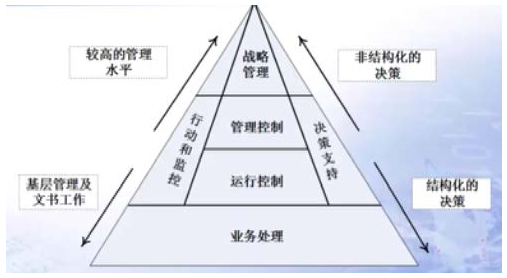

管理信息系统 - 学习笔记
Learning
利用计算机等设备，对信息的收集、传输、加工、储存、更新、拓展和维护的系统.
2018-10-17

## 学习内容

##### 第一部分 信息系统概念基础

- 管理新系统概述（定义与结构）
- 业务流程 —— 信息和信息系统
  - 信息系统与决策
- 组织战略 —— 信息系统和竞争优势
  - 知识管理与专家系统

##### 第二部分 信息系统技术基础

- 硬件和软件
- 数据库应用
  - 数据库设计
- 数据通讯
  - 互联网工作原理

##### 第三部分 信息系统应用 —— 面向组织的运营管理

- 业务流程管理
  - 职能流程：应用与系统
  - 跨职能流程：应用程序与系统
  - 跨组织流程：供应链管理
- 电子商务系统
  - 社会媒体系统
- 商务智能和信息系统
  - 报告与联系分析处理（OLAP）

##### 第四部分 信息系统管理

- 信息系统开发
  - 小型企业的系统开发
  - 系统开发项目管理
- 信息系统管理
  - 信息系统外包
  - 信息系统预算
- 信息安全管理

##### 第五部分 信息系统发展前沿（技术发展前沿和应用前沿等）

## 第一部分 信息系统概念基础

### 全球视角下的信息系统学科

#### 信息系统的定义

- 信息系统（IS）是`硬件、软件、数据和流程`以及生成信息的`人员`的集合
- 管理信息系统（MIS）是帮助组织实现战略管理系统的应用

#### 信息系统学科的发展

- 始于 1976 年前后，是一个相对较新的学科
- 为了传递知识主体和提供有助于事业准备的信息
- 从全世界来看，其自然也因为当地环境如主主题、传递方式、学校所在地、学院和学生背景等而有所不同

#### 世界各国的关注点

- 美国：管理信息系统和医疗信息系统在应用程序的应用
- 加拿大：知识管理，部分在商务分析
- 欧洲
  - 芬兰：商务分析和大数据，同时伴随着 Mongo 计算
  - 瑞士：电子商务，还有小部分关注集中于云计算
  - 乌克兰：软件工程
- 亚洲
  - 中国：商务分析和大数据
  - 香港：信息系统和知识管理
  - 台湾：信息管理、信息系统
  - 新加坡：信息系统、医疗信息学和商务分析
- 澳大利亚：电子健康、信息系统

#### 结论

- 全世界来看，关注点并不相同，但是确实存在着相同的准则和相同的历史
- 在信息系统和管理信息系统的各个领域中都有着很多的衔接和整合
- 增强灵活性以满足不断变化的需求，这是一个继续不断探索的领域
- 还有不断发展的网络并且专注于网络
- 更多地关注个人和社会问题
- 移动设备为中心

#### 关注的必要性

- 信息系统无处不在
- 全球都在关注并受到影响
- 明白和接受我们跟信息系统和管理信息系统的联动很重要
- 你的职业会被信息系统和管理信息系统所影响

### 管理信息系统

#### 学习目标

- 怎样理解管理信息系统和概念？
- 管理信息系统是服务于谁的？
- 从哪些角度进行认知？
- 管理信息系统有什么功能？如何看待？
- 管理信息系统的主要构成是什么？

#### 管理信息系统定义 1

管理信息系统是有`人、计算机、通信设备等硬件和软件`组成的，是能进行管理信息的`收集、加工、存储、传输、维护和使用`的系统。

- 可以实测企业生产经营活动中的各种运行情况
- 能利用历史的数据预测未来
- 能从全局出发辅助管理人员做出科学的决策
- 可以利用信息控制企业的生产经营活动
- 帮助企业实现规划的业务目标

#### 管理信息系统定义 2

美国明尼苏达大学企业管理研究院教授 G.B.Davis：

> 管理新系统是一种以计算机为基础、集成化的人 - 机系统，是用来提供信息，支持组织机构内部的作业、管理和决策职能的系统，该系统使用计算机的软件、硬件和通讯设备，手工规程（流程），分析、计划、控制和决策采用的模型及数据库。

#### 基本概念解释

1. <u>管理信息系统的功能</u>

- 基本功能：数据处理功能
- 核心功能：运营管理
  - 计划功能
  - 预测功能
  - 控制功能
  - 决策优化功能
- 最终目的：帮助企业实现规划的业务

2. <u>人机系统</u>

人：系统开发者和系统用户，影响着他们知识需求和应具有的能力

3. <u>集成化系统</u>： 组成 MIS 的各功能子系统可以在总体开发计划指导下分别开发，并通过数据库合为一体。

4. <u>手工规程</u>：信息系统执行和操作程序（方法、流程、规章制度等）

#### 信息系统系统定义 3

David M.Kroenke 教授，美国华盛顿等大学任教：

1. 系统：系统是一系列要素的集合，通过要素间的相互作用实现相应目标
2. 信息系统：信息系统是一系列要素的集合，通过要素间的交互来产出信息
3. 信息系统的五个基本组建：`硬件、软件、数据、规程（流程）、人`
4. 管理信息系统：可理解为信息系统的开发和使用，以帮助企业实现业务目标
5. 管理信息系统的关键要素：
   1. 信息系统
   2. 开发和使用
   3. 业务目标

#### 开发和使用信息系统

- 管理信息系统的开发和构建：扮演主动角色，了解系统是如何构建的，能够清楚地说明对信息系统的要求
- 信息系统的使用：
  - 学习如何使用，以实现你的目标
  - 新的需求与责任 —— 保证系统和数据的安全，对数据备份，准确完全的系统恢复等
  - 面对信息系统使用的伦理道德问题

<u>实现业务目标：管理信息系统帮助企业实现（组织）业务目标</u>

### 管理系统结构

#### 物理结构组成

硬件设备、软件、数据、流程、操作人员

##### 硬件设备

- 硬件设备是物质基础
- 硬件设备实现数据输入、传输、存储、输出等的计算机设备
- 数据的采集、准备和网络通讯设备等等

##### 软件

- 软件包括系统 MIS 赖以运行的程序系统，系统软件、应用软件
- 系统软件，例如操作系统，数据库管理系统等
- 应用软件，例如订票系统，企业生产管理系统等

##### 数据

- 按一定的组织结构存储起来的各种原始数据和信息
- 包括记录在计算存储介质上的数据库或数据文件，额也包括计算机输出的报表和人工记录的原始单据等等

##### 流程

- 流程流程指保证系统有效运行的流程和规章制度、说明等
- 包括指导系统运行、数据录入、系统维护等方面的说明书和确保系统安全而制定的各种管理规程

##### 操作人员

- 操作人员就是用户和指从事系统开发、系统维护和宝保证系统正常运行的人员
- 世界上只有两类人：系统开发人员和系统使用人员

结构组成的相互关系

#### 系统的实施问题 MIS 应用系统的逻辑结构

##### 基于活动的 MIS 子系统

- 组织活动分为 3 个层次：战略规划（高层），管理控制和战术计划（中层），作业计划与控制（基层）
- 三个层次信息上存在着上传下达这样的交互作用
- 三个层次数据（信息）特点从来源、范围、概括性、时间性、流通性、需求的精度、使用频率上的存在差异

##### 三个层次级别的子系统概述

- 用于作业控制的信息子系统
  - 用于作业控制的基本活动主要三类，事物处理、报表编制和查询处理
- 用于管理控制的信息子系统
  - 管理控制是基于运行情况，比照计划、预算、指标等，行业对标等，来进行业务的分析，进而给出决策、进行相应的运作方式
- 用于战略计划的信息子系统
  - 该系统为战略计划制定过程提供信息源及通用查询和分析工具。战略制定过程比较非结构化

##### 基于职能的 MIS 子系统

定义：它是各个职能子系统的联合体

- 每个子系统又分为四个主要信息处理部分：即事务处理、作业控制的信息辅助、管理控制的信息辅助和战略计划的信息系统的辅助
- 具有各职能子系统为各自编写的应用程序及供其使用的专用数据文件
- 具有为多个职能部门服务的公共应用程序及供多个职能子系统存取、检索使用的公共数据文件
- 具有为多个应用程序公用的分析和决策模型

### 信息系统的逻辑结构

#### 基于活动的 MIS 子系统

##### 组织的活动层次

- 战略规划
- 战术计划和管理控制
- 作业计划与控制

##### 层级的关系结构

- 三个层次信息上存在上传下达的交互作用
- 金字塔模型 —— 反映了业务量大小

不同层级决策特点不同（由下至上结构化程度越低）

##### 不同层级的信息特点

##### 不同层级子系统特点

<u>**作业控制子系统**</u>

- 事务处理
- 报表编制
- 查询处理

<u>**管理控制的信息子系统**</u>

- 处理程序（各种模块）来进行分析预算决策等等
- 对任何组织基本都适用

<u>**战略计划子系统**</u>

- 需要丰富的信息源的支持和很强的查询分析工具的支持

#### 基于职能的子系统

##### 总体概念结构

- 概念结构：基于它支持的、组织的不同的职能及其活动和它使用的主要的数据、模型和一些通用文件来理解的结构
- 职能的定义：在活动上具有某种独立性，在管理上规定了不同的职责任务
- 功能：事务处理、作业控制、管理控制和战略计划

<u>例如市场销售子系统</u>

- 事务处理：有关销售订单，推销订单，合同等的处理
- 作业控制：销售人员的雇佣与培训，编制日销售与推销计划，按地区、产品、客户对销售量作定期的分析
- 管理控制：对总体成绩总体绩效与销售计划的对比，所用信息可能涉及到客户、竞争对手、竞争产品和销售人员
- 战略计划：开辟新的市场、制定信的经销战略

基于职能的子系统的定义：是各个职能子系统的联合体

各个职能子系统的特点： ①每个子系统分成四个主要信息处理部分：即事务处理、作业控制的信息系统辅助、管理控 制的信息系统辅助和战略计划的信息系统的辅助 ②具有各职能子系统为各自编写的应用程序及供使用的专用数据文 ③具有为多个职能部门服务的公共应用程序及供多个职能子系统存取、检索使用的公共数据 文件 ④具有为多个应用程序共用的分析和决策模型 

##### 实际运行结构

实际结构会根据实际的需要有针对性的设计子系统，例如需要考虑成本和效益，开发很快产 生价值的、很快提高效益的、成本相对比较低的、成本效益比较高的子系统 。

组织的综合系统 ：

- 公共正式的管理信息系统
- 公共非正式系统
- 私人正式的信息系统
- 私人非正式系统 

##### 名词解释：

- 组织的职能：在活动上具有某种独立性，在管理上规定了不同的职责任务 
- 概念结构和实际结构的区别：概念结构是基于它支持的、组织的不同的职能及其活动和它 使用的主要的数据、模型和一些通用文件来理解的结构，是理想的完整的结构；而实际结构 会根据实际的需要有针对性的设计子系统，例如需要考虑成本和效益，开发很快产生价值的、 很快提高效益的、成本相对比较低的、成本效益比较高的子系统，所涉及的子系统的职能可能是概念结构中涉及的众多职能中的一部分。
- 公共正式的管理信息系统：是指组织机构内有关的人员和一切有权使用信息的人所拥有， 具有预先规定的规程，基于统一计划、标准和规程建设的应用程序是其组成部分，在组织上 是公共的。
- 共非正式系统：是指组织机构内有关的人员和一切有权使用信息的人所拥有，但极少有 事先制定的规则，只为组织机构内与之相关的所有人服务。
- 私人正式的信息系统：个人所有，至少可以供拥有者本人和帮助维护系统的人员使用，有 统一的标准，不是根据职能和职位，而是根据个人意愿建立
- 私人非正式系统：个人所有，主要是通过个人联系和保持信息，这些信息对个人决策十分 关键。 

## 第二部分 业务流程与信息与信息系统

### 人工智能 机器学习 机器人技术

<u>**人工智能（机器开始模仿「认知」功能）**</u>

现状：有难题，但随着计算能力的提高，人工智能正在崛起

**<u>机器学习（计算机在不显示编程的情况进行学习的能力）</u>**

功能：数据预测、辅助决策（监督或无监督）

#### 机器人技术

- 现状：与人工智能结合，目前持续发展
- 问题：会不会将来取代人类
  - 在工业上中、危险较高危险的工作：机器人可以
  - 需要人际沟通的工作：不一定
  - 较专业的工作（如律师、教授、医生等）
    - 简单重复性工作：机器可以
    - 非日常工作：如管理、规划、创业、制定政策等：目前人类胜于机器

<u>**举例**</u>

- 未来医院的可能性：借助穿戴设备，可以远程进行检测，减少不必要的住院问题，节省资源
- 自动化办公并未实现：这并非技术问题，而是人、流程等改变困难，如政府办公

<u>**展望未来**</u>

一些工作将由机器来做，机器学习、人工智能、机器人的进步将引领未来。

### 信息系统的两种技术

#### 传感器

**<u>定义</u>**：是一种检测装置，能感受到被测量的信息，并能将感受到的信息，按一定归来吧变换成为电信号或其他所需形式的信息输出，以满足信息的传输、处理、存储、现时、记录和控制等要求

<u>**应用**</u>：

- 工业和商业领域：食品生产、工厂机械、飞机飞行、天气预报、温度控制、环境安全、污染、煤气泄漏、爆炸、交通检测、导航、GPS 等
- 可用于可穿戴设备：医疗保健方面、健康保健方面
- 技术问题：
  - 设备数量过多，缺乏标准
  - 无法准确矫正测量数据，可能导致疾病、负担过大
  - 数据隐私和安全性问题

#### 物联网

定义：物联网通过各种传感器和其他设备，实时采集任何需要检测、链接、互动的物体和过程等各种需要的信息，与互联网结合形成一个巨大网络实现物与物，物与人，物与网络的连接，方便识别、管理和控制

<u>**关键技术**</u>：

- 传感器技术
- FRID 标签
- 嵌入式信息系统

<u>**应用环境**</u>

- 食品供应效率
- 食品质量保证
- 可穿戴设备
- 智能家居监控

### 云

#### 云的定义

基于互联网的计算的一种形式，可以根据需要向计算机和其他设备提供共享的计算机处理资源和数据，允许具有各种职能的用户和企业更容易，可靠地存储和处理数据

#### 云的分类

- 按规模分为小型的云和巨型的云
- 公司私有的云
- 由第三方提供的对外开放的云

#### 云的优势

- 提供了更高的灵活性
- 为公司节省了前期基础架构成本
- 使组织能够专注于其核心业务，专注于产品和市场营销，并为人们提供意愿中的优质产品
- 帮助企业更快的起步和运行
- 是信息技术团队能够更快速地调整资源供给以满足不断变化的业务需求

#### 云的应用

一种按需访问共享的计算资源池，这些资源可以是网络、服务器、存储、应用程序、服务、软件，可以以最少的管理成本快速提供和发布。

#### 云的运作方式

- 云计算提供有限选择的服务
- 使用既定的标准的最佳做法
- 可以以标准化的方式轻松地访问全球的云服务
- 利用效用计算的概念为所使用的服务提供指标
- 执行自动故障恢复

#### 云的现状：

- 云计算由于规模经济而更便宜，换句话说，服务于大量的客户，由此可以利用规模经 济，从而减少成本
- 云提供商可能不符合组织的法律需求
- 管理政策取决于云供应商

#### 云的安全性

- 云比其他存储库（如组织或笔记本电脑）更安全，因为它们会不断更新其安全功能并 主动监控访问
- 现在公司都有所担心，因为所有的竞争对手都可能在同一个云中，而公司根本不知道 他们的数据在哪里（以及如何）存储
- 政府在追踪犯罪活动时可以随时要求访问

#### 对云所做的思考

- 你的数据到底存储在哪里？
- 你真的能够管理你的数据吗？
- 你的数据有多少个副本？
- 你是否可以彻底删除一些东西？
- 谁有合法的访问？是否存在非法访问？
- 你会真正知道谁在何时访问了你的数据吗？
- 风险是否大于收益？

#### 关注云的必要性

- 你的生活处处都有云
- 你的职业也会跟云计算联系起来
- 数据会发送到我们日常交互的信息系统中，有时候我们甚至毫无察觉
- 这是一个极佳的创新创业机会
- 这其中还存在着很多需要权衡和考虑的问题，还有管理上的问题