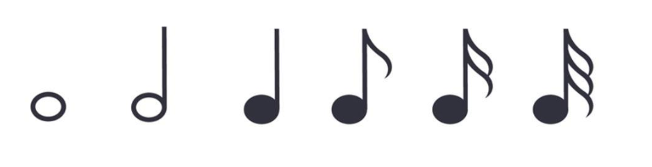
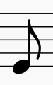

音乐理论基础 - 学习笔记
Learning
基本乐理基础，摘自李重光《音乐理论基础》，交换了一下顺序使简单的在前面.
2018-10-20

## 一   音及音高

#### 音

音高由频率决定，强度由振幅决定，长短由发声时间决定。

通常我们听到的都不会是一个音在响，这种声音叫`复音`，复音的产生是由于发音体（以弦为例）不仅仅是全段在振动，它的各部分（二分之一、三分之一等）同时在振动。全段振动称为`基音`，部分振动称为`泛音`。

#### 音乐体系 音列 音级

- 在音乐中使用的、有固定音高的音的总和，叫做`乐音体系`。
- 乐音体系中的音，按照上行或下行次序排列起来，叫做`音列`。
- 乐音体系中的各种音叫做`音级`，音有`基本音级`和`变化音级`两种。

升高或降低基本音级而得到的音，叫做变化音级。将基本音级升高半音用「升」或者「$\sharp$」来表明；降低半音用「降」或者「$\flat$」来标明；升高全音用「重升」或者「$\times$」来表示，降低全音用「重降」或者「$\flat\flat$」来标明。

#### 音的分组

在音列中央的一组叫做小字一组，音级标记`用小写字母并在右上方加数字 1`，如：$c^1 \; d^1 \; e^1$

比小字一组高的组顺次定名为：小字二组、小组三组、小字四组、小字五组；`小字二组的标记用小写字母并在右上方加数字 2`，如：$c^2 \; d^2 \; e^2$，其他组一次类推

比小字一组低的组称为：小字组、大字组、大字一组、大字二组；`小字组用不带数字的小写字母`表示，如：$c \; d \; e$，`大字组用不带数字的大写字母`表示，如：$C \; D \; E$，`大字一组用右下角加数字的大写字母`表示，如：$C_1 \; D_1 \; E_1$，大字二组同理。

#### 音域及音区

- 总的音域是指`音列的总范围`，即从它的最低音到最高音（$C_2 - c^5$ ）间的距离而言。
- `个别的人声或乐器的音域`是指在整个音域中所能达到的那一部分，如钢琴的音域是 $A_2 - c^5$。

小字组、小字一组和小字二组属于中音区，低于这个的叫做低音区，高于叫做低音区。

## 二   音律

乐音体系中各音的绝对准确高度及其相互关系叫做音律，比如 $a_1 = 440 Hz$。

#### 十二平均律

降八度分成十二个均等的部分 —— `半音` —— 的音律叫做十二平均律；世界上最早根据数学来制定十二平均律的是我国明朝大音乐家朱载堉（1584 年）；`除了 E 到 F、B 到 C 是半音外`，其余相邻两音间的距离都是全音。

#### 五度相生律

由某一音开始向上推一纯五度，产生次一律，再由次一律向上推一纯五度，产生再次一律，如此继续相生所定出的音律叫做五度相生律。
$$
\flat c \to \flat g \to \flat d \to \flat a \to \flat e \to \flat b \to f \to c \to g \to d \to a \to e \to b \to \sharp f \to \sharp c \to \sharp g
$$
和十二平均律中七个基本音级的音高关系是不同的。虽然 E F、B C 之间亦为半音，但比十二平均律的半音要小，其余的全音要比十二平均律的全音大。这种音高的差异就是由于定律方法不同而产生的。

#### 纯律

纯律是于五度相生律用以构成的第二分音和第三分音之外，`再加入第五分音来`来作为生律要素，构成和弦形式。
$$
c \xrightarrow{纯五度} g\\
c \xrightarrow{大三度} e
$$
纯律的音高关系，又不同于五度相生律和十二平均律中的基本音级间的音高关系。

#### 自然半音和自然全音 变化半音和变换全音

自然半音一定是`两个相邻的音级`，如：

$$
E - F, \quad \sharp C - D
$$

自然全音也必须是`相邻的音级`，如：

$$
C - D, \quad \sharp E - \sharp F
$$

变化半音是`相同音级或者差两个音级`，如：

$$
C - \sharp C, \quad \flat D - D, \quad \sharp D - \flat F
$$

变化全音也是`相同音级或者差两个音级`，如：

$$
C - \times C, \quad \sharp C - \flat E
$$

#### 等音

音高相同而`意义不同和记法不同`的音，叫做等音，比如：
$$
\sharp C - \flat D - \times B, \quad \sharp A - \flat B - \flat \flat C
$$

## 三   记谱法

#### 音符

上图分别表示全音符，二分音符，四分音符，八分音符，十六分音符，三十二分音符。

上图为：全休止符，二分休止符，四分休止符，八分休止符，十六分休止符

全休止符，同时也是小节休止符

##### 五线谱

从下而上计算，分别为 1,2,3,4,5 线，线与线之间为 1,2,3,4 间。

假使音乐作品是写在数行五线谱上的，如下图：

那么，这数行五线谱还要用连谱号连接起来。连谱号包括`起线`（垂直线）和`括线`（花括号）。括线还分花和直括线，如下图：

分别表示起线，直括线，花括线。

- 花括线为钢琴、风琴、手风琴、竖琴、扬琴、琵琶等乐器记谱使用。
- 直括线为合奏、合唱、乐队记谱使用。在总谱中用直括线来连接同类乐器。

为了标记过高或过低的音，在五线谱的上面或下面还要加上许多短线，这些短线叫加线。

由于加线而产生的间，叫做加间，在五线谱上面的加间叫上加间，下面的叫下加间。

#### 音符与休止符的写法

音符包括三个组成部分。符头（空心的或实心的椭圆形标记）、符干（垂直的短线），符尾（连在符干一端的旗状标记）

符头在第三线以上时，符干朝下，写在符头的左边；在第三线以下时，符干朝上，写在符头的右边。`符尾在谱子上从上往下看都是在左边`。如图：

符尾永远写成符干的右边并弯向符头。假如同一符干连着符头而又分布在第三线的上下时，则以离第三线`最远`的符头为准。许多音符组成一组时，用共同的符尾（符干）相连。这时符干的方向仍以离第三线`最远`的符头为准。两条以上的符干要`平行`。如图：

符干的长度一般保持`八度音程的距离`，加入符干上连着符头时，符干的长度应是符头间的距离加上八度音程的距离。如果符头在上加三线以上，符干必须延伸到五线谱的第三线或第四线。如果符头在下加三线以下，符干必须延伸到五线谱的第三线或第二线。

许多音符用共用符尾连接在一起时，符干的长度多半长短不一，这是要使符杠与最近符头的距离至少距离八度。

附点写在音符符头和休止符右边的间内，而不记在线上。

休止符在符干记谱中，永远记在第三线上。全休止符写在第四线的下面。

#### 谱号

G 谱号：表示小字一组 g，记在五线谱的第二跟

## 四   节奏 节拍

## 五   音乐的速度与力度

## 六   音程

## 七   和弦

## 八   调试总论

## 九   以五声音阶为基础的各种调式

## 十   大小调式 作品中调的明确法

## 十一 转调及交替调式

## 十二 调试变音与半音阶

## 十三 移调

## 十四 装饰音

## 十五 关于旋律的知识