音乐理论基础 - 学习笔记
Music
基本乐理基础，摘自李重光《音乐理论基础》，放弃了多声部内容，一些专属乐器记谱法.
2018-10-20

文章内使用的免费的作曲的制谱软件
[MuseScore](https://musescore.com/)

摘自`李重光《音乐理论基础》`，摘取了其中常用的部分，多声部和记谱法有部分省略。

## 一   音及音高

#### 音

音高由频率决定，强度由振幅决定，长短由发声时间决定。

通常我们听到的都不会是一个音在响，这种声音叫`复音`，复音的产生是由于发音体（以弦为例）不仅仅是全段在振动，它的各部分（二分之一、三分之一等）同时在振动。全段振动称为`基音`，部分振动称为`泛音`。

#### 音乐体系 音列 音级

- 在音乐中使用的、有固定音高的音的总和，叫做`乐音体系`。
- 乐音体系中的音，按照上行或下行次序排列起来，叫做`音列`。
- 乐音体系中的各种音叫做`音级`，音有`基本音级`和`变化音级`两种。

升高或降低基本音级而得到的音，叫做变化音级。将基本音级升高半音用「升」或者「$\sharp$」来表明；降低半音用「降」或者「$\flat$」来标明；升高全音用「重升」或者「$\times$」来表示，降低全音用「重降」或者「$\flat\flat$」来标明。

#### 音的分组

在音列中央的一组叫做小字一组，音级标记`用小写字母并在右上方加数字 1`，如：$c^1 \; d^1 \; e^1$

比小字一组高的组顺次定名为：小字二组、小组三组、小字四组、小字五组；`小字二组的标记用小写字母并在右上方加数字 2`，如：$c^2 \; d^2 \; e^2$，其他组一次类推

比小字一组低的组称为：小字组、大字组、大字一组、大字二组；`小字组用不带数字的小写字母`表示，如：$c \; d \; e$，`大字组用不带数字的大写字母`表示，如：$C \; D \; E$，`大字一组用右下角加数字的大写字母`表示，如：$C_1 \; D_1 \; E_1$，大字二组同理。

#### 音域及音区

- 总的音域是指`音列的总范围`，即从它的最低音到最高音（$C_2 - c^5$ ）间的距离而言。
- `个别的人声或乐器的音域`是指在整个音域中所能达到的那一部分，如钢琴的音域是 $A_2 - c^5$。

小字组、小字一组和小字二组属于中音区，低于这个的叫做低音区，高于叫做低音区。

## 二   音律

乐音体系中各音的绝对准确高度及其相互关系叫做音律，比如 $a_1 = 440 Hz$。

#### 十二平均律

降八度分成十二个均等的部分 —— `半音` —— 的音律叫做十二平均律；世界上最早根据数学来制定十二平均律的是我国明朝大音乐家朱载堉（1584 年）；`除了 E 到 F、B 到 C 是半音外`，其余相邻两音间的距离都是全音。

#### 五度相生律

由某一音开始向上推一纯五度，产生次一律，再由次一律向上推一纯五度，产生再次一律，如此继续相生所定出的音律叫做五度相生律。
$$
\flat c \to \flat g \to \flat d \to \flat a \to \flat e \to \flat b \to f \to c \to g \to d \to a \to e \to b \to \sharp f \to \sharp c \to \sharp g
$$
和十二平均律中七个基本音级的音高关系是不同的。虽然 E F、B C 之间亦为半音，但比十二平均律的半音要小，其余的全音要比十二平均律的全音大。这种音高的差异就是由于定律方法不同而产生的。

#### 纯律

纯律是于五度相生律用以构成的第二分音和第三分音之外，`再加入第五分音来`来作为生律要素，构成和弦形式。
$$
c \xrightarrow{纯五度} g\\
c \xrightarrow{大三度} e
$$
纯律的音高关系，又不同于五度相生律和十二平均律中的基本音级间的音高关系。

#### 自然半音和自然全音 变化半音和变换全音

自然半音一定是`两个相邻的音级`，如：$E - F, \quad \sharp C - D$

自然全音也必须是`相邻的音级`，如：$C - D, \quad \sharp E - \sharp F$

变化半音是`相同音级或者差两个音级`，如：$C - \sharp C, \quad \flat D - D, \quad \sharp D - \flat F$

变化全音也是`相同音级或者差两个音级`，如：$C - \times C, \quad \sharp C - \flat E$

#### 等音

音高相同而`意义不同和记法不同`的音，叫做等音，比如：
$$
\sharp C - \flat D - \times B, \quad \sharp A - \flat B - \flat \flat C
$$

## 三   记谱法

#### 音符

1. 全音符，二分音符，四分音符，八分音符，十六分音符，三十二分音符。
2. 全休止符，二分休止符，四分休止符，八分休止符，十六分休止符

全休止符，同时也是小节休止符

##### 五线谱

从下而上计算，分别为 1,2,3,4,5 线，线与线之间为 1,2,3,4 间。

假使音乐作品是写在数行五线谱上的，如下图：

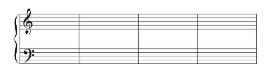

那么，这数行五线谱还要用连谱号连接起来。连谱号包括`起线`（垂直线）和`括线`（花括号）。括线还分花和直括线，如下图：

分别表示起线，直括线，花括线。

- 花括线为钢琴、风琴、手风琴、竖琴、扬琴、琵琶等乐器记谱使用。
- 直括线为合奏、合唱、乐队记谱使用。在总谱中用直括线来连接同类乐器。

为了标记过高或过低的音，在五线谱的上面或下面还要加上许多短线，这些短线叫加线。

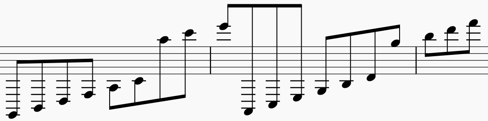

由于加线而产生的间，叫做加间，在五线谱上面的加间叫上加间，下面的叫下加间。

#### 音符与休止符的写法

音符包括三个组成部分。符头（空心的或实心的椭圆形标记）、符干（垂直的短线），符尾（连在符干一端的旗状标记）

符头在第三线以上时，符干朝下，写在符头的左边；在第三线以下时，符干朝上，写在符头的右边。`符尾在谱子上从上往下看都是在左边`。如图：

符尾永远写成符干的右边并弯向符头。假如同一符干连着符头而又分布在第三线的上下时，则以离第三线`最远`的符头为准。许多音符组成一组时，用共同的符尾（符干）相连。这时符干的方向仍以离第三线`最远`的符头为准。两条以上的符干要`平行`。如图：

符干的长度一般保持`八度音程的距离`，加入符干上连着符头时，符干的长度应是符头间的距离加上八度音程的距离。如果符头在上加三线以上，符干必须延伸到五线谱的第三线或第四线。如果符头在下加三线以下，符干必须延伸到五线谱的第三线或第二线。

许多音符用共用符尾连接在一起时，符干的长度多半长短不一，这是要使符杠与最近符头的距离至少距离八度。

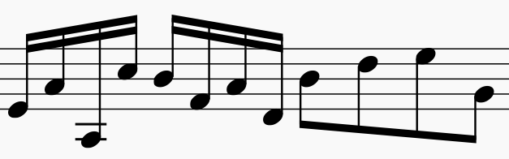

附点写在音符符头和休止符右边的间内，而不记在线上。

休止符在符干记谱中，永远记在第三线上。全休止符写在第四线的下面。

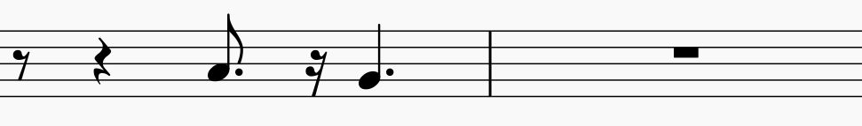

#### 谱号

$G$ 谱号：表示小字一组 $g$，记在五线谱的第二根线上，叫高音铺谱号。

$F$ 谱号：表示小字组的 $f$，记在五线谱的第四根线上，叫低音谱号。

$C$ 谱号：表示小字一组 $c_1$，可记在五线谱的任何一线上：

`使用许多谱号的目的是为了避免过多的加线，以使写谱和读谱更加方便。`

#### 增长音值的补充记号

##### 附点

带有一个附点的音符，增长原有音符时值的二分之一，带有两个附点的音符，增长原有音符时值的四分之三，如图：

`附点也同样适用于休止符`。

##### 延音线

用在音高相同的两个或两个以上的音符时，表示它们要`唱成一个音`，长度等于这些音符的总和。

连线永远写在和符干相反的方向。

##### 延长号

表示按照作品的风格、演奏者的意图可以自由地增长音符或休止符的时值。

记在双纵线上的延长号则表示乐曲的结束或告一段落。

#### 变音记号

1. 升记号（$\sharp$）：表示将基本音级升高半音
2. 降记号（$\flat$）：表示将基本音级降低半音
3. 重升记号（$\times$）：表示将基本音级升高半音（一个全音）
4. 重降记号（$\flat \flat$）：表示将基本音级降低半音（一个全音）
5. 还原记号（$\natural$）：表示将已经升高或降低的音还原

变音记号分可以记在五线谱的线上和间内，可以记在音符的前面和谱号的后面。

##### 调号

记在谱号后面的变音记号叫做调号

更换调号如果发生在一行乐谱的开始处，这是应该在前一行乐谱的末尾处将所要更换的调号予先写清楚，并讲座后一条小节线迁移，一遍记写新的调号。

1. 增加升降号数目，在更换出写出新的调号即可
2. 减少数目，需要将多余的变音记号还原，然后写出新的调号
3. 升号变降号，将号变升号，先还原再写出新的调号

##### 临时记号

直接放在音符前面的变音记号叫做临时记号。临时记号只`限于同音高的音符有效`。而且知道`最近的小节线为止`。为了提醒废除线面所用的临时记号，有时在小节线后面加上临时的记号。

#### 省略记号

##### 移动八度记号：

表示记号之内的音符一高八度或者降低八度。

##### 长休止符

在五线谱的第三线上记以长休止符，并写出所要休止的小节数。

##### 反复记号

乐曲中一次或多次`重复某一小节`时，可以表示为：

乐曲中`较大的重复`，用反复记号表示：

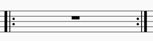

如果乐曲是`从头重复`，则此反复记号的前部分

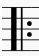

可以省略。

假如重复时`结尾不同`，，可用记号：

第一次唱

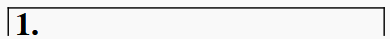

第二次略去 1，唱

如果乐曲是由三部分组成，`第三部分是第一部分的重复`，而在第二部分结尾处写 D.C. ，从头重复，在结束处用 $Fine$ 或曲终的字样。

#### 演奏法的记号

##### 连音奏法

用连线来标记，表示连线内的不同音高的音要（演奏）唱得连贯，连音奏法的连线大都记载五线谱的上面。

断音奏法、持续音奏法、滑音奏法、琶音奏法略。

## 四   节奏 节拍

组织起来的音的`长短关系`，叫做节奏。

## 五   音乐的速度与力度

情景期待...

## 六   音程

#### 音程

> 两个音在音高上的相互关系叫做音程

先后弹奏的两个音形成`旋律音程。`

同时弹奏的两个形成`和声音程。`

在五线谱上书写时，旋律音程需要错开，和声音程需要上下对齐（挤不下错开一点）。

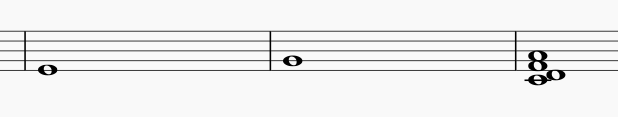

音程中最低的音叫根音，最高的音叫冠音。

旋律音程按进行方式为上行，下行，平行三种（就是越来越高还是越来越低）。

#### 音程的级数和音数

`两个音之间（包括两个音）所占的间和线`的数量，叫做音程的度数。

比如下图，从左到右依次为一度，二度，六度。余此类推

两个音之间所包含的半音的数目，叫做音数，，用整数和带分数来表示。如：$\frac{1}{2}, \; 2, 3\frac{1}{2}$ 等等。

为了区分度数相同而音数不同的音程，还要加上一些文字来描述，比如大、小、增、减、倍增、倍减。（比如大二度，小三度，增五度，减七度，倍减八度等）

#### 自然音程和变化音程

##### 自然音程

`纯音程，大音程，小音程，增四度，和减五度`叫做自然音程。

1.  纯一度：音数为 0，如：$C \to C$， $\sharp E \to \sharp E$ 等
2.  小二度：音数为 $\frac{1}{2}$，如：$C \to \sharp C$，$E \to F$ 等
3.  同理得：大二度，小三度，大三度，纯四度，增四度（减五度），纯五度，小六度，大六度，小七度，大七度，纯八度（每个间隔 $\frac{1}{2}$ 个音数）

五线谱上相邻的线或间一定是三度关系，隔开一条线（间）的线（间）永远是五度关系（五线谱上能很快的读出度数关系，占多少线和间就是多少度，先读出度数，再看大小增减）。

书写的方法：`大写的纯大小增减，小写的度数`，如： $大_3 \quad 小_2 \quad 增_7 \quad 减_6$

##### 变化音程

在大音程或纯音程上增加半个音数就称作`增几度`，增几度增加半个音数为`倍增几度`。

在小音程和纯音程上减少半个音数就乘坐`减几度`，减几度增加半个音数为`倍减几度`

#### 单音程与复音程

不超过八度的音程叫做`单音程`。

超过八度的音程叫做`复音程`。

复音程就是单音程上加上若干个八度。读法为「隔开几个八度的多少度」，如「隔开两个八度的大三度」。

不超过两个八度的复音程还有独立的名称，由「隔开一个八度的二度」对应「九度」，余此类推，增减大小纯按照单音程不变。

#### 音程的转位

音程的根音和冠音可以`互相颠倒`，叫做音程的转位。转位可以在一个八度内进行，也可以在多个八度内进行。转位是根音冠音可以一同移动。

转位有如下规律

-   颠倒前后音程总数是 9，如七度转位变成二度。
-   除了纯音程不变外，其他都变为相反的音程，大变小，增变减，倍增变倍减，余此类推。如增七度变为减二度。

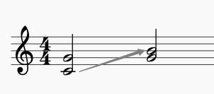

上图为纯五度转纯三度。

#### 音程的构成和识别方式

在之前已经提到过，很容易分辨出几度关系，所以先构成（识别）多少度，再在度数上面做增减大小。

如要做一个减五度，先做一个纯五度关系

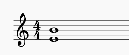

根音不动，调整冠音，构成减五度。

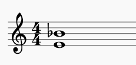

#### 等音程

雷同与等音，相差音数相同但是叫法不同的音程。

#### 协和音程与不协和音程

从听觉感受上来分为两类：协和音程和不协和音程。

听起来悦耳、融合的音程，叫做协和音程。

协和音程分为三类：

-   极完全协和音程：完全相同的纯一度和几乎完全相同的纯八度。
-   完全协和音程：相当融合的纯五度和纯四度。
-   不完全协和音程：不很融合的大小三度和大小六度。

极完全协和音程和完全协和音程听起来声音有点空，不完全协和音程的声音则较为丰满。

听起来比比较刺耳不太融合的音程叫做不协和音程。大小二度、大小七度以及所有的增减音程（包括增四减五）倍增、倍减都属于这一类。

孤立的听一个不协和音程可能觉得很刺耳，但放在一定的调式体系中，可能会觉得比较柔和。

#### 稳定音程与不稳定音程

从构成音程各音的稳定与不稳定方面来看，可以分为稳定与不稳定两种，

由稳定音级构成的音程，叫做稳定音程。

调式总论中会提到，由于和和声的处理不同，稳定音级也可能是各异的。

#### 调式中的音程

待续...

## 七   和弦

#### 和弦

在多声部音乐中，可以按照三度关系排列起来的`三个以上音的结合`，叫做和弦。

按三度关系构成的和弦，由于各音间保持着一定的紧张密度，音响谐调丰满，并合平泛音的自然规律。

也可以遇到的不是按三度关系构成的和弦，这些和弦对丰富和声的色彩有着积极的意义，也不应该忽视。

#### 三和弦

由三个音按照三度关系叠置起来的和弦，叫做三和弦。

下面的音叫做根音，或`一度音`，用数字 1 来表示；中间的音叫做`三度音`，用数字 2 来表示，上面的音叫做`五度音`，用数字 5 来表示。

三个和弦额主要类型有：

1.  大三和弦：大三度 + 小三度，根音到五度音是纯五度音。
2.  小三和弦：小三度 + 大三度，根音到五度音是纯五度音。
3.  增三和弦：大三度 + 大三度：根音到五度音是增五度音。
4.  减三和弦：小三度 + 小三度：根音到五度音是减五度音。

四种和弦如下图：

`大小三和弦都是协和和弦`，因为其中包含的音程都是协和音程（大三度、小三度、纯五度）

`赠三和弦都是不协和和弦`，因为其中的减五度和增五度是不协和音程。

#### 七和弦

由四个音按照三度关系叠置起来的和弦，叫做七和弦。第四个音叫做`七度音`，用数字 7 来代表。

所有的七和弦都是不协和和弦，因为其中包含了`不协和的七度音程`。

七和弦的名称是按照所包含的三和弦的类别及根音与七度音之间的音程关系而定名的。

1.  大小七和弦（大调小七和弦）：大三和弦 + 小七度音（根音到第七度音）
2.  小小七和弦（小七和弦）：小三和弦 + 小七度音
3.  减小七和弦（半减七和弦）：减三和弦 + 小七度音
4.  减减七和弦（减七和弦）：减三和弦 + 减七度音

四种和弦如下图；

#### 原位和弦及转位和弦

以和弦的根音为低音（最低的音）的和弦，叫做原位和弦。

以和弦的三度音、五度音、七度音为低音的和弦，叫做转位和弦。

##### 三和弦的转位

1.  以三度音为低音：三和弦的第一转位，也叫作六和弦，用数字 6 表示。转位后，低音（三度音）和最高音（根音）是六度音程关系，所以叫六和弦。

2.  以五度音为低音：三和弦的第二转位，也叫作四六和弦。同理，也是因为和低音是四六音程的原因。

##### 七和弦的转位

1.  以三度音为低音：七和弦的第一转位，也叫做五六和弦。

2.  以五度音为低音：七和弦的第二转位，也叫作三四和弦。

3.  以七度音为低音：七和弦的第三转位，也叫作二和弦。

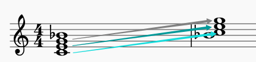

#### 构成和识别和弦的方法

1.  比如在 D 上构造大小七和弦，先确定根音 D，在 D 上构造大三和弦，然后构造到七度音的小七度音程。
2.  先确定根音，根据根音构成或`找出和弦的原位和弦`。例如要在 G 上构成小小七和弦$_5^6$，首先要找出和弦根音 E，在 E 音构成原位小小七和弦，再降根音移高八度，求得 G 音上的小小七和弦$_5^6$。

#### 等和弦

同理等音和等音程。

听起来相同，写法不相同的和弦。

两种类型的和弦：

1.  和弦中的音不因为等音变化而更改音程的结构。
2.  由于等音变化而更改和弦的结构。

#### 调式中的和弦

等待调更新..

#### 和弦的应用及其表现特征

在多声部音乐中，应用得最多的是协和三和弦，即打小三和弦。其次是增减三和弦和七和弦等不协和和弦。

1.  `大三和弦具有明亮的色彩`，这种色彩是由于根音上的大三度造成的，大三和弦和大三度音程一样，往往用来说明大调的特征。
2.  `小三和弦`和大三和弦相比，`色彩比较暗淡`，这种色彩是由于根音上的小三度造成的，小三和弦和小三度音程一样，最能说明小调特征。
3.  `增三和弦`具有`向外扩张的特征`，`减三和弦`具有`向内缩紧的特征`，一切不协和和弦都具有尖锐、紧张的特点。

和弦在实际应用中，往往在不同的八度中重复其全部音或其中的某几个音，和弦中的音`全部出现`时叫做`完全和弦`，和弦中的音没有`全部出现`的叫做`不完全和弦`。

和弦可以用来作为旋律的伴奏，或将许多声部组织在一起，并也可以出现旋律本身之中，即旋律按照和弦音而进行。

## 八   调试总论

情景期待...

## 九   以五声音阶为基础的各种调式

情景期待...

## 十   大小调式 作品中调的明确法

情景期待...

## 十一 转调及交替调式

情景期待...

## 十二 调试变音与半音阶

情景期待...

## 十三 移调

情景期待...

## 十四 装饰音

情景期待...

## 十五 关于旋律的知识

情景期待...