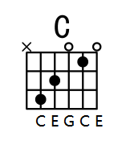

Guitar 和弦
Guitar
吉他和弦是在吉他上由三个或三个以上的音，按照一定的音程关系叠置起来的组合.
2018-10-26

## 前言

阅读此篇文章，默认你拥有一些基本乐理的知识（`音律，音程，和弦`）和吉他（弦，品等）的基本知识，若未掌握可查看之前的文章的音律，音程，和弦的内容：

[音乐理论基础](16.html)

学习音乐理论基础。

## 吉他和弦

### 构成

从音乐理论基础中可以了解到，和弦是由三个及三个以上的音叠加而形成的。最低的音我们称为根音。

现在令根音为：C，构造一个`大三和弦`，为：C，E，G。

第六根弦不弹，从第五到第四个根线，分别为 C E G C E，都是此大三和弦的音。

所以，吉他和弦就是用按品的方式把和弦表现出来。

此和弦的`根音是 C`，又是个`大三和弦`，我们就称其为 C 和弦。

类似的，我们可以定义其他的和弦的名字。

依然看 C 和弦：

-   C：大三和弦：C E G
-   Cm（Min）：小三和弦：C $\flat$E G
-   Caug（Augmented）：增三和弦：C E $\sharp$G
-   Cdim（Diminished）：减三和弦：C $\flat$E $\flat$G
-   Csus4（Suspend）：挂四和弦，挂留四度音，3 音变成 4 音，也就是从 C E G 变成 C F G
-   C6：六和弦，三和弦的第一转位，E G C，若以 C 为低音，

### 性质

### 色彩

### 级数