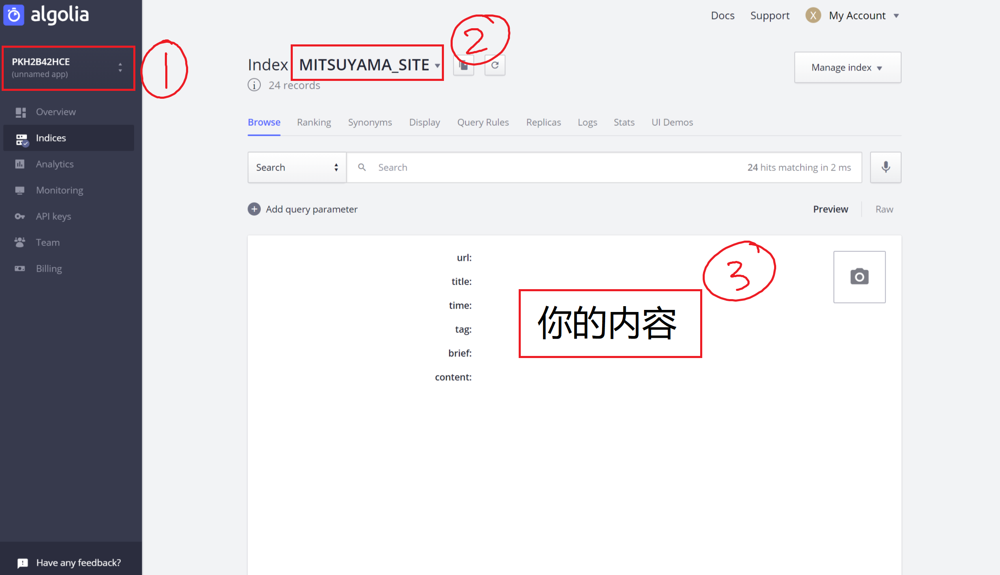

静态网页小功能的实现
Website
GItHub page 是一个静态网页平台，由于没有使用现有的静态网页生成器，学习了一些网页功能实现技巧.
2018-11-8

Github 是一个静态网页，所以不能用例如 Python、PHP 等动态语言。其实网上有很多优秀的静态网页生成器：Jekyll，Hugo，Hexo，Hitbook，Gatsby 等等。但为了学习 HTML、CSS、JavaScript 等前端语言，于是决定自动动手写写。以下总结了一些功能的实现。

## Algolia 实现搜索功能

由于静态网页，无法使用动态语言进行对数据库内容的读取，直接搜索 HTML 文件似乎又不太方便，于是我选择了一个通过 SaaS 模式提供的搜索的 `Algolia`.

[Algolia | Fast, Reliable and Modern Search and Discovery](https://www.algolia.com/)

本地向 Algolia 的服务器提交数据，然后通过 JavaScript 获取你提交的数据，并且 Algolia 提供了一些默认 CSS 样式等功能，从而帮助你实现搜索功能。

实现过程：

#### 注册并登陆

上面的链接，~~点击就送屠龙宝刀~~，注册并登录。

登陆后可能会有一些官方教程，最后进入 Dashboard，如下界面：

图中：

1. API key，新建 Apps 时会随机给一个（新建的时候需要你选择一个 main region，中国选择香港即可，延迟比较低）
2. Apps 中一个 Index 的名字，这个 Index 也是你自己建立的
3. 你上传的内容，上传以 object 为一个单位，每个 object 中都有你设定的键值对，启用搜索时，通过键值对来获得你需要的搜索结果。

