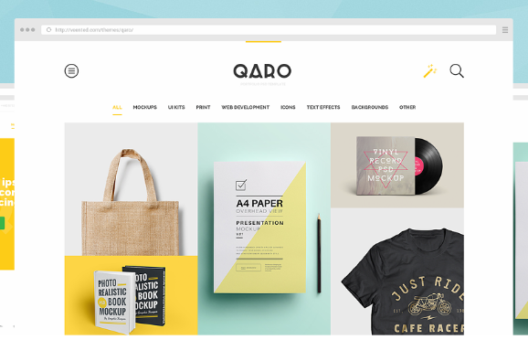
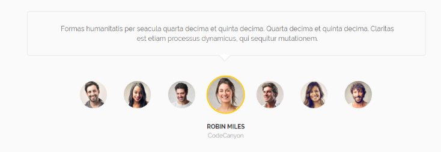
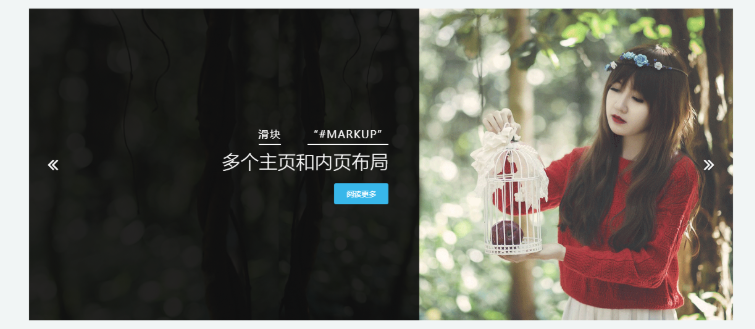
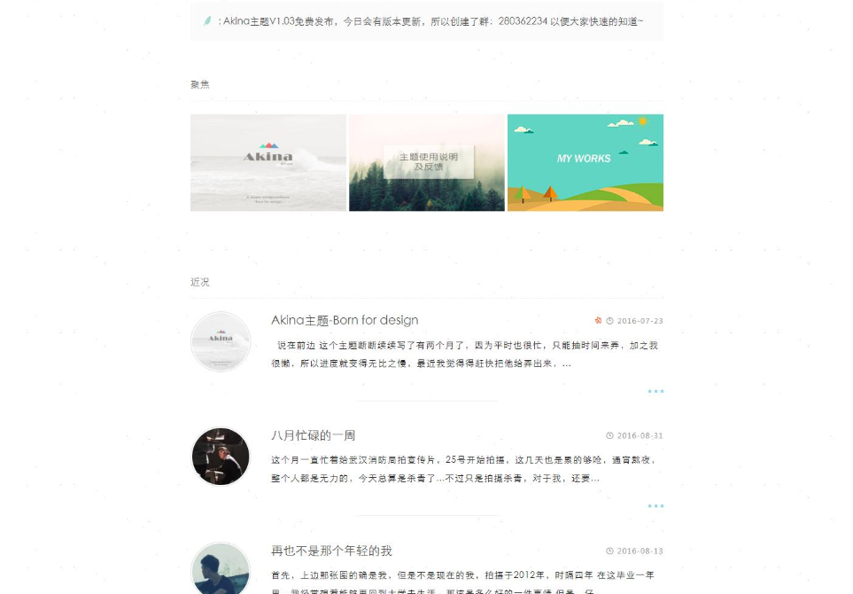
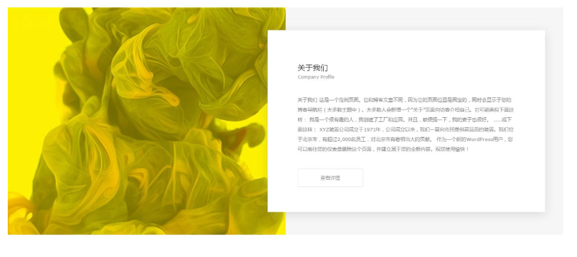
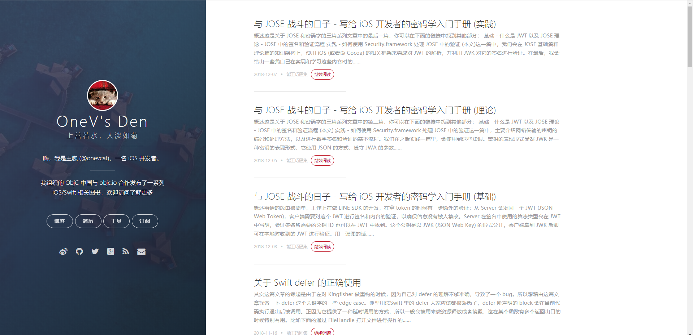
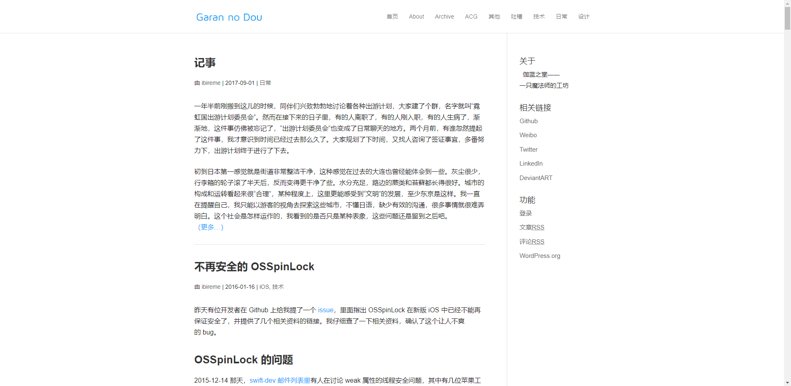

博客页面的重新设计
Website
重新设计一下网页的样式，从网上找到了一些好看的网站的素材。需要的部分有网页最上部分的幻灯片部分，没找到的称心的，就先随便做一个。文章的展示样式，考虑一下需不需要对文章进行分类展示。网页的页脚；主页面的导航栏，导航栏上的按钮，样式，是否固定在最上端，滚动页面是否发生改变，都需要重新设计。还有一些小功能键（比如移动到网页最上端等等）看看是否需要。
2018-11-16

## 一点小想法

1. 轮播的样式必须得换，<u>图片需要重新找，要和内容对上</u>，不然感觉很奇怪，文字和图片也需要配合，有几种样式可以尝试：文字与图片穿插，图片的部分截取等。

↑ 这个是文字和图片穿插

↑ 图片的部分截取

2. 轮播的切换方式，由于自己摸索出来的幻灯片的实现，有许多 BUG，样式还不易修改，什么时候学习一下比较好的构建方式。
3. 轮播部件后面的内容，除了最近上传的博客（注意是最近上传，所以不能一股脑全部放上去了，全部查看得想个办法），文章分类查看，文章搜索（应该还能加一些其他的东西，想起来在往上加）
4. 网页字体有点过于单调，我还在想，页面出博客内容外的其他文字用<u>中文</u>好还是<u>英文</u>好。
5. 文章页面，顶部的那张图可以去掉，非常的多余（除非有点关联）还影响加载速度（或者用单色调的背景来解决）。
6. 文章页面底部例如推荐阅读，下一篇，上一篇可以考虑考虑
7. 经验还不够，还需要再看看做得好的网页

## 几个喜欢的网页样式

[GitHub Dashboard UI refresh](https://github.blog/2019-01-16-dashboard-ui-refresh/)

[National Geographic](https://www.nationalgeographic.com/)

## 网页设计截图

↑ 最喜欢的文章展示格式

标签式：

## 如何自己定义字体

