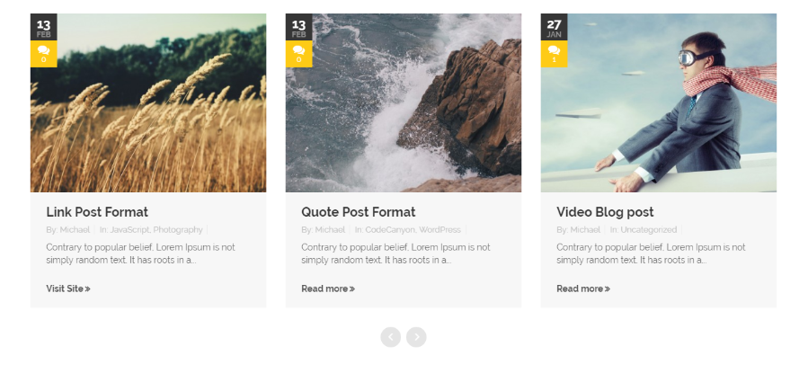
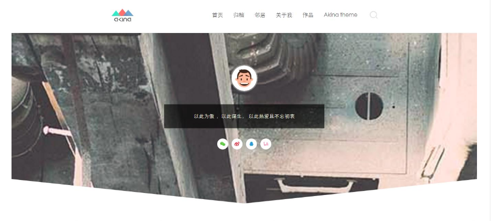
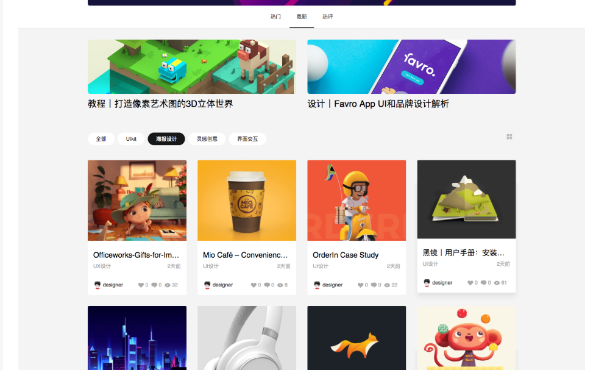

博客的重新设计
Website
重新设计一下网页的样式，从网上找到了一些好看的网站的素材。需要的部分有网页最上部分的幻灯片部分，没找到的称心的，就先随便做一个。文章的展示样式，考虑一下需不需要对文章进行分类展示。网页的页脚；主页面的导航栏，导航栏上的按钮，样式，是否固定在最上端，滚动页面是否发生改变，都需要重新设计。还有一些小功能键（比如移动到网页最上端等等）看看是否需要。
2018-11-16

## 网页地址

[GitHub Dashboard UI refresh](https://github.blog/2019-01-16-dashboard-ui-refresh/)

[National Geographic](https://www.nationalgeographic.com/)

## 网页设计截图

↑ 最喜欢的文章展示格式

标签式：

## 如何自己定义字体

