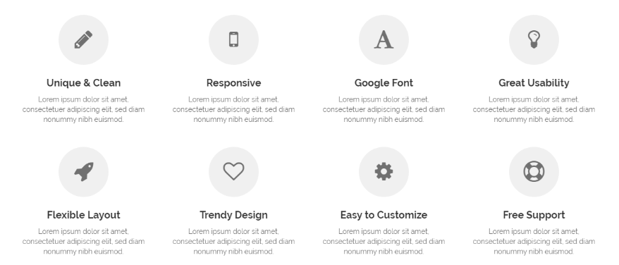
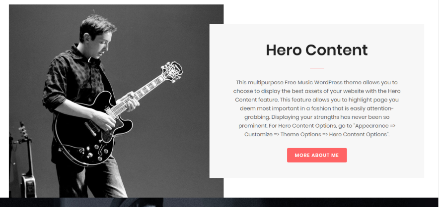
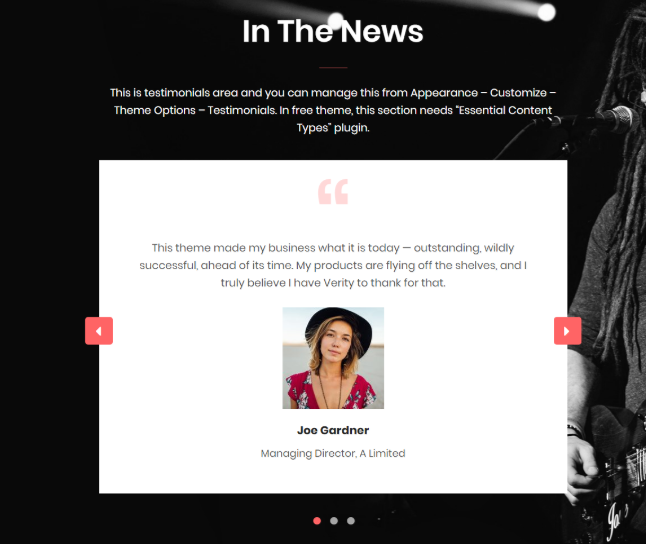
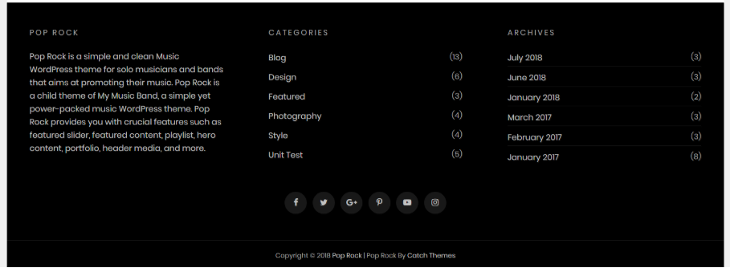
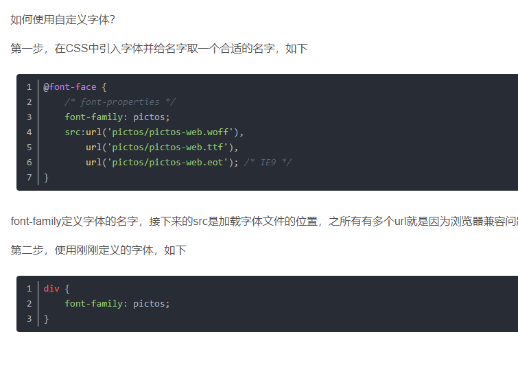

博客页面的重新设计
Website | Github | Design
重新设计一下网页的样式，从网上找到了一些好看的网站的素材。需要的部分有网页最上部分的幻灯片部分，没找到的称心的，就先随便做一个。文章的展示样式，考虑一下需不需要对文章进行分类展示。网页的页脚；主页面的导航栏，导航栏上的按钮，样式，是否固定在最上端，滚动页面是否发生改变，都需要重新设计。还有一些小功能键（比如移动到网页最上端等等）看看是否需要。
2018-11-16

## 一点小想法

轮播的样式必须得换，<u>图片需要重新找，要和内容对上</u>，不然感觉很奇怪，文字和图片也需要配合，有几种样式可以尝试：文字与图片穿插，图片的部分截取等。

↑ 这个是文字和图片穿插

↑ 图片的部分截取

轮播的切换方式，由于自己摸索出来的幻灯片的实现，有许多 BUG，样式还不易修改，什么时候学习一下比较好的构建方式。

轮播部件后面的内容，除了最近上传的博客（注意是最近上传，所以不能一股脑全部放上去了，全部查看得想个办法），文章分类查看，文章搜索（应该还能加一些其他的东西，想起来在往上加）

网页字体有点过于单调，我还在想，页面出博客内容外的其他文字用<u>中文</u>好还是<u>英文</u>好。

文章页面，顶部的那张图可以去掉，非常的多余（除非有点关联）还影响加载速度（或者用单色调的背景来解决）。

文章页面底部例如推荐阅读，下一篇，上一篇可以考虑考虑

经验还不够，还需要再看看做得好的网页

（2019年2月16日22:13:34）想了一下，轮播用第一种解决方案，但是还是要改一下：

1. 自动轮播还是要加上。
2. 由于是中文，字体需要好好考虑一下，图片也需要好好找找，如果暗色图片居多，则用黑色蒙版加白色字体，如果是浅色背景，则用黑色字体。
3. 轮播的进度条位置改在下面（颜色）；进度条移动特效；hover 时的特效。
4. READ MORE 的按钮样式需要修改。
5. 中文标题比较长，放在最上面，但是要和简介、时间等内容左对齐。
6. 右下角的按钮样式，因为是循环播放，左右应该一直存在，所以考虑更换效果，按钮颜色根据找的图片风格需要跟换。

（2019年2月17日21:41:59）

轮播的大概样式做完了，还差一个轮播的定位条，右下角翻页按钮有待商榷，自动轮播不着急做；接下来是顶部的导航栏，和轮播之后的内容，最近跟新可以放上去，把之前的粘贴过来就行；然后还有文章分类。

## 奇思妙想

-   浅色，粗线条下划线作为标题
-   顶部网页滚动进度条

## 几个喜欢的网页样式

[GitHub Dashboard UI refresh](https://github.blog/2019-01-16-dashboard-ui-refresh/)

[National Geographic](https://www.nationalgeographic.com/)

## 网页设计截图

↑ 最喜欢的文章展示格式

标签式：

## 如何自己定义字体

