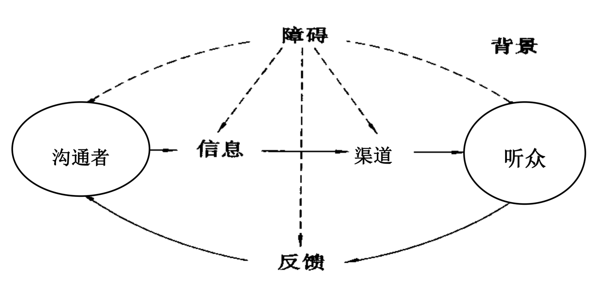

领导力与沟通
Notes
领导力与沟通的三个关键词：良好意愿、换位思考、可信度
2018-11-13

## 管理沟通基础

### 管理与沟通

一个主题：沟通的有效性

##### 两个 70%

1. 管理者的 70% 的时间花在沟通上。
2. 70% 的管理问题源于沟通不善（「尽快」「我以为」）

##### 三个关键词

- Good Will：良好意愿（关注、尊重、认同、客观）
- You-attitude：换位思考
- Credibility：可信度（上面两个关键词提升可信度）

##### 明茨伯格谈沟通

1. 人际关系
2. 信息传递
3. 决策制定

> 语言和书面的接触时经理的工作。
>
> 管理者必须尽早有效地进行沟通
>
> —— 明茨伯格

主要：及时性、有效性。

五种基本策略：

1. 沟通者策略
2. 听众策略
3. 信息策略
4. 沟通选择策略
5. 文化策略

### 管理沟通内涵与过程

##### 管理沟通的过程

管理沟通是指沟通者为了获取沟通对象的反应和反馈而向对方传递信息的全部过程。

沟通者传递信息一定要关注沟通对象能否引起反应和反馈，为此来传递一个信息，这样一个过程才是有效国通过程，也是一个满足<u>需求</u>（马斯洛需求理论）的过程

完整的沟通过程：

##### 让接受者听明白

信息的性质：比如：好信息、坏信息

1. 沟通取决于传递信息的性质和传递者之间的关系
2. 传递的信息必须要清晰明确，必须要让接受者听明白

##### 信息需要被理解

如果信息和想法没有被传达到，则意味着沟通没有发生。

##### 编码与解码

1. 传递与沟通者之间的是符号
2. 关注符号的编码与解码

### 管理沟通的障碍

导致沟通不能有效进行的障碍：

1.  地位影响
2.  无反馈
3.  语义问题
4.  感觉失真
5.  文化差异
6.  信息渠道选择不当

## 沟通的类型