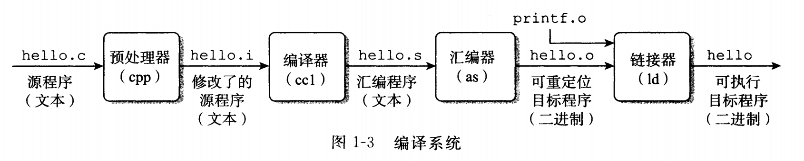
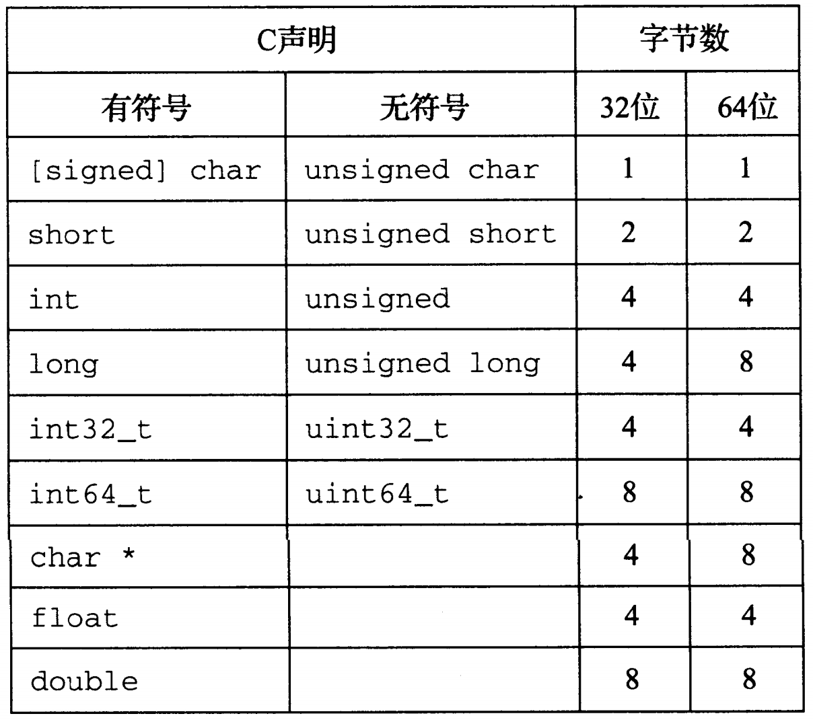
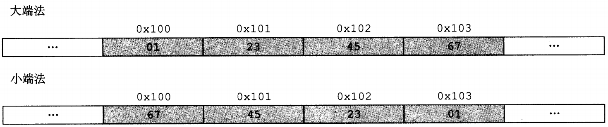
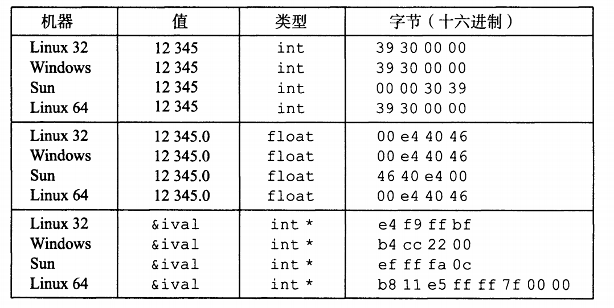
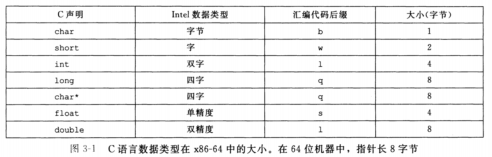
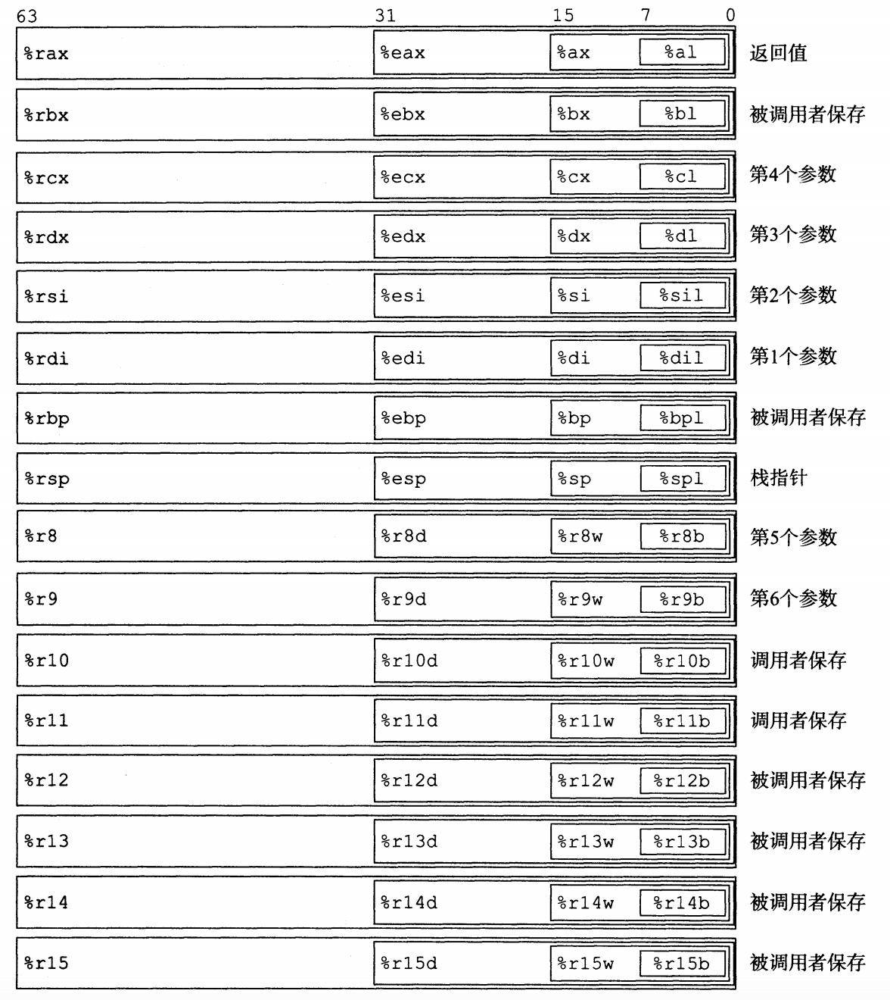
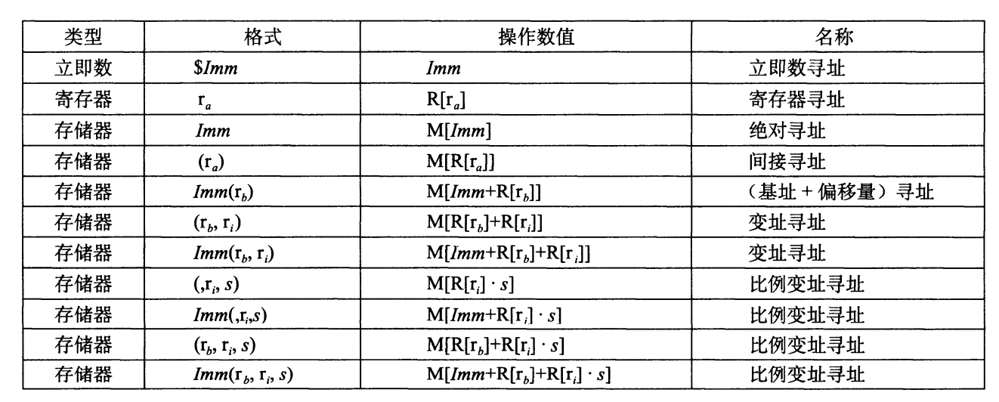

计算机系统基础
Computer | Note
主要参考书目《深入理解计算机系统》。这本书的主要论题包括：数据表示、C 程序的机器级表示、处理器结构，程序优化、存储器层次结构、链接、异常控制流、虚拟存储器和存储器管理、系统级 I/O、网络编程和并发编程。书中所覆盖的内容主要是这些方面是如何影响应用和系统程序员的。主要选取书中非常识、重要或者难懂的部分。
2019/3/11

## 计算机系统漫游——绪论

作者前言中，对读者应具备的背景知识的描述（节选）：

>文中包含大量已在 Linux 系统上编译和运行过的程序示例。我们假设你能访间一台这样的机器,并且能够登录，做一些诸如切换目录之类的简单操作 ……
>
>我们还假设你对 C 和 C++ 有一定的了解。如果你以前只有Java经验，那么你需要付出更多的努力来完成这种转换 …… 不过，有一些C语言的特性(特别是指针、显式的动态内存分配和格式化I/o)在Java中都是没有的 ……

这篇博客的内容砍掉了大部分在学习 C 语言就应该掌握的内容（逻辑运算、位运算、各种数据类型表示范围等）

##### 程序编译

GCC 编译器的如何将一个源程序文件 hello.c（输出 "hello world" 的程序） 翻译成一个可执行目标文件 hello。



了解 GCC：[CNU Compile Collection](https://zh.wikipedia.org/wiki/GCC)

## 程序结构和执行

### 信息存储

#### 字数据

##### 位、字节、字

1. `比特`：或称为「位」，<u>最底层</u>的二进制数字（数码）称为位（bit，比特），值位 0 或 1；
2. `位组合`：把位组合在一起，采用某种规则进行解读
3. `字节`：8-bit 块（1bytes = 8bits）
4. `字`：CPU 中 ALU（Arithmetic Logic Unit）的数据位数 = CPU 中**通用寄存器的位数**（通常说计算机是 XX 位的，是指这台计算机 CPU 字的长度 OS 是 XX 位的，是指其 CPU 的工作模式，这与操作系统各 DLL [Dynamic Link Library] 库函数、编译连接环境有关）

##### 字数据大小

>  每台计算机都有一个字长（word size），指明指针数据的标称大小（normal size）。因为虚拟机是以这样的一个字来编码的，所以字长决定的最终的系统参数就是虚拟地址空间的大小。

`字长`和`虚拟地址空间`我们常常称为**系统位数**（或者说**机器的字长**）和**内存大小**。

32 位系统（32 位字长机器）虚拟地址的范围为 $0 \sim 2^{32} - 1$，只能使用 4G 的内存（虚拟地址空间），而 64 位则能扩展到 16EB。

大多数


大多数 64 位机器是可以运行 32 位机器编译的程序，这是一种向后兼容。

若程序 `prog.c` 用如下伪指令编译后：

```bash
linux> gcc -m32 prog.c
```

该程序就可以在 32 位或者 64 位机器上正确运行。

但是如果用如下伪指令编译：

```bash
linux> gcc -m64 prog.c
```

那就只能在 64 位机器上运行。


##### 数据大小

基本 C 数据类型的典型大小（以字节为单位）



为了避免由于依赖「典型」大小和不同编译器设置带来的奇怪行为。ISO C99 引入了一类数据类型。其数据大小是固定的，不随编译器和机器设置而变化。其中就有数据类型 *int32_t* 和 *int64_t*，它们分别为 4 字节和 8 字节。

#### 寻址和字节顺序

##### 概述

某些机器选择在内存中按照从最低有有效字节到最高有效字节的顺序存储对象，而另一些机器相反。最低有效字节在地址前面的方式，称为小端法；最高有效字节在最前面的方式，称为大端法。

假设变量 x 的类型位 *int*，位于地址 *0x100* 处，它的十六进制值为 *0x1234567*。地址范围 *0x100 ~ 0x103* 的字节顺序依赖机器的类型：




##### 如何查看机器大小端


```c
#include <stdio.h>
#include <stdlib.h>

int main() {
    int val = 12345;
    unsigned char *start = &val;
    int len = sizeof(val);
    int i = 0;
    for(i = 0; i < len; i++)
        printf("%.2x ", *(start + i));
    printf("\n");
}
```

代码中，把 *int* 强制转换`无符号字符指针`，*start* 存放的这个 *int* 变量的初始地址，*sizeof* 获取 *int* 数据长度，*printf* 实现从数据低位向高位循环输出内容。

我实在 MacOS 上进行的试验，结果是：

```bash
39 30 00 00
```

教材上的结果：



参数 *12345* 的十六进制表示为 *0x00003039*。发现 Windows、Linux、MacOS 都是先输出 *0x39*，说明它们都是小端法机器，而 Sun 则是大端法机器。

#### 整数表示

##### 补码编码

假如现在有一个钟表：


（现在所指时间：八点）

如果我们要将时间拨到 4 点，我们可以将时针逆时针往回拨 4 个刻度到 4 点。

但是，我们也可以将时针顺时针**顺时针往前拨** 8 个刻度，利用时针的循环表示规则（我们称之为自然溢出，12 点 + 1 = 1 点）。


补码编码则基于这个原理。

我们假设一个数据类型：*short short int*，只有 4 位（0 表示为 0000）。

1. 首先规定：最高位为 1 时时负数，0 为正数。那么最大的正数 0111 十进制下等于 7。
2. 我们设定：负数 x 的补码为：取绝对值，然后取反 + 1（0110 取反为 1001），比如 7（1111）表示为 0001。

这就是补码编码，`绝对值取反加一`。

下面解释这样做的理由，计算 4 - 2：

1. 4 = *0100*
2. 4 - 2 = 4 + (-2)
3. -2 = *1110*
4. 4 - 2 = *0100 + 1110* = *0010* = 2（最高位进位自然溢出）

##### 有符号数和无符号数之间的转换

```c
short int v = -12345;
unsigned short uv = (unsigned short) v;
```

结果：*v = -12345, uv = 53191*

强制类型转换的结果保持位值不变（二进制下相同表示），只是改变了解释这些位的方式。


C 语言在处理无符号和有符号的运算时，都是隐性地把有符号数转成无符号数来处理。比如小于操作 *-1 < 0U* 的结果（0U 指无符号数 0）为 *TRUE*。

##### 扩展一个数字的位表示

当我们把一个**短字长数据类型**变量强制转换成一个**长字长数据类型**时，如何表示：

1. 无符号数的扩展：高位填满 0
2. 有符号数的扩展，高位填符号位（即正数填 0，负数填 1）

##### 截断数字

当我们把一个**长字长数据类型**变量强制转换成一个**短字长数据类型**时，如何表示：

1. 无符号数截断：直接截断，高位丢掉
2. 有符号数截断：同样直接截断，但是按照有符号数解释

```c
#include <stdio.h>
#include <stdlib.h>

int main() {
    int x1 = 0b11111111111111110000000000000000;
    int x2 = 0b00000000000000001000000000000000;
    short y = x1;
    short z = x2;
    printf("%d, %d\n", y, z);
    return 0;
}

```

结果：*0, -32768*

有符号数截断同样是直接截断，不管符号位。

#### 浮点数

##### 原理

表示成有理数的形式：
$$
FLOAT = (-1)^S \; 2^E \; M
$$
其中：

1. S（符号 Sign）：决定正负
2. E（Exponent）：用 $2^E$ 将数值加权
3. M（位数 Significant）：二进制小数

##### IEEE 浮点编码

1. Sign 字段：符号位 S
2. Exp 字段：编码 E（E 与 exp 不相等，后面会解释）
3. Frac 字段：尾数 M

32 位浮点数：


注：图中 Mantissa 等同于 Frac 字段

##### 阶码 Exp

阶码用`移码`表示。举个例子，当 E = -126，Exp 如何表示：

1. E 的真值：-126
2. 负数，先改为补码，正数不用此操作：10000010
3. 移码 + 127：00000001

这么做，有两个原因：

**第一个原因**：负数和正数能够直接当做无符号数来进行比较，-126 移码后变成 1，-125 变成 2，-1 变成 126，0 变成 127，1 变成 128。

*-126 < -125 < -1 < 0 < 1*：*1 < 2 < 126 < 127 < 128*

**第二个原因**：空出 00000000 和 11111111

为什么？为了表示非规格化数。

##### 非规格化数

1. Exp = 000...0，Frac = 000...0：表示 0（**注意**：有 *+0*  和 *-0* 之分）
2. Exp = 000...0，Frac ≠ 000...0：表示最接近 0.0 的那些数，比如 32 位浮点数：$FLOAT = frac * 2^{-126}$
3. Exp = 111…1，Frac = 000...0：表示正负无穷
4. Exp = 111…1，Frac ≠ 000...0：表示这不是个数（比如除以 0 等）， Not a Number (NaN)

##### 规格化数

条件：Exp ≠ 000…0 且 Exp ≠ 111…1

阶码采用偏置值编码：E = Exp - Bias，比如 32 位浮点数，E = Exp - 127

$FLOAT = (-1)^S \times 2^{E - Bias} \times M$

##### 默认的舍入模式

1. 恰好在两个可能数值中间时（中间值）：舍入后，最低有效位的数码位偶数
2. 其他的时候，像最近的数值舍入（类似于四舍五入，比中间值小向下舍入，比中间值大向上舍入）

举个例子：

7/8：10.11**110** → 11.0**0** → 3

5/8：10.10**110** → 10.1**0** → 2

时间有点紧缺，后面的内容不能事无巨细的讲解，就列一下重要的内容。

### 程序的机器级表示

#### 数据格式



汇编代码后缀：*b (bytes) → w (word) → l (double words) → q (quad words)*

#### 访问信息

一个 x86-64 的中央处理单元（CPU）包含一组 16 个存储 64 位值的通用目的寄存器。这些寄存器用来存储整数`数据和指针`。

1. 名字都以 %r 开头
2. 最初的 **8086** 处理器是 8 个 16 位的寄存器，从 %ax 到 %bp
3. 后来扩展到 **IA32** 构架，寄存器扩展到 32 位寄存器，标号从 %eax 到 %ebp
4. 再扩展到 **x86-64** 构架，寄存器扩展到 64 位，标号从 %rax 到 %rbp，除此之外，还新增了 8 个新的寄存器，标号用新规定命名，从 %r8 到 %r15



如图中嵌套的方框标明的，指令可以对这 16 个寄存器的低位字节中存放的不同大小的数据进行操作。字节级操作可以访问最低的字节，16 位操作可以访问最低的 2 个字节 32 位操作可以访问最低的 4 个字节而 64 位操作可以访问整个寄存。

#### 操作数指示符

大多数指令有一个或多个`操作数`（operand），指示出执行一个操作中要使用的源数据值，以及放置结果的目的位置。



`立即数`：用来表示常数值。在 ATT 格式的汇编代码中，立即数的书写方式是 「\$」后面跟一个用标准 C 表示法表示的整数，比如：S-577 或 \$0x1F。

`寄存器`：表示寄存器的内容。我们用符号 $r_a$ 来表示任意寄存器 $a$ ，用引用 $R[r_a]$ 来表示它的值，这是将**寄存器集合看成一个数组** R，用寄存器标识符作为索引。比如 %rax 获取 rax 寄存器中的内容。

`内存引用`：它会根据计算出来的地址（通常称为有效地址）访问某个内存位置。因为将内存看成一个很大的字节数组，我们用符号 $M_b[Addr]$ 表示对存储在内存中从地址 $Addr$ 开始的 $b$ 个字节值的引用。为了简便，我们通常省去下标 $b$。

内存引用举例：*0x80567f* 表示获取地址 0x80567f 中的内容。*0x80567f(%rax)* 获取地址 0x80567f + %rax 中的内容。*0x80567f(%rax, %rbx, 4)* 表示获取地址 0x80567f + %rax + (%rbx * 4) 中的内容。

### 基础

##### Intel x86 处理器

复杂指令集计算机（Complex instruction set computer，CISC）

1. 指令多、指令格式多（Linux 程序设计只用到较小子集）
2. 性能难与精简指令计算机（Reduced Instruction Set Computer，RISC）相比

##### 8086/8

8086/8 内部有两个功能模块，完成一条指令的取值和执行功能

1. 模块之一：总线结构单元 BIU，主要负责读取指令和操作数
2. 模块之二：执行单元 EU，主要负责指令译码和执行

### 8086 的寄存器组

对于汇编语言程序来说，8086 内部结构就是可编程的寄存器组

1. 执行单元 EU 8 个通用寄存器
2. 1 个指令指针寄存器
3. 1 个标志寄存器
4. 4 个段寄存器 / 64 位增加了 fs/gs 也成 16 位
5. `注意` 32 / 64 位 CPU 对通用寄存器记性了位扩展，64 位增加了 R8 - R15 共 8 个寄存器

#### 8086 的通用寄存器

8086 的 16 位通用寄存器是：

1. AX（Accumulator Register）：累加寄存器，使用频率最高，常用于运算；在乘除等指令中用来存放操作数，另外，所有的 I/O 指令都使用这一寄存器与外界设备传送数据。
2. BX（Base）：基址寄存器，常用于存放村粗器地址、地址索引，数组首地址
3. CX（Count）：计数寄存器，常用于计数；常用于保存计算值，如在移位指令，循环（Loop）和串处理中用作隐含的计数器。
4. DX（Data）：数据寄存器，常用于数据传递；双字长场数据的高 16 位，或存放

以上这 4 个寄存器，可以分为高 8 位：AH，BH，CH，DH；以及低 8 位：AL，BL，CL，DL。这 2 组 八位寄存器可以分别寻址，并单独使用。


另一组是**指针寄存器**和**变址寄存器**，包括：

1. SP（Stack Pointer）：堆栈指针，与 SS 配合使用，可指向目前的堆栈位置，不能用于其他目的，具有专用目的
2. BP（Base Pointer）：基址指针寄存器，可用作 SS 的一个相对基址位置

SP 和 BP 寄存器与 SS 段寄存器联合使用以确定堆栈段中的存储单元地址。


1. SI（Source Index）：源变址寄存器，可用来存放相对于 DS 段之源变址指针
2. DI（Destination Index）：目的变址寄存器，可以用来存放相对于 ES 段之目的变址指针。

串操作类指令中，SI 和 DI 具有特别的功能。

##### 堆栈

采用先进后出 FILO（First In Last Out）或者后进先出 LIFO（Last In Fist Out）的原则进行存取操作，而不是随机存取操作方式。

堆栈通常由处理器自动维持。在 8086 中，由堆栈段寄存器 SS 和堆栈指针寄存器 SP 共同指示。SP 指向栈顶，BP 指向值参的首地址。

##### 指令指针 IP

1. 指令指针寄存器 IP，指示代码段中指令的偏移地址
2. 它与代码段寄存器 CS 联用，确定下一条指令的物理地址
3. 计算机通过 CS：IP 寄存器来控制指令序列的执行流程
4. IP 寄存器是一个专用寄存器

#### 标志寄存器

标志（Flag）用于反映指令执行结果或控制指令执行形式，8086 处理器的各种标志形成了一个 16 位的标志寄存器 FLAGS（程序状态字 PSW 寄存器）

`程序设计需要利用标志的状态`


状态标志：用来记录程序运行结果的状态信息，许多指令的执行都将相应地设置它。

CF、ZF、SF、PF、OF、AF

控制标志：可由程序根据需要用指令设置，用于控制处理器执行指令的方式

DF、IF、TF


1. 进位标志 CF（Carry Flag）：当运算结果的最高有效进位（加法）或借位（减法）时，进位标志置 1，即 CF = 1；否则 CF = 0
2. 零标志 ZF（Zero Flag）：若运算结果为 0，则 ZF = 1，否则 ZF = 0（`注意`：ZF 为 1 表示结果是 0）
3. 符号标志 SF（Sign Flag）：运算结果最高位为 1，则 SF = 1；否则 SF = 0
4. 奇偶标志 PF（Parity Flag）：当运算结果最低字节中「1」的个数为零或偶数时，PF = 1；否则 PF = 0（`注意`：PF 标志尽反映最低 8 位中「1」的个数，即使是 16 位字操作）
5. 溢出标志 OF（Overflow Flag）：算术运算结果有溢出则为1（`注意`：溢出与进位的不同）
6. 辅助进位标志 AF（Auxiliary Carry Flag）：运算时 $D_3$ 位（低半子节）有进位或借位时，AF = 1；否则 AF = 0。（这个标志主要由处理器内部使用，用于十进制算数运算调整指令中，用户一般不必关心）
7. 方向标志 DF（Direction Flag）：用于串操作指令中，控制地址的变化方向。（设置 DF = 0，存储器地址自动增加；设置 DF = 1，存储器地址自动减少）CLD 指令复位方向标志：DF = 0；STD 指令置位方向标志：DF = 1；
8. 中断允许标志 IF（Interrupt-enable Flag）：用于控制外部可屏蔽中断是否可以被处理器相应。（IF = 1，允许中断）CLI 指令复位中断标志：IF = 0；STI 指令置位中断标志：IF = 1
9. 陷阱标志 TF（Trap Flag）：用于控制处理器进入但不操作方式（TF = 0：正常；1：单步）
   - 单步执行指令：处理器在每条指令执行结束时，便产生一个编号为 1 的内部中断，这种内部中断被称为**单步中断**
   - 所以 TF 也称为**单步标志**，利用单步中断可以对程序进行逐条指令的调试，这种逐条指令调试程序的方法就是单步**调试**

#### 段寄存器

8086 有 4 个 16 位段寄存器（分别指明各段的起始地址）：CS（代码段）、SS（堆栈段）、DS（数据段）、ES（附加段）

每个段寄存器用来确定一个逻辑段的起始地址，每种逻辑段均有各自的用途

32 / 64 位 CPU 采用段选择子——数组下标 / 段表述符表 —— 数组（含段地址、范围、权限等）的形式来确定段地址


##### 段值的确定

1. 一个执行文件执行时，首先由操作系统分析程序的段占用情况；包括多少段，每段的长度，代码段第一条指令的偏移
2. 然后在当前内存中寻找合适区域，并分配 CS、DS、SS、ES 等各段
3. 把执行文件中的数据调入内存 DS 段，代码调入 CS 段
4. 然后把 CPU 的 CS 变成当前分配的代码段值，IP 位第一条指令的便宜，从而开始程序的执行
5. SP 位堆栈段的大小（最大值 -wB）
6. 在汇编程序时，通过交叉文件可以看出各段的大小

#### 8086 的指令系统

8086 / 8088 的指令系统包含了六种类型，其中数据传送指令 14 条，算术运算指令 20 条，逻辑运算指令 13 条，串操作指令 10 条，控制转移指令 28 条，处理器控制指令 12 条。

### 数据传送指令

1. **MOV** DST SRC：传送（Move）。目的数可以是通用寄存器、存储单元、段寄存器，CS 段寄存器除外；<u>不允许两个存储单元或段寄存器直接传送</u>；
2. **PUSH** SRC，**POP** DST：堆栈操作（Push onto / Pop from the stack）
   - PUSH 操作：SP = SP - 2；(SP, SP + 1) = SRC
   - POP 操作：DST = (SP + 1, SP)；SP = SP + 2
3. **XCHG** OPR1,OPR2：交换（Exchange）。不能与段寄存器交换数据；存储器之间不能交换

#### 累加器专用传送指令

1. **IN**（Input）输入
   1. 长格式：**IN** AL,PORT（字节）；**IN** AX, PORT（字）：执行的操作：AL = PORT（字节），AX = (wPORT + 1, PORT)（字）
   2. 短格式：**IN** AL, DX（字节）；**IN** AX, DX（字）
2. **OUT**（Output）输出
   1. 长格式：**OUT** PORT, AL（字节）, **OUT** PORT, AX（字），执行的操作：PORT = AL, (PORT + 1, PORT) = AX
   2. 短格式：**OUT** DX, AL，**OUT** DX, AX，执行操作同上
3. **XLAT**（TRANSLATE） 转码指令：把一种代码转换成另一种代码。
   1. 格式：**XLAR**  (OPR 可选)，自行操作：AL = (BX, AL)
   2. 注意：指令执行时只是用预先已存入 BX 中的表格首地址，执行后，AL 中内容则是要转换的代码。

#### 有效地址送寄存器指令

1. **LEA** REG, SRC（Load effective address）有效地址送寄存器
2. **LDS** REG, SRC（Load DS with Pinter）指针送寄存器和 DS 指令
3. **LES** REG, SRC（Load ES with Pointer）指针送寄存器和 ES

#### 标志寄存器传送指令

1. LAHF（Load AH with flags）标志送 AH
2. SAHF（Store AH into flags）AH 送标志寄存器
3. PUSHF（Push the flags）标志进栈
4. POPF（Pop the flags）标志出栈

#### 算术指令

##### 加法指令

**ADD** DST, SRC（Add）加法指令

操作：DST = SRC + DST

1. 两个寄存器操作数不能通过 ADD 直接相加，必须有一个是通用寄存器操作数
2. 段寄存器不能用
3. 影响标志位：CF，OF，ZF，SF，AF，PF


**ADC** DST, SRC（Add with Carry）带进位加法指令

操作：DST = SRC + DST + CF


**INC** OPR（Increment）加一指令	

操作：OPR = OPR + 1

1. OPR 可以是寄存器和存储器操作数，但是不能是立即数和段寄存器
2. 影响标志位 OF，SF，ZF，PF 和 AF，但是不影响 CF

##### 减法指令

**SUB** DST, SRC

操作：DST = DST - SRC

1. 寻址方式及规定与 ADD 相同
2. 影响全部标志位


**SBB** DST, SRC（Subtract with borrow）带借位减法指令

操作：DST = DST - SRC - CF	


**DEC** OPR（Decrement）减一指令

操作：OPR = OPR - 1

除 CF 标志位，其他都受到影响（和 INC 相同）


**NEG** OPR（Negate）求补指令

操作：OPR = ~OPR + 1


**CMP ** OPR1, OPR2（Compare）比较指令

执行操作：OPR1 - OPR2

注：与 SUB 指令执行一样的操作，但是不保存结果，只是根据结果设置条件标志。

##### 乘法指令

**MUL** SRC（unsigned Multiple）无符号乘法指令

操作：

1. 字操作：AX = AL * SRC
2. 字节操作：(DX, AX) = AX * SRC

注：

1. 目的数必须是累加器 AX 或者 AL，指令中不需要写出
2. SRC 可以是通用寄存器和各种寻址方式的存储器操作数，不能是立即数和段寄存器


**IMUL** SRC（signed Multiple）有符号数乘法指令

与 MUL 相同，但必须是带符号数

##### 除法指令

**DIV** SRC（unsigned divide）

SRC 规定同乘法指令

操作：

1. 字节操作：
   1. AL = AX / SRC 的商
   2. AH = AX / SRC 的余数
2. 字操作：
   1. AX  = (DX, AX) / SRC 的商
   2. DX = (DX, AX) / SRC 的余数

注：存储器操作数必须指明数据类型：BYTE PTR src 或 WORD PTR src


**IDIV** SRC（signed divied）有符号数除法指令

与 DIV 相同


**CBW**（Convert Byte to Word）字节转换为字指令

执行操作：AL 中的符号位（D7）扩展到 8 位 AH 中，若 AL 中的 D7 = 0，则 AH = 00H，若 AL 中的 D7 = 1，则 AH = FFH


**CWD**（Convert Word to Double Word）字转换为双字指令

AX 中的符号位（D15）扩展到 16 位 DX 中；

**注**：两条转换指令都不影响条件码

#### 逻辑指令

AND，OR，NOT，XOR，TEST：

1. AND，OR，XOR，TEST 都是双字节操作指令，操作数的寻址方式的规定与算法算术指令相同
2. NOT 是单字节操作指令，不允许使用立即数
3. 逻辑运算按位进行操作

##### 标志位影响：

1. **AND，OR** 将使 CF = OF = 0，AF 位无定位，指令执行结果影响 SF，ZF，和 PF 标志位。
2. **XOR** 常用于使某个操作数清零，同时使 CF = 0，清除进位标志
3. **NOT** 不影响任何标志位
4. **TEST** 影响标志位 PF，SF 和 ZF，使 CF = OF = 0，而 AF 位无定义。

#### 移位指令

**SHL、SHR**（Shift Logical left / right）逻辑左右移，**SAL，SAL**（A：arithmetic）算术左右移，执行操作和逻辑左右移相同（最高位移出到 CF，最低位补 0）。

**ROL、ROR**（Rotate left / right）：循环左右移，最高位同时移到 CF 和最低位。

**RCL、RCR**（Rotate right / left through carry），带进位循环左右移。

#### 串处理指令

1. MOVS、MOVSB、MOVSW：传送串
2. CMPS、CMPSB、CSMPSW：串比较
3. SCAS、SCASB、SCASW：串扫描
4. LODS、LODSB、LODSW：取字符串
5. STOS、STOSB、STOSW：存字符串
6. REP、REPZ、REPNZ：重复前缀

#### 控制转移指令

##### 过程调用以及返回指令

**CALL** DST：子程序调用（在程序中 DST 实际是子程序标号）

执行操作：先将过程的返回地址（即子程序调用完后下一条的首地址）存如堆栈，然后转移到过程入口执行子程序。


**RET** 子程序返回指令

RET EXP：带立即数返回

##### 转移指令

**JUMP** 无条件转移指令


**JZ / JNZ** ORP（Jump if zero, or zero）：结果为零（或不为零）则转移，利用零标志 **ZF**

**JE / JNE** OPR（Jump if equal, or not equal）：结果相等（或者不相等）则转移，利用零标志 **ZF**

**JS / JNS** OPR（Jump if sign, or not sign）：结果为负（或正）则转移，利用符号标志 **SF**

**JO / JNO** OPR（Jump of overflow, or not overflow）：结果溢出（或不溢出）则转移，利用溢出标志 **OF**

**JP / JPE** OPR（Jump if parity, or parity even）：奇偶位为 1 则转移，利用奇偶标志 **PF**

**JNP / JPO** OPR（Jump if not parity, or parity odd）奇偶位为 0 则，转移，利用奇偶标志 **PF**

**JB / JNAE / JC** OPR（Jump if below, or not above equal, or carry）：低于，或者不高于或等于，或进位为 1 则转移，利用进位标志 **CF**，判断结果是否进位或者借位

**JNB / JAE / JNC** OPR（Jump if not below, or above or equal, or not carry）：不低于，或者高于或等于，或者进位位为 0 则转移，利用进位标志 **CF**，判断结果是否进位或者借位

##### 比较无符号的数

无符号数的大小用高（Above）低（Below）表示

利用 CF 确定高低、利用 ZF 标志确定想等（Equal）

1. 低于（不高于等于）：JB（JNAE）
2. 不低于（高于等于）：JNB（JAE）
3. 低于等于（不高于）：JBE（JNA）
4. 不低于等于（高于）：JNBE（JA）

##### 比较有符号数

有符号数的大（Greater）小（Less）需要组合 OF、SF 标志，并利用 ZF 标志确定相等（Equal）

1. 小于（不大于等于）：JL（JNGE）
2. 不小于（大于等于）：JNL（JGE）
3. 小于等于（不大于）：JLE（JNG）
4. 不小于等于（大于）：JNLE（JG）

##### 其他控制转移指令

LOOP：循环

LOPPNE、LOOPE：条件循环

JCXZ：寄存器 CX = 0 转移

INT、INTO：中断

IRET：中断返回

#### 处理机控制指令

CLC、CLD、CLI：清楚 CF、DF、IF 标志

CMC：进位位 CF 求反

STC、STD、STI：设置 CF、DF、IF 标志

HLT：处理机暂停

WAIT：等待状态

ESC：将数据传送给协处理器（提供到地址 / 数据线上）

LOCK：保证总线的控制

NOP：无操作

#### 操作数寻址方式

指令由操作码和操作数组成，操作数是一个常数值 - 立即数，也可以在 CPU、内存、IO 端内（IN / OUT 指令）中

操作数寻址方式有：

1. 立即数寻址：MOV EAX, 123456678H
2. 寄存器寻址：MOV EAX, EBX
3. 存储器寻址：MOV EAX, DS: [20000H]

存储器寻址 SREG:D(Rb, Ri, S) 段寄存器可用默认，省略

1. 段址：[基地址 Rb + 变址 Ri * 比例因子 S + 偏移 D]，这三部分可以任意组合。32 位以上 CPU 才有比例因子（1 / 2 / 4 / 8）
2. 16 位 CPU：基址 BX / BP，变址 SI / DI。其他 CPU 变址不用 ESP 等。

#### 存储器寻址

其组合与我们高级语言编程时的各种类型与结构的全局变量、局部变量、参数的访问有关系。

- 直接寻址：MOV AX, [1000H]
- 寄存器间接寻址：MOV AX, [BX]
- 基址变址寻址：MOV AX, [BX + SI]
- 相对基址变址寻址：MOV AX, [BX + SI + 100]
- 比例寻址：32 / 64 位 CPU，变址不用 ESP / RSP：
  - [变址 * 比例因子]：MOV EAX, [EDI * 4]
  - [变址 * 比例因子 + 偏移]：MOV EAX, [EDI * 4 + 100]
  - [基址 + 变址 * 比例因子]：MOV EAX, [EBX + EDI * 4]
  - [基址 + 变址 * 比例因子 + 偏移]：MOV EAX, [EBX + EDI * 4 + 8]